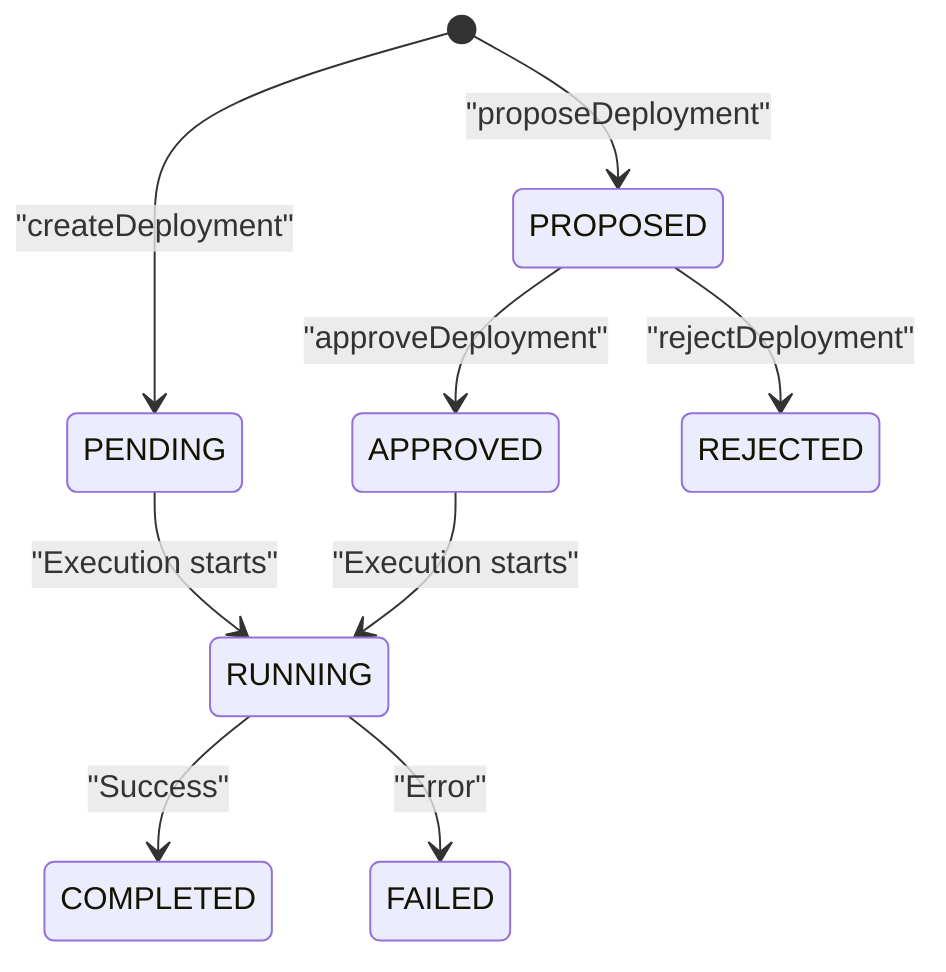

export const Bullet = () => <><span style={{ fontWeight: 'normal', fontSize: '.5em', color: 'var(--ifm-color-secondary-darkest)' }}>&nbsp;●&nbsp;</span></>

export const SpecifiedBy = (props) => <>Specification<a className="link" style={{ fontSize:'1.5em', paddingLeft:'4px' }} target="_blank" href={props.url} title={'Specified by ' + props.url}>⎘</a></>

export const Badge = (props) => <><span className={props.class}>{props.text}</span></>

import { useState } from 'react';

export const Details = ({ dataOpen, dataClose, children, startOpen = false }) => {
  const [open, setOpen] = useState(startOpen);
  return (
    <details {...(open ? { open: true } : {})} className="details" style={{ border:'none', boxShadow:'none', background:'var(--ifm-background-color)' }}>
      <summary
        onClick={(e) => {
          e.preventDefault();
          setOpen((open) => !open);
        }}
        style={{ listStyle:'none' }}
      >
      {open ? dataOpen : dataClose}
      </summary>
      {open && children}
    </details>
  );
};


The current state of a deployment operation.

Deployments created with `createDeployment` enter the lifecycle at `PENDING`.
Deployments created with `proposeDeployment` enter at `PROPOSED` and require
approval before they can run:



Once a deployment reaches a terminal state (`COMPLETED`, `FAILED`, or
`REJECTED`), it cannot transition again.


```graphql
enum DeploymentStatus {
  PROPOSED
  REJECTED
  APPROVED
  PENDING
  RUNNING
  COMPLETED
  FAILED
}
```


### Values

#### [<code style={{ fontWeight: 'normal' }}>DeploymentStatus.<b>PROPOSED</b></code>](#proposed) \{#proposed\} 
A proposed deployment awaiting human approval. Proposed deployments are not scheduled and do not block the queue.


#### [<code style={{ fontWeight: 'normal' }}>DeploymentStatus.<b>REJECTED</b></code>](#rejected) \{#rejected\} 
The proposal was rejected and will never run. Terminal.


#### [<code style={{ fontWeight: 'normal' }}>DeploymentStatus.<b>APPROVED</b></code>](#approved) \{#approved\} 
The proposal was approved and is waiting to execute. Approved deployments are drained from the queue alongside PENDING deployments.


#### [<code style={{ fontWeight: 'normal' }}>DeploymentStatus.<b>PENDING</b></code>](#pending) \{#pending\} 
The deployment is queued and waiting for execution to begin.


#### [<code style={{ fontWeight: 'normal' }}>DeploymentStatus.<b>RUNNING</b></code>](#running) \{#running\} 
Infrastructure changes are actively being applied.


#### [<code style={{ fontWeight: 'normal' }}>DeploymentStatus.<b>COMPLETED</b></code>](#completed) \{#completed\} 
All infrastructure changes were applied successfully.


#### [<code style={{ fontWeight: 'normal' }}>DeploymentStatus.<b>FAILED</b></code>](#failed) \{#failed\} 
The deployment encountered an error. Check deployment logs for details.


### Member Of

[`Deployment`](/api/graphql/types/objects/deployment.mdx)  <Badge class="badge badge--secondary badge--relation" text="object"/><Bullet />[`DeploymentStatusFilter`](/api/graphql/types/inputs/deployment-status-filter.mdx)  <Badge class="badge badge--secondary badge--relation" text="input"/>