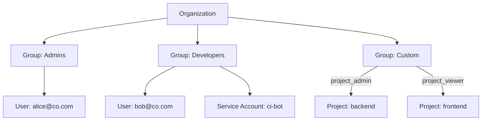

export const Bullet = () => <><span style={{ fontWeight: 'normal', fontSize: '.5em', color: 'var(--ifm-color-secondary-darkest)' }}>&nbsp;●&nbsp;</span></>

export const SpecifiedBy = (props) => <>Specification<a className="link" style={{ fontSize:'1.5em', paddingLeft:'4px' }} target="_blank" href={props.url} title={'Specified by ' + props.url}>⎘</a></>

export const Badge = (props) => <><span className={props.class}>{props.text}</span></>

import { useState } from 'react';

export const Details = ({ dataOpen, dataClose, children, startOpen = false }) => {
  const [open, setOpen] = useState(startOpen);
  return (
    <details {...(open ? { open: true } : {})} className="details" style={{ border:'none', boxShadow:'none', background:'var(--ifm-background-color)' }}>
      <summary
        onClick={(e) => {
          e.preventDefault();
          setOpen((open) => !open);
        }}
        style={{ listStyle:'none' }}
      >
      {open ? dataOpen : dataClose}
      </summary>
      {open && children}
    </details>
  );
};


A collection of users and service accounts that share the same access level within your organization.

Groups are the primary mechanism for managing access control in Massdriver. Rather than
assigning permissions to individual users, you add them to groups that define what they
can see and do.



**Built-in groups** — Every organization starts with an `Admins` group (`organization_admin` role)
and a `Viewers` group (`organization_viewer` role). These cannot be deleted.

**Custom groups** — Create custom groups with the `CUSTOM` role to grant project-level access.
Each custom group can be assigned `project_admin` or `project_viewer` on specific projects.

**Members** — Both human users and service accounts can be group members. Users live under
`members` and are added via `addAccountToGroup` (auto-adds existing org members or sends an
invitation otherwise). Service accounts live under `serviceAccounts` and are added via
`addServiceAccountToGroup`.


```graphql
type Group {
  id: ID!
  name: String!
  description: String
  role: GroupRole!
  createdAt: DateTime!
  updatedAt: DateTime!
  policies(
    filter: PoliciesFilter
    sort: PoliciesSort
    cursor: Cursor
  ): PoliciesPage
  members(
    sort: GroupMembersSort
    cursor: Cursor
  ): AccountsPage
  invitations(
    sort: GroupInvitationsSort
    cursor: Cursor
  ): GroupInvitationsPage
  serviceAccounts(
    sort: ServiceAccountsSort
    cursor: Cursor
  ): ServiceAccountsPage
}
```


### Fields

#### [<code style={{ fontWeight: 'normal' }}>Group.<b>id</b></code>](#id)<Bullet />[<code style={{ fontWeight: 'normal' }}><b>ID!</b></code>](/api/graphql/types/scalars/id.mdx) <Badge class="badge badge--secondary badge--non_null" text="non-null"/> <Badge class="badge badge--secondary " text="scalar"/> \{#id\} 
Unique identifier for this group.


#### [<code style={{ fontWeight: 'normal' }}>Group.<b>name</b></code>](#name)<Bullet />[<code style={{ fontWeight: 'normal' }}><b>String!</b></code>](/api/graphql/types/scalars/string.mdx) <Badge class="badge badge--secondary badge--non_null" text="non-null"/> <Badge class="badge badge--secondary " text="scalar"/> \{#name\} 
Human-readable name displayed in the UI and API responses.


#### [<code style={{ fontWeight: 'normal' }}>Group.<b>description</b></code>](#description)<Bullet />[<code style={{ fontWeight: 'normal' }}><b>String</b></code>](/api/graphql/types/scalars/string.mdx) <Badge class="badge badge--secondary " text="scalar"/> \{#description\} 
Optional text explaining the purpose of this group.


#### [<code style={{ fontWeight: 'normal' }}>Group.<b>role</b></code>](#role)<Bullet />[<code style={{ fontWeight: 'normal' }}><b>GroupRole!</b></code>](/api/graphql/types/enums/group-role.mdx) <Badge class="badge badge--secondary badge--non_null" text="non-null"/> <Badge class="badge badge--secondary " text="enum"/> \{#role\} 
The access level this group grants to its members.


#### [<code style={{ fontWeight: 'normal' }}>Group.<b>createdAt</b></code>](#created-at)<Bullet />[<code style={{ fontWeight: 'normal' }}><b>DateTime!</b></code>](/api/graphql/types/scalars/date-time.mdx) <Badge class="badge badge--secondary badge--non_null" text="non-null"/> <Badge class="badge badge--secondary " text="scalar"/> \{#created-at\} 
When this group was created (UTC).


#### [<code style={{ fontWeight: 'normal' }}>Group.<b>updatedAt</b></code>](#updated-at)<Bullet />[<code style={{ fontWeight: 'normal' }}><b>DateTime!</b></code>](/api/graphql/types/scalars/date-time.mdx) <Badge class="badge badge--secondary badge--non_null" text="non-null"/> <Badge class="badge badge--secondary " text="scalar"/> \{#updated-at\} 
When this group was last modified (UTC).


#### [<code style={{ fontWeight: 'normal' }}>Group.<b>policies</b></code>](#policies)<Bullet />[<code style={{ fontWeight: 'normal' }}><b>PoliciesPage</b></code>](/api/graphql/types/objects/policies-page.mdx) <Badge class="badge badge--secondary " text="object"/> \{#policies\} 
Paginated list of ABAC policies attached to this group as the principal.

Group policies define what every member of the group can do across the organization.
##### [<code style={{ fontWeight: 'normal' }}>Group.policies.<b>filter</b></code>](#group-policies-filter)<Bullet />[<code style={{ fontWeight: 'normal' }}><b>PoliciesFilter</b></code>](/api/graphql/types/inputs/policies-filter.mdx) <Badge class="badge badge--secondary " text="input"/> \{#group-policies-filter\} 
Narrow the list by `effect` or `action`. Filters combine with AND.


##### [<code style={{ fontWeight: 'normal' }}>Group.policies.<b>sort</b></code>](#group-policies-sort)<Bullet />[<code style={{ fontWeight: 'normal' }}><b>PoliciesSort</b></code>](/api/graphql/types/inputs/policies-sort.mdx) <Badge class="badge badge--secondary " text="input"/> \{#group-policies-sort\} 
How to sort results. Defaults to oldest first.


##### [<code style={{ fontWeight: 'normal' }}>Group.policies.<b>cursor</b></code>](#group-policies-cursor)<Bullet />[<code style={{ fontWeight: 'normal' }}><b>Cursor</b></code>](/api/graphql/types/inputs/cursor.mdx) <Badge class="badge badge--secondary " text="input"/> \{#group-policies-cursor\} 
Cursor from a previous page to fetch the next set of results.


#### [<code style={{ fontWeight: 'normal' }}>Group.<b>members</b></code>](#members)<Bullet />[<code style={{ fontWeight: 'normal' }}><b>AccountsPage</b></code>](/api/graphql/types/objects/accounts-page.mdx) <Badge class="badge badge--secondary " text="object"/> \{#members\} 
Paginated list of human accounts that are members of this group.

Service accounts are exposed separately via `serviceAccounts` — pair both queries when
rendering the full membership of a group.
##### [<code style={{ fontWeight: 'normal' }}>Group.members.<b>sort</b></code>](#group-members-sort)<Bullet />[<code style={{ fontWeight: 'normal' }}><b>GroupMembersSort</b></code>](/api/graphql/types/inputs/group-members-sort.mdx) <Badge class="badge badge--secondary " text="input"/> \{#group-members-sort\} 
How to sort results. Defaults to email ascending.


##### [<code style={{ fontWeight: 'normal' }}>Group.members.<b>cursor</b></code>](#group-members-cursor)<Bullet />[<code style={{ fontWeight: 'normal' }}><b>Cursor</b></code>](/api/graphql/types/inputs/cursor.mdx) <Badge class="badge badge--secondary " text="input"/> \{#group-members-cursor\} 
Cursor from a previous page to fetch the next set of results.


#### [<code style={{ fontWeight: 'normal' }}>Group.<b>invitations</b></code>](#invitations)<Bullet />[<code style={{ fontWeight: 'normal' }}><b>GroupInvitationsPage</b></code>](/api/graphql/types/objects/group-invitations-page.mdx) <Badge class="badge badge--secondary " text="object"/> \{#invitations\} 
Paginated list of pending invitations to this group. Visible to organization admins only.

Pending invitations are users who have been invited by email but have not yet accepted.
Once accepted, the row is replaced by a `GroupMembership` and no longer appears here.
Non-admin callers receive `null` here with a top-level forbidden error so the rest of the
response still resolves; viewers should query `Viewer.invites` for their own invitations.
##### [<code style={{ fontWeight: 'normal' }}>Group.invitations.<b>sort</b></code>](#group-invitations-sort)<Bullet />[<code style={{ fontWeight: 'normal' }}><b>GroupInvitationsSort</b></code>](/api/graphql/types/inputs/group-invitations-sort.mdx) <Badge class="badge badge--secondary " text="input"/> \{#group-invitations-sort\} 
How to sort results. Defaults to email ascending.


##### [<code style={{ fontWeight: 'normal' }}>Group.invitations.<b>cursor</b></code>](#group-invitations-cursor)<Bullet />[<code style={{ fontWeight: 'normal' }}><b>Cursor</b></code>](/api/graphql/types/inputs/cursor.mdx) <Badge class="badge badge--secondary " text="input"/> \{#group-invitations-cursor\} 
Cursor from a previous page to fetch the next set of results.


#### [<code style={{ fontWeight: 'normal' }}>Group.<b>serviceAccounts</b></code>](#service-accounts)<Bullet />[<code style={{ fontWeight: 'normal' }}><b>ServiceAccountsPage</b></code>](/api/graphql/types/objects/service-accounts-page.mdx) <Badge class="badge badge--secondary " text="object"/> \{#service-accounts\} 
Paginated list of service accounts in this group.

Human accounts are exposed separately via `members` — pair both queries when rendering
the full group membership.
##### [<code style={{ fontWeight: 'normal' }}>Group.serviceAccounts.<b>sort</b></code>](#group-service-accounts-sort)<Bullet />[<code style={{ fontWeight: 'normal' }}><b>ServiceAccountsSort</b></code>](/api/graphql/types/inputs/service-accounts-sort.mdx) <Badge class="badge badge--secondary " text="input"/> \{#group-service-accounts-sort\} 
How to sort results. Defaults to name ascending.


##### [<code style={{ fontWeight: 'normal' }}>Group.serviceAccounts.<b>cursor</b></code>](#group-service-accounts-cursor)<Bullet />[<code style={{ fontWeight: 'normal' }}><b>Cursor</b></code>](/api/graphql/types/inputs/cursor.mdx) <Badge class="badge badge--secondary " text="input"/> \{#group-service-accounts-cursor\} 
Cursor from a previous page to fetch the next set of results.


### Returned By

[`group`](/api/graphql/operations/queries/group.mdx)  <Badge class="badge badge--secondary badge--relation" text="query"/>

### Member Of

[`GroupPayload`](/api/graphql/types/objects/group-payload.mdx)  <Badge class="badge badge--secondary badge--relation" text="object"/><Bullet />[`GroupsPage`](/api/graphql/types/objects/groups-page.mdx)  <Badge class="badge badge--secondary badge--relation" text="object"/><Bullet />[`Policy`](/api/graphql/types/objects/policy.mdx)  <Badge class="badge badge--secondary badge--relation" text="object"/>