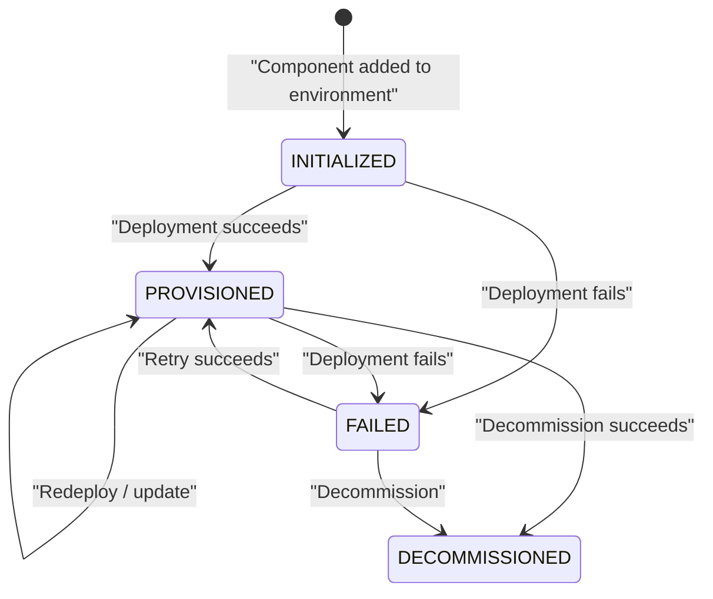

export const Bullet = () => <><span style={{ fontWeight: 'normal', fontSize: '.5em', color: 'var(--ifm-color-secondary-darkest)' }}>&nbsp;●&nbsp;</span></>

export const SpecifiedBy = (props) => <>Specification<a className="link" style={{ fontSize:'1.5em', paddingLeft:'4px' }} target="_blank" href={props.url} title={'Specified by ' + props.url}>⎘</a></>

export const Badge = (props) => <><span className={props.class}>{props.text}</span></>

import { useState } from 'react';

export const Details = ({ dataOpen, dataClose, children, startOpen = false }) => {
  const [open, setOpen] = useState(startOpen);
  return (
    <details {...(open ? { open: true } : {})} className="details" style={{ border:'none', boxShadow:'none', background:'var(--ifm-background-color)' }}>
      <summary
        onClick={(e) => {
          e.preventDefault();
          setOpen((open) => !open);
        }}
        style={{ listStyle:'none' }}
      >
      {open ? dataOpen : dataClose}
      </summary>
      {open && children}
    </details>
  );
};


A deployed piece of infrastructure in an environment.

An instance is the **runtime representation** of a component. When you add a
"database" component to your blueprint and deploy it to the `staging`
environment, Massdriver creates an instance that tracks the database's
configuration, deployment state, costs, and produced resources.

**Lifecycle:** Instances progress through a well-defined set of states:



**Version resolution:** Each instance has a `version` constraint (e.g., `~1.0`)
and a `releaseStrategy` (stable or development). Together these determine
the `resolvedVersion` that will be used on the next deployment. Compare
`resolvedVersion` with `deployedVersion` to see if a redeployment is needed,
or check `availableUpgrade` for newer matching releases.


```graphql
type Instance {
  id: ID!
  name: String!
  status: InstanceStatus!
  params: Map
  paramsSchema: Map!
  uiSchema: Map!
  secretFields: [InstanceSecretField!]!
  operatorGuide: String
  attributes: Map!
  effectiveAttributes: Map!
  version: VersionConstraint!
  releaseStrategy: ReleaseStrategy!
  createdAt: DateTime!
  updatedAt: DateTime!
  resolvedVersion: String!
  deployedVersion: String
  availableUpgrade: String
  cost: CostSummary!
  environment: Environment
  bundle: Bundle
  component: Component!
  statePaths: [InstanceStatePath!]!
  properties: [InstanceProperty!]!
  resources: [InstanceResource!]!
  alarms(
    cursor: Cursor
  ): AlarmsPage
  dependencies: [InstanceDependency!]!
  decommissionable: Deletable!
}
```


### Fields

#### [<code style={{ fontWeight: 'normal' }}>Instance.<b>id</b></code>](#id)<Bullet />[<code style={{ fontWeight: 'normal' }}><b>ID!</b></code>](/api/graphql/types/scalars/id.mdx) <Badge class="badge badge--secondary badge--non_null" text="non-null"/> <Badge class="badge badge--secondary " text="scalar"/> \{#id\} 


#### [<code style={{ fontWeight: 'normal' }}>Instance.<b>name</b></code>](#name)<Bullet />[<code style={{ fontWeight: 'normal' }}><b>String!</b></code>](/api/graphql/types/scalars/string.mdx) <Badge class="badge badge--secondary badge--non_null" text="non-null"/> <Badge class="badge badge--secondary " text="scalar"/> \{#name\} 
Name of the instance.


#### [<code style={{ fontWeight: 'normal' }}>Instance.<b>status</b></code>](#status)<Bullet />[<code style={{ fontWeight: 'normal' }}><b>InstanceStatus!</b></code>](/api/graphql/types/enums/instance-status.mdx) <Badge class="badge badge--secondary badge--non_null" text="non-null"/> <Badge class="badge badge--secondary " text="enum"/> \{#status\} 
Current lifecycle state of the instance.


#### [<code style={{ fontWeight: 'normal' }}>Instance.<b>params</b></code>](#params)<Bullet />[<code style={{ fontWeight: 'normal' }}><b>Map</b></code>](/api/graphql/types/scalars/map.mdx) <Badge class="badge badge--secondary " text="scalar"/> \{#params\} 
Cached configuration parameters from the most recent deployment. Null if the instance has never been deployed.


#### [<code style={{ fontWeight: 'normal' }}>Instance.<b>paramsSchema</b></code>](#params-schema)<Bullet />[<code style={{ fontWeight: 'normal' }}><b>Map!</b></code>](/api/graphql/types/scalars/map.mdx) <Badge class="badge badge--secondary badge--non_null" text="non-null"/> <Badge class="badge badge--secondary " text="scalar"/> \{#params-schema\} 
JSON Schema describing the configuration parameters this instance accepts.

The schema is sourced from the instance's resolved bundle release with
Massdriver's `$md` extensions evaluated against the current instance state:

- `$md.enum` is replaced with a `oneOf` list whose entries are computed by
  running the configured jq expression against the connected resource's
  payload. Missing connections or jq errors produce a single placeholder
  entry whose `title` begins with `ERROR:`.
- `$md.immutable` is rewritten to `readOnly: true` once the instance has
  reached a state where the field can no longer be changed (`PROVISIONED`
  or `FAILED`).

Use this schema to drive form rendering, client-side validation, or to
inspect the contract between the bundle and the deployer.


#### [<code style={{ fontWeight: 'normal' }}>Instance.<b>uiSchema</b></code>](#ui-schema)<Bullet />[<code style={{ fontWeight: 'normal' }}><b>Map!</b></code>](/api/graphql/types/scalars/map.mdx) <Badge class="badge badge--secondary badge--non_null" text="non-null"/> <Badge class="badge badge--secondary " text="scalar"/> \{#ui-schema\} 
UI hints describing how to render the params form.

Follows [react-jsonschema-form](https://rjsf-team.github.io/react-jsonschema-form/)'s
`uiSchema` conventions: keys mirror the params schema's structure and values
contain rendering directives (e.g., `ui:widget`, `ui:order`, `ui:help`).
Returns an empty object when the bundle does not provide UI hints.


#### [<code style={{ fontWeight: 'normal' }}>Instance.<b>secretFields</b></code>](#secret-fields)<Bullet />[<code style={{ fontWeight: 'normal' }}><b>[InstanceSecretField!]!</b></code>](/api/graphql/types/objects/instance-secret-field.mdx) <Badge class="badge badge--secondary badge--non_null" text="non-null"/> <Badge class="badge badge--secondary " text="object"/> \{#secret-fields\} 
Definitions of the secrets this instance's bundle expects, sorted by name.

Each entry pairs the bundle's declared field (name, required flag, optional title /
description) with the stored value's `sha256` fingerprint when one has been set.
Use null vs non-null `sha256` to render set/unset state. Secret values are never
returned by the API.


#### [<code style={{ fontWeight: 'normal' }}>Instance.<b>operatorGuide</b></code>](#operator-guide)<Bullet />[<code style={{ fontWeight: 'normal' }}><b>String</b></code>](/api/graphql/types/scalars/string.mdx) <Badge class="badge badge--secondary " text="scalar"/> \{#operator-guide\} 
Operator guide for this instance, rendered with the current instance state.

The bundle's raw guide is plain markdown that may include YAML front matter
selecting a templating engine (`mustache` or `liquid`). When templating is
enabled, the body is rendered with a context exposing the instance's
`id`, `params`, connected `connections` payloads, and produced `artifacts`
payloads -- with sensitive fields masked as `[SENSITIVE]`. When templating
is not declared (or the engine is unsupported), the raw guide is returned
unchanged. Returns null when the bundle does not provide an operator guide.


#### [<code style={{ fontWeight: 'normal' }}>Instance.<b>attributes</b></code>](#attributes)<Bullet />[<code style={{ fontWeight: 'normal' }}><b>Map!</b></code>](/api/graphql/types/scalars/map.mdx) <Badge class="badge badge--secondary badge--non_null" text="non-null"/> <Badge class="badge badge--secondary " text="scalar"/> \{#attributes\} 
Key-value attributes assigned directly to this instance.


#### [<code style={{ fontWeight: 'normal' }}>Instance.<b>effectiveAttributes</b></code>](#effective-attributes)<Bullet />[<code style={{ fontWeight: 'normal' }}><b>Map!</b></code>](/api/graphql/types/scalars/map.mdx) <Badge class="badge badge--secondary badge--non_null" text="non-null"/> <Badge class="badge badge--secondary " text="scalar"/> \{#effective-attributes\} 
The full attribute map the authorization system evaluates policies against for
this instance — user attributes merged across the hierarchy plus auto-injected
`md-*` system attributes.

User-attribute merge precedence (higher overrides lower): project &#x003E; environment &#x003E; component &#x003E; instance.

System attributes always present on an instance:
- `md-id` — the instance's identifier
- `md-project` — the project's identifier
- `md-environment` — the environment's local identifier
- `md-component` — the component's local identifier
- `md-repo` — the bundle's repo name
- `md-bundle` — `"{bundle}@{version}"` of the resolved release


#### [<code style={{ fontWeight: 'normal' }}>Instance.<b>version</b></code>](#version)<Bullet />[<code style={{ fontWeight: 'normal' }}><b>VersionConstraint!</b></code>](/api/graphql/types/scalars/version-constraint.mdx) <Badge class="badge badge--secondary badge--non_null" text="non-null"/> <Badge class="badge badge--secondary " text="scalar"/> \{#version\} 
The version constraint controlling which bundle releases are eligible for deployment. Accepts any value accepted by the `VersionConstraint` scalar: a pinned semver (e.g., `1.2.3`) or a release channel name as listed by `ociRepo.releaseChannels` (e.g., `latest`, `~1.2`, `~1.2+dev`). Round-trips: the value returned here is valid input for the next `updateInstance` mutation.


#### [<code style={{ fontWeight: 'normal' }}>Instance.<b>releaseStrategy</b></code>](#release-strategy)<Bullet />[<code style={{ fontWeight: 'normal' }}><b>ReleaseStrategy!</b></code>](/api/graphql/types/enums/release-strategy.mdx) <Badge class="badge badge--secondary badge--non_null" text="non-null"/> <Badge class="badge badge--secondary " text="enum"/> \{#release-strategy\} 
Deprecated. Derived from `version`: `:development` when `version` is a development release channel, otherwise `:stable`. Will be removed.


#### [<code style={{ fontWeight: 'normal' }}>Instance.<b>createdAt</b></code>](#created-at)<Bullet />[<code style={{ fontWeight: 'normal' }}><b>DateTime!</b></code>](/api/graphql/types/scalars/date-time.mdx) <Badge class="badge badge--secondary badge--non_null" text="non-null"/> <Badge class="badge badge--secondary " text="scalar"/> \{#created-at\} 
When this instance was created (UTC).


#### [<code style={{ fontWeight: 'normal' }}>Instance.<b>updatedAt</b></code>](#updated-at)<Bullet />[<code style={{ fontWeight: 'normal' }}><b>DateTime!</b></code>](/api/graphql/types/scalars/date-time.mdx) <Badge class="badge badge--secondary badge--non_null" text="non-null"/> <Badge class="badge badge--secondary " text="scalar"/> \{#updated-at\} 
When this instance was last modified (UTC).


#### [<code style={{ fontWeight: 'normal' }}>Instance.<b>resolvedVersion</b></code>](#resolved-version)<Bullet />[<code style={{ fontWeight: 'normal' }}><b>String!</b></code>](/api/graphql/types/scalars/string.mdx) <Badge class="badge badge--secondary badge--non_null" text="non-null"/> <Badge class="badge badge--secondary " text="scalar"/> \{#resolved-version\} 
The concrete bundle version resolved from the version constraint and release strategy.

This is the version that will be used on the **next** deployment. Compare
with `deployedVersion` to determine if a redeployment would change anything.


#### [<code style={{ fontWeight: 'normal' }}>Instance.<b>deployedVersion</b></code>](#deployed-version)<Bullet />[<code style={{ fontWeight: 'normal' }}><b>String</b></code>](/api/graphql/types/scalars/string.mdx) <Badge class="badge badge--secondary " text="scalar"/> \{#deployed-version\} 
The bundle version that was last successfully deployed to infrastructure.

May differ from `resolvedVersion` if the version constraint has been updated
but no deployment has occurred yet. Null if the instance has never been deployed.


#### [<code style={{ fontWeight: 'normal' }}>Instance.<b>availableUpgrade</b></code>](#available-upgrade)<Bullet />[<code style={{ fontWeight: 'normal' }}><b>String</b></code>](/api/graphql/types/scalars/string.mdx) <Badge class="badge badge--secondary " text="scalar"/> \{#available-upgrade\} 
The newest bundle version available that satisfies the version constraint.

Returns null if the instance is already on the latest matching version.
Use this field to detect when an upgrade is available.


#### [<code style={{ fontWeight: 'normal' }}>Instance.<b>cost</b></code>](#cost)<Bullet />[<code style={{ fontWeight: 'normal' }}><b>CostSummary!</b></code>](/api/graphql/types/objects/cost-summary.mdx) <Badge class="badge badge--secondary badge--non_null" text="non-null"/> <Badge class="badge badge--secondary " text="object"/> \{#cost\} 
Cloud provider cost summary for this instance, including daily and monthly breakdowns.


#### [<code style={{ fontWeight: 'normal' }}>Instance.<b>environment</b></code>](#environment)<Bullet />[<code style={{ fontWeight: 'normal' }}><b>Environment</b></code>](/api/graphql/types/objects/environment.mdx) <Badge class="badge badge--secondary " text="object"/> \{#environment\} 
The environment this instance is deployed in.


#### [<code style={{ fontWeight: 'normal' }}>Instance.<b>bundle</b></code>](#bundle)<Bullet />[<code style={{ fontWeight: 'normal' }}><b>Bundle</b></code>](/api/graphql/types/objects/bundle.mdx) <Badge class="badge badge--secondary " text="object"/> \{#bundle\} 
The bundle release currently resolved for this instance.


#### [<code style={{ fontWeight: 'normal' }}>Instance.<b>component</b></code>](#component)<Bullet />[<code style={{ fontWeight: 'normal' }}><b>Component!</b></code>](/api/graphql/types/objects/component.mdx) <Badge class="badge badge--secondary badge--non_null" text="non-null"/> <Badge class="badge badge--secondary " text="object"/> \{#component\} 
The component this instance was deployed from.


#### [<code style={{ fontWeight: 'normal' }}>Instance.<b>statePaths</b></code>](#state-paths)<Bullet />[<code style={{ fontWeight: 'normal' }}><b>[InstanceStatePath!]!</b></code>](/api/graphql/types/objects/instance-state-path.mdx) <Badge class="badge badge--secondary badge--non_null" text="non-null"/> <Badge class="badge badge--secondary " text="object"/> \{#state-paths\} 
Terraform/OpenTofu state paths for each provisioning step, ordered by the bundle's step definition.

Each bundle can define multiple steps (e.g., `core`, `iam`, `monitoring`). Use the
`stateUrl` to configure your Terraform backend or inspect state externally.


#### [<code style={{ fontWeight: 'normal' }}>Instance.<b>properties</b></code>](#properties)<Bullet />[<code style={{ fontWeight: 'normal' }}><b>[InstanceProperty!]!</b></code>](/api/graphql/types/objects/instance-property.mdx) <Badge class="badge badge--secondary badge--non_null" text="non-null"/> <Badge class="badge badge--secondary " text="object"/> \{#properties\} 
Flattened list of scalar leaf values published by this instance's resources.

Each entry corresponds to one scalar in a resource's payload (e.g. a database
hostname, a queue URL). Entries are drawn from both provisioned resources and
any remote references set on this instance.

Sensitive fields (marked `$md.sensitive: true` on the resource type's schema)
are returned as `"[SENSITIVE]"`. Paths are jq-style — identifier-safe keys as
`.key`, non-identifier keys quoted (`."app.kubernetes.io/name"`), array
elements as `[n]` (e.g. `.cluster.nodes[0].host`).


#### [<code style={{ fontWeight: 'normal' }}>Instance.<b>resources</b></code>](#resources)<Bullet />[<code style={{ fontWeight: 'normal' }}><b>[InstanceResource!]!</b></code>](/api/graphql/types/objects/instance-resource.mdx) <Badge class="badge badge--secondary badge--non_null" text="non-null"/> <Badge class="badge badge--secondary " text="object"/> \{#resources\} 
Resources produced by this instance, sorted alphabetically by field.

Resources are the outputs published after a successful deployment
(e.g., connection strings, endpoints, credentials). Other instances consume
these resources via connections.


#### [<code style={{ fontWeight: 'normal' }}>Instance.<b>alarms</b></code>](#alarms)<Bullet />[<code style={{ fontWeight: 'normal' }}><b>AlarmsPage</b></code>](/api/graphql/types/objects/alarms-page.mdx) <Badge class="badge badge--secondary " text="object"/> \{#alarms\} 
Paginated list of cloud metric alarms configured for this instance.

Alarms are provisioned by the Massdriver Terraform/OpenTofu provider and
receive state updates via webhooks from AWS CloudWatch, Azure Monitor,
GCP Cloud Monitoring, or Prometheus Alertmanager. Inspect `currentState`
to see whether an alarm is firing; a `null` `currentState` means no state
has been reported yet.
##### [<code style={{ fontWeight: 'normal' }}>Instance.alarms.<b>cursor</b></code>](#instance-alarms-cursor)<Bullet />[<code style={{ fontWeight: 'normal' }}><b>Cursor</b></code>](/api/graphql/types/inputs/cursor.mdx) <Badge class="badge badge--secondary " text="input"/> \{#instance-alarms-cursor\} 
Pagination cursor returned by a previous page.


#### [<code style={{ fontWeight: 'normal' }}>Instance.<b>dependencies</b></code>](#dependencies)<Bullet />[<code style={{ fontWeight: 'normal' }}><b>[InstanceDependency!]!</b></code>](/api/graphql/types/objects/instance-dependency.mdx) <Badge class="badge badge--secondary badge--non_null" text="non-null"/> <Badge class="badge badge--secondary " text="object"/> \{#dependencies\} 
Dependencies wired into this instance's bundle slots, sorted alphabetically by field.

Each entry is one filled slot from the bundle's `connections_schema` along
with the source object that filled it — a blueprint `Connection`, a
per-instance `RemoteReference`, or an `EnvironmentDefault` from the
environment. Unfilled slots are not included.


#### [<code style={{ fontWeight: 'normal' }}>Instance.<b>decommissionable</b></code>](#decommissionable)<Bullet />[<code style={{ fontWeight: 'normal' }}><b>Deletable!</b></code>](/api/graphql/types/objects/deletable.mdx) <Badge class="badge badge--secondary badge--non_null" text="non-null"/> <Badge class="badge badge--secondary " text="object"/> \{#decommissionable\} 
Whether this instance can be safely decommissioned right now. Check `constraints` for blocking conditions.

Decommissioning tears down the instance's provisioned cloud infrastructure and
moves the instance to `DECOMMISSIONED`. Decommissioning is blocked while another
instance is consuming this instance's resources, or while an environment default
is pinned to one of those resources.


### Returned By

[`instance`](/api/graphql/operations/queries/instance.mdx)  <Badge class="badge badge--secondary badge--relation" text="query"/>

### Member Of

[`Connection`](/api/graphql/types/objects/connection.mdx)  <Badge class="badge badge--secondary badge--relation" text="object"/><Bullet />[`Deployment`](/api/graphql/types/objects/deployment.mdx)  <Badge class="badge badge--secondary badge--relation" text="object"/><Bullet />[`Environment`](/api/graphql/types/objects/environment.mdx)  <Badge class="badge badge--secondary badge--relation" text="object"/><Bullet />[`InstanceComparison`](/api/graphql/types/objects/instance-comparison.mdx)  <Badge class="badge badge--secondary badge--relation" text="object"/><Bullet />[`InstanceEvent`](/api/graphql/types/objects/instance-event.mdx)  <Badge class="badge badge--secondary badge--relation" text="object"/><Bullet />[`InstancePayload`](/api/graphql/types/objects/instance-payload.mdx)  <Badge class="badge badge--secondary badge--relation" text="object"/><Bullet />[`InstancesPage`](/api/graphql/types/objects/instances-page.mdx)  <Badge class="badge badge--secondary badge--relation" text="object"/><Bullet />[`RemoteReference`](/api/graphql/types/objects/remote-reference.mdx)  <Badge class="badge badge--secondary badge--relation" text="object"/><Bullet />[`Resource`](/api/graphql/types/objects/resource.mdx)  <Badge class="badge badge--secondary badge--relation" text="object"/>