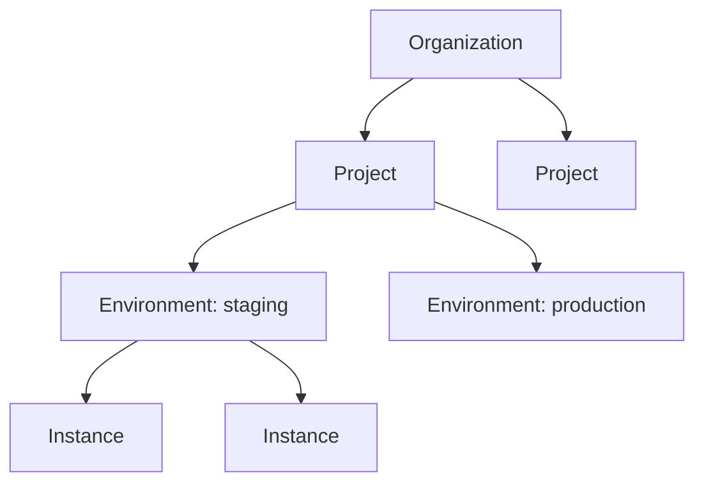

export const Bullet = () => <><span style={{ fontWeight: 'normal', fontSize: '.5em', color: 'var(--ifm-color-secondary-darkest)' }}>&nbsp;●&nbsp;</span></>

export const SpecifiedBy = (props) => <>Specification<a className="link" style={{ fontSize:'1.5em', paddingLeft:'4px' }} target="_blank" href={props.url} title={'Specified by ' + props.url}>⎘</a></>

export const Badge = (props) => <><span className={props.class}>{props.text}</span></>

import { useState } from 'react';

export const Details = ({ dataOpen, dataClose, children, startOpen = false }) => {
  const [open, setOpen] = useState(startOpen);
  return (
    <details {...(open ? { open: true } : {})} className="details" style={{ border:'none', boxShadow:'none', background:'var(--ifm-background-color)' }}>
      <summary
        onClick={(e) => {
          e.preventDefault();
          setOpen((open) => !open);
        }}
        style={{ listStyle:'none' }}
      >
      {open ? dataOpen : dataClose}
      </summary>
      {open && children}
    </details>
  );
};


The top-level account that owns all your infrastructure, projects, and team members.

An organization is the root of the Massdriver resource hierarchy. Everything you build
and deploy lives under an organization: **Projects** contain your infrastructure designs,
**Environments** (like staging and production) are where those designs come to life, and
**Instances** are the actual running cloud resources.



Members access resources through **group memberships** with role-based permissions.
Custom attributes defined at the organization level govern attribute metadata across all child resources.

Administrative fields (`billing`, `members`, `customAttributes`) resolve to `null` for
callers who lack the corresponding ABAC action; in that case a top-level `FORBIDDEN`
error is added to the response while the rest of the organization still resolves.


```graphql
type Organization {
  id: ID!
  name: String!
  createdAt: DateTime!
  updatedAt: DateTime!
  subscriptionStatus: OrganizationSubscriptionStatus!
  trialEndsAt: DateTime
  planExpiresOn: Date
  logo: LogoOrganization
  members(
    cursor: Cursor
  ): AccountsPage
  customAttributes(
    sort: CustomAttributesSort
    cursor: Cursor
  ): CustomAttributesPage
  billing: OrganizationBilling
}
```


### Fields

#### [<code style={{ fontWeight: 'normal' }}>Organization.<b>id</b></code>](#id)<Bullet />[<code style={{ fontWeight: 'normal' }}><b>ID!</b></code>](/api/graphql/types/scalars/id.mdx) <Badge class="badge badge--secondary badge--non_null" text="non-null"/> <Badge class="badge badge--secondary " text="scalar"/> \{#id\} 


#### [<code style={{ fontWeight: 'normal' }}>Organization.<b>name</b></code>](#name)<Bullet />[<code style={{ fontWeight: 'normal' }}><b>String!</b></code>](/api/graphql/types/scalars/string.mdx) <Badge class="badge badge--secondary badge--non_null" text="non-null"/> <Badge class="badge badge--secondary " text="scalar"/> \{#name\} 
Display name shown in the UI and CLI.


#### [<code style={{ fontWeight: 'normal' }}>Organization.<b>createdAt</b></code>](#created-at)<Bullet />[<code style={{ fontWeight: 'normal' }}><b>DateTime!</b></code>](/api/graphql/types/scalars/date-time.mdx) <Badge class="badge badge--secondary badge--non_null" text="non-null"/> <Badge class="badge badge--secondary " text="scalar"/> \{#created-at\} 
When this organization was created (UTC).


#### [<code style={{ fontWeight: 'normal' }}>Organization.<b>updatedAt</b></code>](#updated-at)<Bullet />[<code style={{ fontWeight: 'normal' }}><b>DateTime!</b></code>](/api/graphql/types/scalars/date-time.mdx) <Badge class="badge badge--secondary badge--non_null" text="non-null"/> <Badge class="badge badge--secondary " text="scalar"/> \{#updated-at\} 
When this organization was last modified (UTC).


#### [<code style={{ fontWeight: 'normal' }}>Organization.<b>subscriptionStatus</b></code>](#subscription-status)<Bullet />[<code style={{ fontWeight: 'normal' }}><b>OrganizationSubscriptionStatus!</b></code>](/api/graphql/types/enums/organization-subscription-status.mdx) <Badge class="badge badge--secondary badge--non_null" text="non-null"/> <Badge class="badge badge--secondary " text="enum"/> \{#subscription-status\} 
Subscription status of the organization. Visible to every member so the UI can
surface billing warnings or lock down features for delinquent accounts. Detailed
payment, seat, and invoice data live behind the admin-only `billing` field.


#### [<code style={{ fontWeight: 'normal' }}>Organization.<b>trialEndsAt</b></code>](#trial-ends-at)<Bullet />[<code style={{ fontWeight: 'normal' }}><b>DateTime</b></code>](/api/graphql/types/scalars/date-time.mdx) <Badge class="badge badge--secondary " text="scalar"/> \{#trial-ends-at\} 
When the current free trial expires (UTC).

Only populated while `subscriptionStatus` is `TRIAL`. If a paid plan is not
active by this timestamp, `subscriptionStatus` becomes `EXPIRED` and most
write operations are blocked until billing is resolved. Once the organization
upgrades to a paid plan or the trial expires, this field returns `null`.


#### [<code style={{ fontWeight: 'normal' }}>Organization.<b>planExpiresOn</b></code>](#plan-expires-on)<Bullet />[<code style={{ fontWeight: 'normal' }}><b>Date</b></code>](/api/graphql/types/scalars/date.mdx) <Badge class="badge badge--secondary " text="scalar"/> \{#plan-expires-on\} 
Date the current paid plan period ends.

Populated for annual plans (the date the prepaid year runs out) and for grace
periods after a failed payment. `null` for organizations on monthly plans
(which auto-renew without a fixed end date), trial-only organizations, and
organizations that have never had a paid plan.


#### [<code style={{ fontWeight: 'normal' }}>Organization.<b>logo</b></code>](#logo)<Bullet />[<code style={{ fontWeight: 'normal' }}><b>LogoOrganization</b></code>](/api/graphql/types/objects/logo-organization.mdx) <Badge class="badge badge--secondary " text="object"/> \{#logo\} 
The organization's logo image, or `null` if no logo has been uploaded.


#### [<code style={{ fontWeight: 'normal' }}>Organization.<b>members</b></code>](#members)<Bullet />[<code style={{ fontWeight: 'normal' }}><b>AccountsPage</b></code>](/api/graphql/types/objects/accounts-page.mdx) <Badge class="badge badge--secondary " text="object"/> \{#members\} 
Paginated list of every human account in this organization, whether or not they belong to a group.
Includes members provisioned by an identity provider (e.g. Okta) who have not yet been added to a group.

Sorted by email ascending. Service accounts live under the top-level `serviceAccounts`
query — pair both when rendering the full organization roster.

Requires the `organization:manageProfile` action.
##### [<code style={{ fontWeight: 'normal' }}>Organization.members.<b>cursor</b></code>](#organization-members-cursor)<Bullet />[<code style={{ fontWeight: 'normal' }}><b>Cursor</b></code>](/api/graphql/types/inputs/cursor.mdx) <Badge class="badge badge--secondary " text="input"/> \{#organization-members-cursor\} 
Cursor from a previous page to fetch the next set of results.


#### [<code style={{ fontWeight: 'normal' }}>Organization.<b>customAttributes</b></code>](#custom-attributes)<Bullet />[<code style={{ fontWeight: 'normal' }}><b>CustomAttributesPage</b></code>](/api/graphql/types/objects/custom-attributes-page.mdx) <Badge class="badge badge--secondary " text="object"/> \{#custom-attributes\} 
Paginated list of custom attributes that govern attribute metadata across this organization.

Requires the `organization:manageCustomAttributes` action.
##### [<code style={{ fontWeight: 'normal' }}>Organization.customAttributes.<b>sort</b></code>](#organization-custom-attributes-sort)<Bullet />[<code style={{ fontWeight: 'normal' }}><b>CustomAttributesSort</b></code>](/api/graphql/types/inputs/custom-attributes-sort.mdx) <Badge class="badge badge--secondary " text="input"/> \{#organization-custom-attributes-sort\} 
How to sort results. Defaults to alphabetical by key.


##### [<code style={{ fontWeight: 'normal' }}>Organization.customAttributes.<b>cursor</b></code>](#organization-custom-attributes-cursor)<Bullet />[<code style={{ fontWeight: 'normal' }}><b>Cursor</b></code>](/api/graphql/types/inputs/cursor.mdx) <Badge class="badge badge--secondary " text="input"/> \{#organization-custom-attributes-cursor\} 
Cursor from a previous page to fetch the next set of results.


#### [<code style={{ fontWeight: 'normal' }}>Organization.<b>billing</b></code>](#billing)<Bullet />[<code style={{ fontWeight: 'normal' }}><b>OrganizationBilling</b></code>](/api/graphql/types/objects/organization-billing.mdx) <Badge class="badge badge--secondary " text="object"/> \{#billing\} 
Subscription, trial, and upgrade information for this organization.

Requires the `organization:manageBilling` action. The non-sensitive
`subscriptionStatus` field at the top of the type stays visible to every member.


### Returned By

[`organization`](/api/graphql/operations/queries/organization.mdx)  <Badge class="badge badge--secondary badge--relation" text="query"/>

### Member Of

[`AccessToken`](/api/graphql/types/objects/access-token.mdx)  <Badge class="badge badge--secondary badge--relation" text="object"/><Bullet />[`AccountViewer`](/api/graphql/types/objects/account-viewer.mdx)  <Badge class="badge badge--secondary badge--relation" text="object"/><Bullet />[`OrganizationPayload`](/api/graphql/types/objects/organization-payload.mdx)  <Badge class="badge badge--secondary badge--relation" text="object"/><Bullet />[`OrganizationsPage`](/api/graphql/types/objects/organizations-page.mdx)  <Badge class="badge badge--secondary badge--relation" text="object"/><Bullet />[`ServiceAccountViewer`](/api/graphql/types/objects/service-account-viewer.mdx)  <Badge class="badge badge--secondary badge--relation" text="object"/>