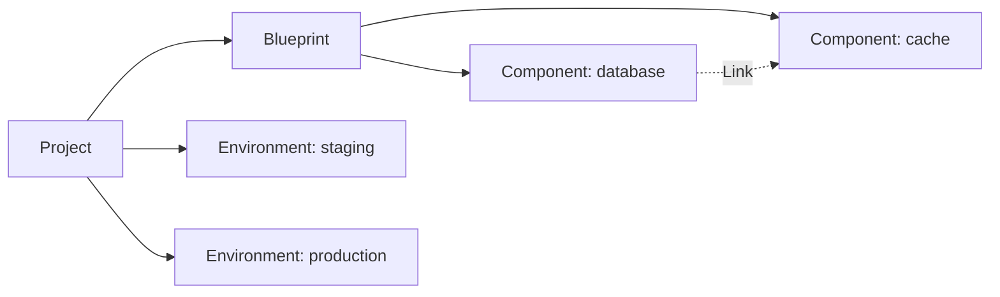

export const Bullet = () => <><span style={{ fontWeight: 'normal', fontSize: '.5em', color: 'var(--ifm-color-secondary-darkest)' }}>&nbsp;●&nbsp;</span></>

export const SpecifiedBy = (props) => <>Specification<a className="link" style={{ fontSize:'1.5em', paddingLeft:'4px' }} target="_blank" href={props.url} title={'Specified by ' + props.url}>⎘</a></>

export const Badge = (props) => <><span className={props.class}>{props.text}</span></>

import { useState } from 'react';

export const Details = ({ dataOpen, dataClose, children, startOpen = false }) => {
  const [open, setOpen] = useState(startOpen);
  return (
    <details {...(open ? { open: true } : {})} className="details" style={{ border:'none', boxShadow:'none', background:'var(--ifm-background-color)' }}>
      <summary
        onClick={(e) => {
          e.preventDefault();
          setOpen((open) => !open);
        }}
        style={{ listStyle:'none' }}
      >
      {open ? dataOpen : dataClose}
      </summary>
      {open && children}
    </details>
  );
};


A project organizes related infrastructure under a single blueprint.

Each project contains a **Blueprint** that defines your infrastructure architecture -- which
bundles to use and how they connect -- and one or more **Environments** (like staging or
production) where that architecture is actually deployed.



Attributes set on a project are inherited by all environments and instances within it.


```graphql
type Project {
  id: ID!
  name: String!
  description: String
  attributes: Map!
  effectiveAttributes: Map!
  createdAt: DateTime!
  updatedAt: DateTime!
  deletable: Deletable!
  cost: CostSummary!
  environments(
    sort: EnvironmentsSort
    cursor: Cursor
  ): EnvironmentsPage
  blueprint: Blueprint
}
```


### Fields

#### [<code style={{ fontWeight: 'normal' }}>Project.<b>id</b></code>](#id)<Bullet />[<code style={{ fontWeight: 'normal' }}><b>ID!</b></code>](/api/graphql/types/scalars/id.mdx) <Badge class="badge badge--secondary badge--non_null" text="non-null"/> <Badge class="badge badge--secondary " text="scalar"/> \{#id\} 


#### [<code style={{ fontWeight: 'normal' }}>Project.<b>name</b></code>](#name)<Bullet />[<code style={{ fontWeight: 'normal' }}><b>String!</b></code>](/api/graphql/types/scalars/string.mdx) <Badge class="badge badge--secondary badge--non_null" text="non-null"/> <Badge class="badge badge--secondary " text="scalar"/> \{#name\} 
Display name shown in the UI and CLI. Must be unique within the organization.


#### [<code style={{ fontWeight: 'normal' }}>Project.<b>description</b></code>](#description)<Bullet />[<code style={{ fontWeight: 'normal' }}><b>String</b></code>](/api/graphql/types/scalars/string.mdx) <Badge class="badge badge--secondary " text="scalar"/> \{#description\} 
Free-text description of what this project is for.


#### [<code style={{ fontWeight: 'normal' }}>Project.<b>attributes</b></code>](#attributes)<Bullet />[<code style={{ fontWeight: 'normal' }}><b>Map!</b></code>](/api/graphql/types/scalars/map.mdx) <Badge class="badge badge--secondary badge--non_null" text="non-null"/> <Badge class="badge badge--secondary " text="scalar"/> \{#attributes\} 
Key-value attributes assigned directly to this project. Attributes cascade to environments and instances. Must conform to your organization's custom attributes for the `PROJECT` scope.


#### [<code style={{ fontWeight: 'normal' }}>Project.<b>effectiveAttributes</b></code>](#effective-attributes)<Bullet />[<code style={{ fontWeight: 'normal' }}><b>Map!</b></code>](/api/graphql/types/scalars/map.mdx) <Badge class="badge badge--secondary badge--non_null" text="non-null"/> <Badge class="badge badge--secondary " text="scalar"/> \{#effective-attributes\} 
The full attribute map the authorization system evaluates policies against for
this project — the project's own user attributes plus auto-injected `md-*` system attributes.

System attributes always present on a project:
- `md-id` — the project's identifier
- `md-project` — the project's identifier


#### [<code style={{ fontWeight: 'normal' }}>Project.<b>createdAt</b></code>](#created-at)<Bullet />[<code style={{ fontWeight: 'normal' }}><b>DateTime!</b></code>](/api/graphql/types/scalars/date-time.mdx) <Badge class="badge badge--secondary badge--non_null" text="non-null"/> <Badge class="badge badge--secondary " text="scalar"/> \{#created-at\} 
When this project was created (UTC).


#### [<code style={{ fontWeight: 'normal' }}>Project.<b>updatedAt</b></code>](#updated-at)<Bullet />[<code style={{ fontWeight: 'normal' }}><b>DateTime!</b></code>](/api/graphql/types/scalars/date-time.mdx) <Badge class="badge badge--secondary badge--non_null" text="non-null"/> <Badge class="badge badge--secondary " text="scalar"/> \{#updated-at\} 
When this project was last modified (UTC).


#### [<code style={{ fontWeight: 'normal' }}>Project.<b>deletable</b></code>](#deletable)<Bullet />[<code style={{ fontWeight: 'normal' }}><b>Deletable!</b></code>](/api/graphql/types/objects/deletable.mdx) <Badge class="badge badge--secondary badge--non_null" text="non-null"/> <Badge class="badge badge--secondary " text="object"/> \{#deletable\} 
Whether this project can be safely deleted. Check `constraints` for blocking conditions.


#### [<code style={{ fontWeight: 'normal' }}>Project.<b>cost</b></code>](#cost)<Bullet />[<code style={{ fontWeight: 'normal' }}><b>CostSummary!</b></code>](/api/graphql/types/objects/cost-summary.mdx) <Badge class="badge badge--secondary badge--non_null" text="non-null"/> <Badge class="badge badge--secondary " text="object"/> \{#cost\} 
Aggregated cloud-provider cost metrics for all instances in this project.


#### [<code style={{ fontWeight: 'normal' }}>Project.<b>environments</b></code>](#environments)<Bullet />[<code style={{ fontWeight: 'normal' }}><b>EnvironmentsPage</b></code>](/api/graphql/types/objects/environments-page.mdx) <Badge class="badge badge--secondary " text="object"/> \{#environments\} 
Paginated list of environments in this project (e.g., staging, production).
##### [<code style={{ fontWeight: 'normal' }}>Project.environments.<b>sort</b></code>](#project-environments-sort)<Bullet />[<code style={{ fontWeight: 'normal' }}><b>EnvironmentsSort</b></code>](/api/graphql/types/inputs/environments-sort.mdx) <Badge class="badge badge--secondary " text="input"/> \{#project-environments-sort\} 
How to sort results. Defaults to alphabetical by name.


##### [<code style={{ fontWeight: 'normal' }}>Project.environments.<b>cursor</b></code>](#project-environments-cursor)<Bullet />[<code style={{ fontWeight: 'normal' }}><b>Cursor</b></code>](/api/graphql/types/inputs/cursor.mdx) <Badge class="badge badge--secondary " text="input"/> \{#project-environments-cursor\} 
Cursor from a previous page to fetch the next set of results.


#### [<code style={{ fontWeight: 'normal' }}>Project.<b>blueprint</b></code>](#blueprint)<Bullet />[<code style={{ fontWeight: 'normal' }}><b>Blueprint</b></code>](/api/graphql/types/objects/blueprint.mdx) <Badge class="badge badge--secondary " text="object"/> \{#blueprint\} 
The infrastructure blueprint defining this project's components and their connections.


### Returned By

[`project`](/api/graphql/operations/queries/project.mdx)  <Badge class="badge badge--secondary badge--relation" text="query"/>

### Member Of

[`Component`](/api/graphql/types/objects/component.mdx)  <Badge class="badge badge--secondary badge--relation" text="object"/><Bullet />[`Environment`](/api/graphql/types/objects/environment.mdx)  <Badge class="badge badge--secondary badge--relation" text="object"/><Bullet />[`ProjectEvent`](/api/graphql/types/objects/project-event.mdx)  <Badge class="badge badge--secondary badge--relation" text="object"/><Bullet />[`ProjectPayload`](/api/graphql/types/objects/project-payload.mdx)  <Badge class="badge badge--secondary badge--relation" text="object"/><Bullet />[`ProjectsPage`](/api/graphql/types/objects/projects-page.mdx)  <Badge class="badge badge--secondary badge--relation" text="object"/>