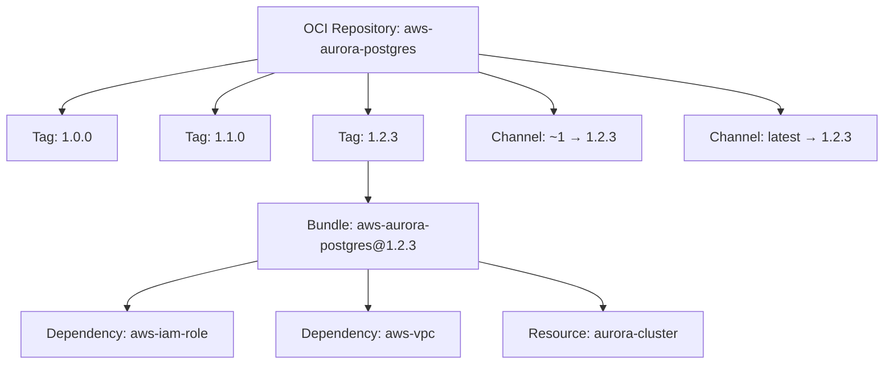

export const Bullet = () => <><span style={{ fontWeight: 'normal', fontSize: '.5em', color: 'var(--ifm-color-secondary-darkest)' }}>&nbsp;●&nbsp;</span></>

export const SpecifiedBy = (props) => <>Specification<a className="link" style={{ fontSize:'1.5em', paddingLeft:'4px' }} target="_blank" href={props.url} title={'Specified by ' + props.url}>⎘</a></>

export const Badge = (props) => <><span className={props.class}>{props.text}</span></>

import { useState } from 'react';

export const Details = ({ dataOpen, dataClose, children, startOpen = false }) => {
  const [open, setOpen] = useState(startOpen);
  return (
    <details {...(open ? { open: true } : {})} className="details" style={{ border:'none', boxShadow:'none', background:'var(--ifm-background-color)' }}>
      <summary
        onClick={(e) => {
          e.preventDefault();
          setOpen((open) => !open);
        }}
        style={{ listStyle:'none' }}
      >
      {open ? dataOpen : dataClose}
      </summary>
      {open && children}
    </details>
  );
};


Fetch a single bundle by its composite identifier.

The `id` accepts a `name@version` string where the version portion can be an
exact semver, a release channel, or omitted entirely:

| Input | Resolves to |
|-------|-------------|
| `aws-aurora-postgres@1.2.3` | Exact version `1.2.3` |
| `aws-aurora-postgres@~1.2` | Latest patch in `1.2.x` |
| `aws-aurora-postgres@~1` | Latest minor in `1.x.x` |
| `aws-aurora-postgres@latest` | Newest stable release |
| `aws-aurora-postgres@latest+dev` | Newest release including dev builds |
| `aws-aurora-postgres` | Shorthand for `latest` (falls back to `latest+dev` if no stable exists) |

Returns `null` with a `NOT_FOUND` error if no matching version exists.

```graphql
query {
  bundle(organizationId: "your-org-id", id: "aws-aurora-postgres@~1") {
    id
    version
    dependencies { name required resourceType { id name } }
    resources { name required resourceType { id name } }
  }
}
```


```graphql
bundle(
  organizationId: ID!
  id: BundleId!
): Bundle
```


### Arguments

#### [<code style={{ fontWeight: 'normal' }}>bundle.<b>organizationId</b></code>](#organization-id)<Bullet />[<code style={{ fontWeight: 'normal' }}><b>ID!</b></code>](/api/graphql/v1/types/scalars/id.mdx) <Badge class="badge badge--secondary badge--non_null" text="non-null"/> <Badge class="badge badge--secondary " text="scalar"/> \{#organization-id\} 
Your organization's unique identifier.


#### [<code style={{ fontWeight: 'normal' }}>bundle.<b>id</b></code>](#id)<Bullet />[<code style={{ fontWeight: 'normal' }}><b>BundleId!</b></code>](/api/graphql/v1/types/scalars/bundle-id.mdx) <Badge class="badge badge--secondary badge--non_null" text="non-null"/> <Badge class="badge badge--secondary " text="scalar"/> \{#id\} 
Bundle identifier in `name@version` format. The version can be an exact semver, a release channel, or omitted to resolve `latest`.


### Type

#### [<code style={{ fontWeight: 'normal' }}><b>Bundle</b></code>](/api/graphql/v1/types/objects/bundle.mdx) <Badge class="badge badge--secondary " text="object"/> 
A versioned infrastructure-as-code package.

A bundle is a single published version of an IaC package in your organization's
catalog. Each bundle belongs to an OCI repository and is identified by a composite
`name@version` string (e.g., `aws-aurora-postgres@1.2.3`).

Bundles declare **dependencies** (inputs they require from other bundles) and
**resources** (outputs they produce). These declarations drive the connection
system on the Massdriver canvas -- when you add a component to a blueprint,
the platform knows which other components can satisfy its dependencies.

