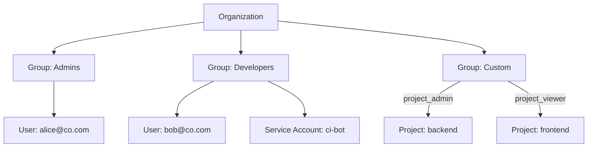

export const Bullet = () => <><span style={{ fontWeight: 'normal', fontSize: '.5em', color: 'var(--ifm-color-secondary-darkest)' }}>&nbsp;●&nbsp;</span></>

export const SpecifiedBy = (props) => <>Specification<a className="link" style={{ fontSize:'1.5em', paddingLeft:'4px' }} target="_blank" href={props.url} title={'Specified by ' + props.url}>⎘</a></>

export const Badge = (props) => <><span className={props.class}>{props.text}</span></>

import { useState } from 'react';

export const Details = ({ dataOpen, dataClose, children, startOpen = false }) => {
  const [open, setOpen] = useState(startOpen);
  return (
    <details {...(open ? { open: true } : {})} className="details" style={{ border:'none', boxShadow:'none', background:'var(--ifm-background-color)' }}>
      <summary
        onClick={(e) => {
          e.preventDefault();
          setOpen((open) => !open);
        }}
        style={{ listStyle:'none' }}
      >
      {open ? dataOpen : dataClose}
      </summary>
      {open && children}
    </details>
  );
};


Retrieve a single group by its identifier.

Returns `null` with a `NOT_FOUND` error if the group does not exist or you do not have
permission to view it.


```graphql
group(
  organizationId: ID!
  id: ID!
): Group
```


### Arguments

#### [<code style={{ fontWeight: 'normal' }}>group.<b>organizationId</b></code>](#organization-id)<Bullet />[<code style={{ fontWeight: 'normal' }}><b>ID!</b></code>](/api/graphql/v1/types/scalars/id.mdx) <Badge class="badge badge--secondary badge--non_null" text="non-null"/> <Badge class="badge badge--secondary " text="scalar"/> \{#organization-id\} 
Your organization's unique identifier.


#### [<code style={{ fontWeight: 'normal' }}>group.<b>id</b></code>](#id)<Bullet />[<code style={{ fontWeight: 'normal' }}><b>ID!</b></code>](/api/graphql/v1/types/scalars/id.mdx) <Badge class="badge badge--secondary badge--non_null" text="non-null"/> <Badge class="badge badge--secondary " text="scalar"/> \{#id\} 
The group's unique identifier.


### Type

#### [<code style={{ fontWeight: 'normal' }}><b>Group</b></code>](/api/graphql/v1/types/objects/group.mdx) <Badge class="badge badge--secondary " text="object"/> 
A collection of users and service accounts that share the same access level within your organization.

Groups are the primary mechanism for managing access control in Massdriver. Rather than
assigning permissions to individual users, you add them to groups that define what they
can see and do.



&#x002A;&#x002A;Built-in groups&#x002A;&#x002A; — Every organization starts with an `Admins` group (`organization_admin` role)
and a `Viewers` group (`organization_viewer` role). These cannot be deleted.

&#x002A;&#x002A;Custom groups&#x002A;&#x002A; — Create custom groups with the `CUSTOM` role to grant project-level access.
Each custom group can be assigned `project_admin` or `project_viewer` on specific projects.

&#x002A;&#x002A;Members&#x002A;&#x002A; — Both human users and service accounts can be group members. Users are added via
email invitation; service accounts are added directly.