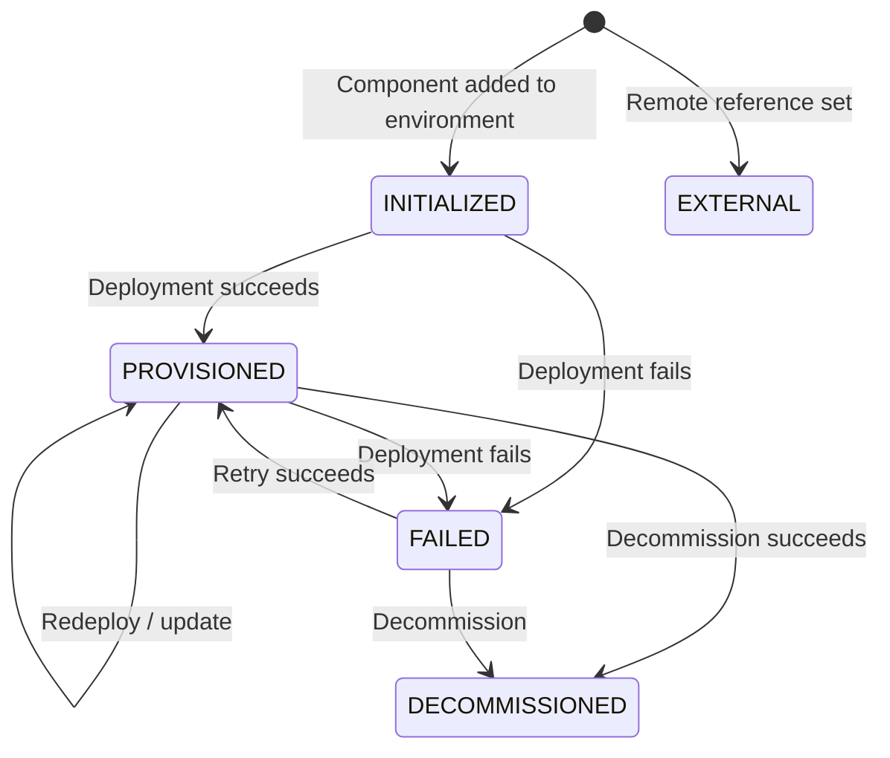

export const Bullet = () => <><span style={{ fontWeight: 'normal', fontSize: '.5em', color: 'var(--ifm-color-secondary-darkest)' }}>&nbsp;●&nbsp;</span></>

export const SpecifiedBy = (props) => <>Specification<a className="link" style={{ fontSize:'1.5em', paddingLeft:'4px' }} target="_blank" href={props.url} title={'Specified by ' + props.url}>⎘</a></>

export const Badge = (props) => <><span className={props.class}>{props.text}</span></>

import { useState } from 'react';

export const Details = ({ dataOpen, dataClose, children, startOpen = false }) => {
  const [open, setOpen] = useState(startOpen);
  return (
    <details {...(open ? { open: true } : {})} className="details" style={{ border:'none', boxShadow:'none', background:'var(--ifm-background-color)' }}>
      <summary
        onClick={(e) => {
          e.preventDefault();
          setOpen((open) => !open);
        }}
        style={{ listStyle:'none' }}
      >
      {open ? dataOpen : dataClose}
      </summary>
      {open && children}
    </details>
  );
};


Fetch a single instance by its ID. Returns null with a `NOT_FOUND` error if the instance does not exist.


```graphql
instance(
  organizationId: ID!
  id: ID!
): Instance
```


### Arguments

#### [<code style={{ fontWeight: 'normal' }}>instance.<b>organizationId</b></code>](#organization-id)<Bullet />[<code style={{ fontWeight: 'normal' }}><b>ID!</b></code>](/api/graphql/v1/types/scalars/id.mdx) <Badge class="badge badge--secondary badge--non_null" text="non-null"/> <Badge class="badge badge--secondary " text="scalar"/> \{#organization-id\} 
Your organization's unique identifier.


#### [<code style={{ fontWeight: 'normal' }}>instance.<b>id</b></code>](#id)<Bullet />[<code style={{ fontWeight: 'normal' }}><b>ID!</b></code>](/api/graphql/v1/types/scalars/id.mdx) <Badge class="badge badge--secondary badge--non_null" text="non-null"/> <Badge class="badge badge--secondary " text="scalar"/> \{#id\} 
The instance ID to look up.


### Type

#### [<code style={{ fontWeight: 'normal' }}><b>Instance</b></code>](/api/graphql/v1/types/objects/instance.mdx) <Badge class="badge badge--secondary " text="object"/> 
A deployed piece of infrastructure in an environment.

An instance is the &#x002A;&#x002A;runtime representation&#x002A;&#x002A; of a component. When you add a
"database" component to your blueprint and deploy it to the `staging`
environment, Massdriver creates an instance that tracks the database's
configuration, deployment state, costs, and produced resources.

&#x002A;&#x002A;Lifecycle:&#x002A;&#x002A; Instances progress through a well-defined set of states:



&#x002A;&#x002A;Version resolution:&#x002A;&#x002A; Each instance has a `version` constraint (e.g., `~1.0`)
and a `releaseStrategy` (stable or development). Together these determine
the `resolvedVersion` that will be used on the next deployment. Compare
`resolvedVersion` with `deployedVersion` to see if a redeployment is needed,
or check `availableUpgrade` for newer matching releases.