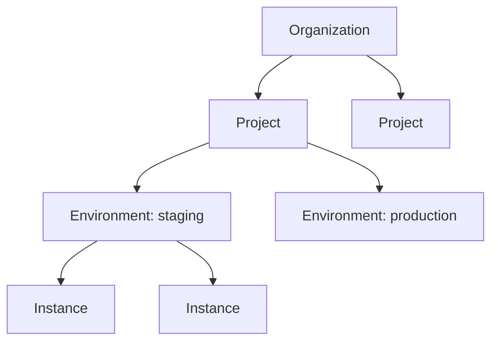

export const Bullet = () => <><span style={{ fontWeight: 'normal', fontSize: '.5em', color: 'var(--ifm-color-secondary-darkest)' }}>&nbsp;●&nbsp;</span></>

export const SpecifiedBy = (props) => <>Specification<a className="link" style={{ fontSize:'1.5em', paddingLeft:'4px' }} target="_blank" href={props.url} title={'Specified by ' + props.url}>⎘</a></>

export const Badge = (props) => <><span className={props.class}>{props.text}</span></>

import { useState } from 'react';

export const Details = ({ dataOpen, dataClose, children, startOpen = false }) => {
  const [open, setOpen] = useState(startOpen);
  return (
    <details {...(open ? { open: true } : {})} className="details" style={{ border:'none', boxShadow:'none', background:'var(--ifm-background-color)' }}>
      <summary
        onClick={(e) => {
          e.preventDefault();
          setOpen((open) => !open);
        }}
        style={{ listStyle:'none' }}
      >
      {open ? dataOpen : dataClose}
      </summary>
      {open && children}
    </details>
  );
};


Fetch your organization's details, including tag constraints and logo.

```graphql
query {
  organization(organizationId: "my-org") {
    id
    name
    tagConstraints { items { key scope required } }
  }
}
```


```graphql
organization(
  organizationId: ID!
): Organization
```


### Arguments

#### [<code style={{ fontWeight: 'normal' }}>organization.<b>organizationId</b></code>](#organization-id)<Bullet />[<code style={{ fontWeight: 'normal' }}><b>ID!</b></code>](/api/graphql/v1/types/scalars/id.mdx) <Badge class="badge badge--secondary badge--non_null" text="non-null"/> <Badge class="badge badge--secondary " text="scalar"/> \{#organization-id\} 
Your organization's unique identifier.


### Type

#### [<code style={{ fontWeight: 'normal' }}><b>Organization</b></code>](/api/graphql/v1/types/objects/organization.mdx) <Badge class="badge badge--secondary " text="object"/> 
The top-level account that owns all your infrastructure, projects, and team members.

An organization is the root of the Massdriver resource hierarchy. Everything you build
and deploy lives under an organization: **Projects** contain your infrastructure designs,
**Environments** (like staging and production) are where those designs come to life, and
**Instances** are the actual running cloud resources.



Members access resources through **group memberships** with role-based permissions.
Tag constraints defined at the organization level govern tagging across all child resources.