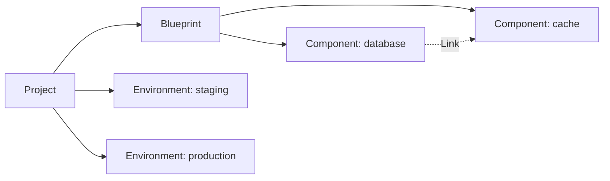

export const Bullet = () => <><span style={{ fontWeight: 'normal', fontSize: '.5em', color: 'var(--ifm-color-secondary-darkest)' }}>&nbsp;●&nbsp;</span></>

export const SpecifiedBy = (props) => <>Specification<a className="link" style={{ fontSize:'1.5em', paddingLeft:'4px' }} target="_blank" href={props.url} title={'Specified by ' + props.url}>⎘</a></>

export const Badge = (props) => <><span className={props.class}>{props.text}</span></>

import { useState } from 'react';

export const Details = ({ dataOpen, dataClose, children, startOpen = false }) => {
  const [open, setOpen] = useState(startOpen);
  return (
    <details {...(open ? { open: true } : {})} className="details" style={{ border:'none', boxShadow:'none', background:'var(--ifm-background-color)' }}>
      <summary
        onClick={(e) => {
          e.preventDefault();
          setOpen((open) => !open);
        }}
        style={{ listStyle:'none' }}
      >
      {open ? dataOpen : dataClose}
      </summary>
      {open && children}
    </details>
  );
};


Fetch a single project by its identifier.


```graphql
project(
  organizationId: ID!
  id: ID!
): Project
```


### Arguments

#### [<code style={{ fontWeight: 'normal' }}>project.<b>organizationId</b></code>](#organization-id)<Bullet />[<code style={{ fontWeight: 'normal' }}><b>ID!</b></code>](/api/graphql/v1/types/scalars/id.mdx) <Badge class="badge badge--secondary badge--non_null" text="non-null"/> <Badge class="badge badge--secondary " text="scalar"/> \{#organization-id\} 
Your organization's unique identifier.


#### [<code style={{ fontWeight: 'normal' }}>project.<b>id</b></code>](#id)<Bullet />[<code style={{ fontWeight: 'normal' }}><b>ID!</b></code>](/api/graphql/v1/types/scalars/id.mdx) <Badge class="badge badge--secondary badge--non_null" text="non-null"/> <Badge class="badge badge--secondary " text="scalar"/> \{#id\} 
The project's unique identifier.


### Type

#### [<code style={{ fontWeight: 'normal' }}><b>Project</b></code>](/api/graphql/v1/types/objects/project.mdx) <Badge class="badge badge--secondary " text="object"/> 
A project organizes related infrastructure under a single blueprint.

Each project contains a &#x002A;&#x002A;Blueprint&#x002A;&#x002A; that defines your infrastructure architecture -- which
bundles to use and how they connect -- and one or more &#x002A;&#x002A;Environments&#x002A;&#x002A; (like staging or
production) where that architecture is actually deployed.



Tags set on a project are inherited by all environments and instances within it.