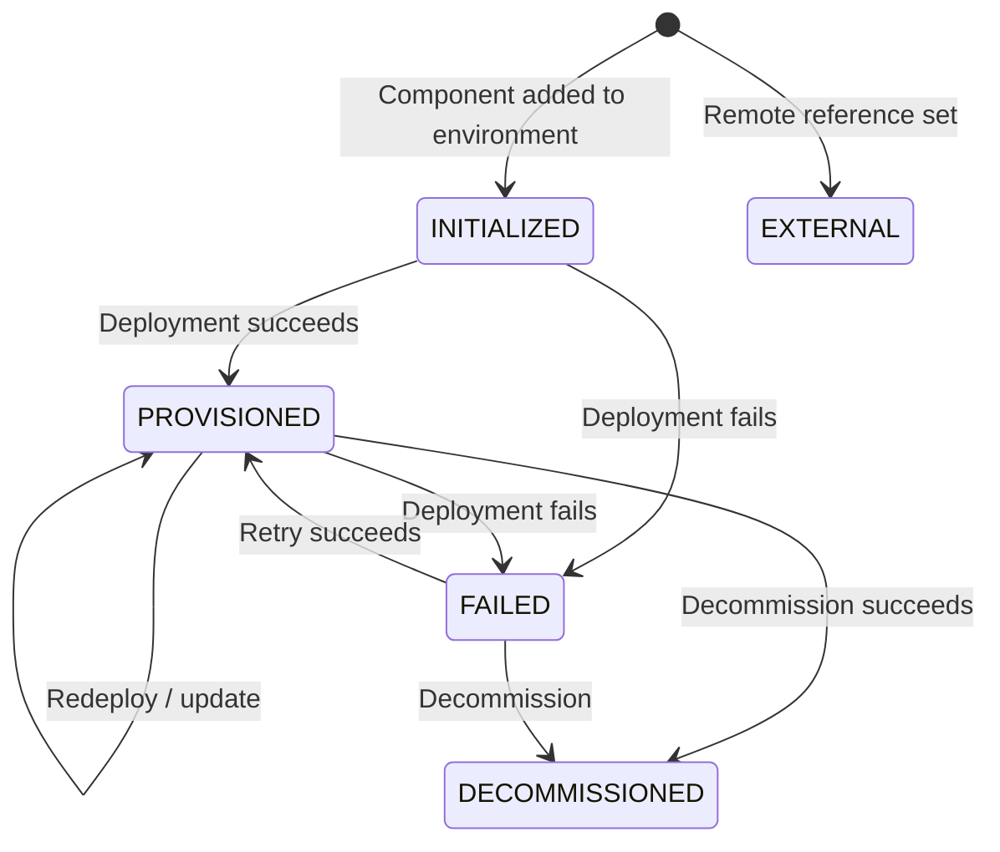

export const Bullet = () => <><span style={{ fontWeight: 'normal', fontSize: '.5em', color: 'var(--ifm-color-secondary-darkest)' }}>&nbsp;●&nbsp;</span></>

export const SpecifiedBy = (props) => <>Specification<a className="link" style={{ fontSize:'1.5em', paddingLeft:'4px' }} target="_blank" href={props.url} title={'Specified by ' + props.url}>⎘</a></>

export const Badge = (props) => <><span className={props.class}>{props.text}</span></>

import { useState } from 'react';

export const Details = ({ dataOpen, dataClose, children, startOpen = false }) => {
  const [open, setOpen] = useState(startOpen);
  return (
    <details {...(open ? { open: true } : {})} className="details" style={{ border:'none', boxShadow:'none', background:'var(--ifm-background-color)' }}>
      <summary
        onClick={(e) => {
          e.preventDefault();
          setOpen((open) => !open);
        }}
        style={{ listStyle:'none' }}
      >
      {open ? dataOpen : dataClose}
      </summary>
      {open && children}
    </details>
  );
};


The current lifecycle state of an instance.




```graphql
enum InstanceStatus {
  INITIALIZED
  PROVISIONED
  DECOMMISSIONED
  FAILED
  EXTERNAL
}
```


### Values

#### [<code style={{ fontWeight: 'normal' }}>InstanceStatus.<b>INITIALIZED</b></code>](#initialized) \{#initialized\} 
The instance has been created but no deployment has started yet.


#### [<code style={{ fontWeight: 'normal' }}>InstanceStatus.<b>PROVISIONED</b></code>](#provisioned) \{#provisioned\} 
Infrastructure is successfully deployed and running.


#### [<code style={{ fontWeight: 'normal' }}>InstanceStatus.<b>DECOMMISSIONED</b></code>](#decommissioned) \{#decommissioned\} 
Infrastructure has been torn down. The instance record is retained for audit purposes.


#### [<code style={{ fontWeight: 'normal' }}>InstanceStatus.<b>FAILED</b></code>](#failed) \{#failed\} 
The most recent deployment failed. Check deployment logs for details. Can be retried.


#### [<code style={{ fontWeight: 'normal' }}>InstanceStatus.<b>EXTERNAL</b></code>](#external) \{#external\} 
Imported infrastructure managed outside Massdriver. Not deployed by Massdriver but tracked for wiring.


### Member Of

[`Instance`](/api/graphql/v1/types/objects/instance.mdx)  <Badge class="badge badge--secondary badge--relation" text="object"/><Bullet />[`InstanceStatusFilter`](/api/graphql/v1/types/inputs/instance-status-filter.mdx)  <Badge class="badge badge--secondary badge--relation" text="input"/>