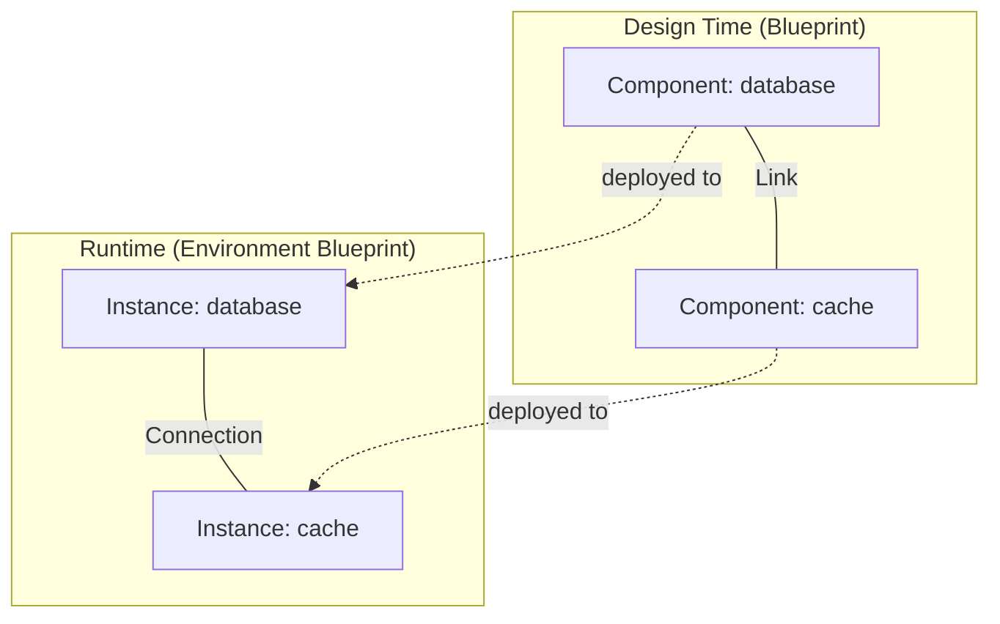

export const Bullet = () => <><span style={{ fontWeight: 'normal', fontSize: '.5em', color: 'var(--ifm-color-secondary-darkest)' }}>&nbsp;●&nbsp;</span></>

export const SpecifiedBy = (props) => <>Specification<a className="link" style={{ fontSize:'1.5em', paddingLeft:'4px' }} target="_blank" href={props.url} title={'Specified by ' + props.url}>⎘</a></>

export const Badge = (props) => <><span className={props.class}>{props.text}</span></>

import { useState } from 'react';

export const Details = ({ dataOpen, dataClose, children, startOpen = false }) => {
  const [open, setOpen] = useState(startOpen);
  return (
    <details {...(open ? { open: true } : {})} className="details" style={{ border:'none', boxShadow:'none', background:'var(--ifm-background-color)' }}>
      <summary
        onClick={(e) => {
          e.preventDefault();
          setOpen((open) => !open);
        }}
        style={{ listStyle:'none' }}
      >
      {open ? dataOpen : dataClose}
      </summary>
      {open && children}
    </details>
  );
};


A project's infrastructure blueprint -- the design-time architecture.

The blueprint is the canonical description of how your infrastructure fits
together. It contains &#x002A;&#x002A;components&#x002A;&#x002A; (the bundles you want to deploy) and
&#x002A;&#x002A;links&#x002A;&#x002A; (the wiring between them).

Every project has exactly one blueprint. When you deploy to an environment,
the blueprint is realized as an &#x002A;&#x002A;environment blueprint&#x002A;&#x002A; containing live
&#x002A;&#x002A;instances&#x002A;&#x002A; and &#x002A;&#x002A;connections&#x002A;&#x002A;.




```graphql
type Blueprint {
  components(
    filter: ComponentsFilter
    sort: ComponentsSort
    cursor: Cursor
  ): ComponentsPage
  links(
    filter: LinksFilter
    sort: LinksSort
    cursor: Cursor
  ): LinksPage
}
```


### Fields

#### [<code style={{ fontWeight: 'normal' }}>Blueprint.<b>components</b></code>](#components)<Bullet />[<code style={{ fontWeight: 'normal' }}><b>ComponentsPage</b></code>](/api/graphql/v1/types/objects/components-page.mdx) <Badge class="badge badge--secondary " text="object"/> \{#components\} 
Paginated list of components in this blueprint.

Returns all bundle slots that make up the project's architecture.
Defaults to alphabetical order by name.
##### [<code style={{ fontWeight: 'normal' }}>Blueprint.components.<b>filter</b></code>](#blueprint-components-filter)<Bullet />[<code style={{ fontWeight: 'normal' }}><b>ComponentsFilter</b></code>](/api/graphql/v1/types/inputs/components-filter.mdx) <Badge class="badge badge--secondary " text="input"/> \{#blueprint-components-filter\} 
Narrow results by component ID or bundle name.


##### [<code style={{ fontWeight: 'normal' }}>Blueprint.components.<b>sort</b></code>](#blueprint-components-sort)<Bullet />[<code style={{ fontWeight: 'normal' }}><b>ComponentsSort</b></code>](/api/graphql/v1/types/inputs/components-sort.mdx) <Badge class="badge badge--secondary " text="input"/> \{#blueprint-components-sort\} 
Sort field and direction. Defaults to `name` ascending.


##### [<code style={{ fontWeight: 'normal' }}>Blueprint.components.<b>cursor</b></code>](#blueprint-components-cursor)<Bullet />[<code style={{ fontWeight: 'normal' }}><b>Cursor</b></code>](/api/graphql/v1/types/inputs/cursor.mdx) <Badge class="badge badge--secondary " text="input"/> \{#blueprint-components-cursor\} 
Pagination cursor returned by a previous page.


#### [<code style={{ fontWeight: 'normal' }}>Blueprint.<b>links</b></code>](#links)<Bullet />[<code style={{ fontWeight: 'normal' }}><b>LinksPage</b></code>](/api/graphql/v1/types/objects/links-page.mdx) <Badge class="badge badge--secondary " text="object"/> \{#links\} 
Paginated list of links between components in this blueprint.

Each link declares a dependency from one component's output to another's input.
Defaults to chronological order by creation time.
##### [<code style={{ fontWeight: 'normal' }}>Blueprint.links.<b>filter</b></code>](#blueprint-links-filter)<Bullet />[<code style={{ fontWeight: 'normal' }}><b>LinksFilter</b></code>](/api/graphql/v1/types/inputs/links-filter.mdx) <Badge class="badge badge--secondary " text="input"/> \{#blueprint-links-filter\} 
Narrow results by source or destination component.


##### [<code style={{ fontWeight: 'normal' }}>Blueprint.links.<b>sort</b></code>](#blueprint-links-sort)<Bullet />[<code style={{ fontWeight: 'normal' }}><b>LinksSort</b></code>](/api/graphql/v1/types/inputs/links-sort.mdx) <Badge class="badge badge--secondary " text="input"/> \{#blueprint-links-sort\} 
Sort field and direction. Defaults to `created_at` ascending.


##### [<code style={{ fontWeight: 'normal' }}>Blueprint.links.<b>cursor</b></code>](#blueprint-links-cursor)<Bullet />[<code style={{ fontWeight: 'normal' }}><b>Cursor</b></code>](/api/graphql/v1/types/inputs/cursor.mdx) <Badge class="badge badge--secondary " text="input"/> \{#blueprint-links-cursor\} 
Pagination cursor returned by a previous page.


### Member Of

[`Project`](/api/graphql/v1/types/objects/project.mdx)  <Badge class="badge badge--secondary badge--relation" text="object"/>