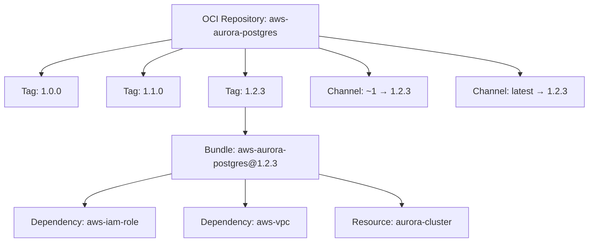

export const Bullet = () => <><span style={{ fontWeight: 'normal', fontSize: '.5em', color: 'var(--ifm-color-secondary-darkest)' }}>&nbsp;●&nbsp;</span></>

export const SpecifiedBy = (props) => <>Specification<a className="link" style={{ fontSize:'1.5em', paddingLeft:'4px' }} target="_blank" href={props.url} title={'Specified by ' + props.url}>⎘</a></>

export const Badge = (props) => <><span className={props.class}>{props.text}</span></>

import { useState } from 'react';

export const Details = ({ dataOpen, dataClose, children, startOpen = false }) => {
  const [open, setOpen] = useState(startOpen);
  return (
    <details {...(open ? { open: true } : {})} className="details" style={{ border:'none', boxShadow:'none', background:'var(--ifm-background-color)' }}>
      <summary
        onClick={(e) => {
          e.preventDefault();
          setOpen((open) => !open);
        }}
        style={{ listStyle:'none' }}
      >
      {open ? dataOpen : dataClose}
      </summary>
      {open && children}
    </details>
  );
};


A versioned infrastructure-as-code package.

A bundle is a single published version of an IaC package in your organization's
catalog. Each bundle belongs to an OCI repository and is identified by a composite
`name@version` string (e.g., `aws-aurora-postgres@1.2.3`).

Bundles declare **dependencies** (inputs they require from other bundles) and
**resources** (outputs they produce). These declarations drive the connection
system on the Massdriver canvas -- when you add a component to a blueprint,
the platform knows which other components can satisfy its dependencies.




```graphql
type Bundle {
  id: BundleId!
  name: OciRepoName!
  version: Semver!
  description: String
  icon: String
  sourceUrl: String
  createdAt: DateTime!
  updatedAt: DateTime!
  repo: String!
  dependencies: [BundleDependency!]!
  resources: [BundleResource!]!
}
```


### Fields

#### [<code style={{ fontWeight: 'normal' }}>Bundle.<b>id</b></code>](#id)<Bullet />[<code style={{ fontWeight: 'normal' }}><b>BundleId!</b></code>](/api/graphql/v1/types/scalars/bundle-id.mdx) <Badge class="badge badge--secondary badge--non_null" text="non-null"/> <Badge class="badge badge--secondary " text="scalar"/> \{#id\} 
Composite identifier in `name@version` format (e.g., `aws-aurora-postgres@1.2.3`). Always contains the fully resolved semver version.


#### [<code style={{ fontWeight: 'normal' }}>Bundle.<b>name</b></code>](#name)<Bullet />[<code style={{ fontWeight: 'normal' }}><b>OciRepoName!</b></code>](/api/graphql/v1/types/scalars/oci-repo-name.mdx) <Badge class="badge badge--secondary badge--non_null" text="non-null"/> <Badge class="badge badge--secondary " text="scalar"/> \{#name\} 
OCI repository name this bundle belongs to (e.g., `aws-aurora-postgres`).


#### [<code style={{ fontWeight: 'normal' }}>Bundle.<b>version</b></code>](#version)<Bullet />[<code style={{ fontWeight: 'normal' }}><b>Semver!</b></code>](/api/graphql/v1/types/scalars/semver.mdx) <Badge class="badge badge--secondary badge--non_null" text="non-null"/> <Badge class="badge badge--secondary " text="scalar"/> \{#version\} 
Fully resolved semantic version of this bundle (e.g., `1.2.3`).


#### [<code style={{ fontWeight: 'normal' }}>Bundle.<b>description</b></code>](#description)<Bullet />[<code style={{ fontWeight: 'normal' }}><b>String</b></code>](/api/graphql/v1/types/scalars/string.mdx) <Badge class="badge badge--secondary " text="scalar"/> \{#description\} 
Short summary of what this bundle provisions.


#### [<code style={{ fontWeight: 'normal' }}>Bundle.<b>icon</b></code>](#icon)<Bullet />[<code style={{ fontWeight: 'normal' }}><b>String</b></code>](/api/graphql/v1/types/scalars/string.mdx) <Badge class="badge badge--secondary " text="scalar"/> \{#icon\} 
URL to the bundle's display icon.


#### [<code style={{ fontWeight: 'normal' }}>Bundle.<b>sourceUrl</b></code>](#source-url)<Bullet />[<code style={{ fontWeight: 'normal' }}><b>String</b></code>](/api/graphql/v1/types/scalars/string.mdx) <Badge class="badge badge--secondary " text="scalar"/> \{#source-url\} 
URL to the bundle's source code repository, if published by the author.


#### [<code style={{ fontWeight: 'normal' }}>Bundle.<b>createdAt</b></code>](#created-at)<Bullet />[<code style={{ fontWeight: 'normal' }}><b>DateTime!</b></code>](/api/graphql/v1/types/scalars/date-time.mdx) <Badge class="badge badge--secondary badge--non_null" text="non-null"/> <Badge class="badge badge--secondary " text="scalar"/> \{#created-at\} 
Timestamp when this bundle version was first published (UTC).


#### [<code style={{ fontWeight: 'normal' }}>Bundle.<b>updatedAt</b></code>](#updated-at)<Bullet />[<code style={{ fontWeight: 'normal' }}><b>DateTime!</b></code>](/api/graphql/v1/types/scalars/date-time.mdx) <Badge class="badge badge--secondary badge--non_null" text="non-null"/> <Badge class="badge badge--secondary " text="scalar"/> \{#updated-at\} 
Timestamp when this bundle version was last modified (UTC).


#### [<code style={{ fontWeight: 'normal' }}>Bundle.<b>repo</b></code>](#repo)<Bullet />[<code style={{ fontWeight: 'normal' }}><b>String!</b></code>](/api/graphql/v1/types/scalars/string.mdx) <Badge class="badge badge--secondary badge--non_null" text="non-null"/> <Badge class="badge badge--secondary " text="scalar"/> \{#repo\} 
OCI repository name for this bundle (e.g., `aws-aurora-postgres`). Equivalent to `name`.


#### [<code style={{ fontWeight: 'normal' }}>Bundle.<b>dependencies</b></code>](#dependencies)<Bullet />[<code style={{ fontWeight: 'normal' }}><b>[BundleDependency!]!</b></code>](/api/graphql/v1/types/objects/bundle-dependency.mdx) <Badge class="badge badge--secondary badge--non_null" text="non-null"/> <Badge class="badge badge--secondary " text="object"/> \{#dependencies\} 
Dependencies (inputs) this bundle requires. Each entry names a slot and the resource type it accepts. Sorted alphabetically by name.


#### [<code style={{ fontWeight: 'normal' }}>Bundle.<b>resources</b></code>](#resources)<Bullet />[<code style={{ fontWeight: 'normal' }}><b>[BundleResource!]!</b></code>](/api/graphql/v1/types/objects/bundle-resource.mdx) <Badge class="badge badge--secondary badge--non_null" text="non-null"/> <Badge class="badge badge--secondary " text="object"/> \{#resources\} 
Resources (outputs) this bundle produces when deployed. Each entry names a slot and the resource type it creates. Sorted alphabetically by name.


### Returned By

[`bundle`](/api/graphql/v1/operations/queries/bundle.mdx)  <Badge class="badge badge--secondary badge--relation" text="query"/>

### Member Of

[`BundlesPage`](/api/graphql/v1/types/objects/bundles-page.mdx)  <Badge class="badge badge--secondary badge--relation" text="object"/><Bullet />[`Instance`](/api/graphql/v1/types/objects/instance.mdx)  <Badge class="badge badge--secondary badge--relation" text="object"/>