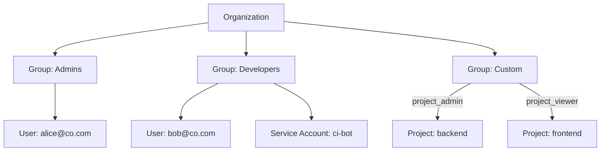

export const Bullet = () => <><span style={{ fontWeight: 'normal', fontSize: '.5em', color: 'var(--ifm-color-secondary-darkest)' }}>&nbsp;●&nbsp;</span></>

export const SpecifiedBy = (props) => <>Specification<a className="link" style={{ fontSize:'1.5em', paddingLeft:'4px' }} target="_blank" href={props.url} title={'Specified by ' + props.url}>⎘</a></>

export const Badge = (props) => <><span className={props.class}>{props.text}</span></>

import { useState } from 'react';

export const Details = ({ dataOpen, dataClose, children, startOpen = false }) => {
  const [open, setOpen] = useState(startOpen);
  return (
    <details {...(open ? { open: true } : {})} className="details" style={{ border:'none', boxShadow:'none', background:'var(--ifm-background-color)' }}>
      <summary
        onClick={(e) => {
          e.preventDefault();
          setOpen((open) => !open);
        }}
        style={{ listStyle:'none' }}
      >
      {open ? dataOpen : dataClose}
      </summary>
      {open && children}
    </details>
  );
};


A collection of users and service accounts that share the same access level within your organization.

Groups are the primary mechanism for managing access control in Massdriver. Rather than
assigning permissions to individual users, you add them to groups that define what they
can see and do.



&#x002A;&#x002A;Built-in groups&#x002A;&#x002A; — Every organization starts with an `Admins` group (`organization_admin` role)
and a `Viewers` group (`organization_viewer` role). These cannot be deleted.

&#x002A;&#x002A;Custom groups&#x002A;&#x002A; — Create custom groups with the `CUSTOM` role to grant project-level access.
Each custom group can be assigned `project_admin` or `project_viewer` on specific projects.

&#x002A;&#x002A;Members&#x002A;&#x002A; — Both human users and service accounts can be group members. Users are added via
email invitation; service accounts are added directly.


```graphql
type Group {
  id: ID!
  name: String!
  description: String
  role: GroupRole!
  createdAt: DateTime!
  updatedAt: DateTime!
}
```


### Fields

#### [<code style={{ fontWeight: 'normal' }}>Group.<b>id</b></code>](#id)<Bullet />[<code style={{ fontWeight: 'normal' }}><b>ID!</b></code>](/api/graphql/v1/types/scalars/id.mdx) <Badge class="badge badge--secondary badge--non_null" text="non-null"/> <Badge class="badge badge--secondary " text="scalar"/> \{#id\} 
Unique identifier for this group.


#### [<code style={{ fontWeight: 'normal' }}>Group.<b>name</b></code>](#name)<Bullet />[<code style={{ fontWeight: 'normal' }}><b>String!</b></code>](/api/graphql/v1/types/scalars/string.mdx) <Badge class="badge badge--secondary badge--non_null" text="non-null"/> <Badge class="badge badge--secondary " text="scalar"/> \{#name\} 
Human-readable name displayed in the UI and API responses.


#### [<code style={{ fontWeight: 'normal' }}>Group.<b>description</b></code>](#description)<Bullet />[<code style={{ fontWeight: 'normal' }}><b>String</b></code>](/api/graphql/v1/types/scalars/string.mdx) <Badge class="badge badge--secondary " text="scalar"/> \{#description\} 
Optional text explaining the purpose of this group.


#### [<code style={{ fontWeight: 'normal' }}>Group.<b>role</b></code>](#role)<Bullet />[<code style={{ fontWeight: 'normal' }}><b>GroupRole!</b></code>](/api/graphql/v1/types/enums/group-role.mdx) <Badge class="badge badge--secondary badge--non_null" text="non-null"/> <Badge class="badge badge--secondary " text="enum"/> \{#role\} 
The access level this group grants to its members.


#### [<code style={{ fontWeight: 'normal' }}>Group.<b>createdAt</b></code>](#created-at)<Bullet />[<code style={{ fontWeight: 'normal' }}><b>DateTime!</b></code>](/api/graphql/v1/types/scalars/date-time.mdx) <Badge class="badge badge--secondary badge--non_null" text="non-null"/> <Badge class="badge badge--secondary " text="scalar"/> \{#created-at\} 
When this group was created (UTC).


#### [<code style={{ fontWeight: 'normal' }}>Group.<b>updatedAt</b></code>](#updated-at)<Bullet />[<code style={{ fontWeight: 'normal' }}><b>DateTime!</b></code>](/api/graphql/v1/types/scalars/date-time.mdx) <Badge class="badge badge--secondary badge--non_null" text="non-null"/> <Badge class="badge badge--secondary " text="scalar"/> \{#updated-at\} 
When this group was last modified (UTC).


### Returned By

[`group`](/api/graphql/v1/operations/queries/group.mdx)  <Badge class="badge badge--secondary badge--relation" text="query"/>

### Member Of

[`GroupPayload`](/api/graphql/v1/types/objects/group-payload.mdx)  <Badge class="badge badge--secondary badge--relation" text="object"/><Bullet />[`GroupsPage`](/api/graphql/v1/types/objects/groups-page.mdx)  <Badge class="badge badge--secondary badge--relation" text="object"/>