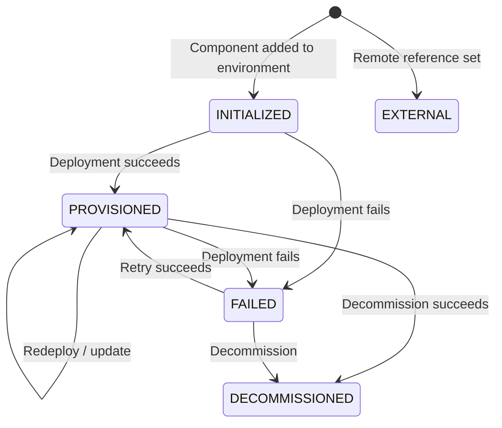

export const Bullet = () => <><span style={{ fontWeight: 'normal', fontSize: '.5em', color: 'var(--ifm-color-secondary-darkest)' }}>&nbsp;●&nbsp;</span></>

export const SpecifiedBy = (props) => <>Specification<a className="link" style={{ fontSize:'1.5em', paddingLeft:'4px' }} target="_blank" href={props.url} title={'Specified by ' + props.url}>⎘</a></>

export const Badge = (props) => <><span className={props.class}>{props.text}</span></>

import { useState } from 'react';

export const Details = ({ dataOpen, dataClose, children, startOpen = false }) => {
  const [open, setOpen] = useState(startOpen);
  return (
    <details {...(open ? { open: true } : {})} className="details" style={{ border:'none', boxShadow:'none', background:'var(--ifm-background-color)' }}>
      <summary
        onClick={(e) => {
          e.preventDefault();
          setOpen((open) => !open);
        }}
        style={{ listStyle:'none' }}
      >
      {open ? dataOpen : dataClose}
      </summary>
      {open && children}
    </details>
  );
};


A deployed piece of infrastructure in an environment.

An instance is the &#x002A;&#x002A;runtime representation&#x002A;&#x002A; of a component. When you add a
"database" component to your blueprint and deploy it to the `staging`
environment, Massdriver creates an instance that tracks the database's
configuration, deployment state, costs, and produced resources.

&#x002A;&#x002A;Lifecycle:&#x002A;&#x002A; Instances progress through a well-defined set of states:



&#x002A;&#x002A;Version resolution:&#x002A;&#x002A; Each instance has a `version` constraint (e.g., `~1.0`)
and a `releaseStrategy` (stable or development). Together these determine
the `resolvedVersion` that will be used on the next deployment. Compare
`resolvedVersion` with `deployedVersion` to see if a redeployment is needed,
or check `availableUpgrade` for newer matching releases.


```graphql
type Instance {
  id: ID!
  name: String!
  status: InstanceStatus!
  params: Map
  tags: Map!
  version: String!
  releaseStrategy: ReleaseStrategy!
  createdAt: DateTime!
  updatedAt: DateTime!
  resolvedVersion: String!
  deployedVersion: String
  availableUpgrade: String
  cost: CostSummary!
  environment: Environment
  bundle: Bundle
  component: Component!
  statePaths: [InstanceStatePath!]!
  resources(
    cursor: Cursor
  ): InstanceResourcesPage
  alarms(
    cursor: Cursor
  ): AlarmsPage
  dependencies(
    cursor: Cursor
  ): InstanceDependenciesPage
}
```


### Fields

#### [<code style={{ fontWeight: 'normal' }}>Instance.<b>id</b></code>](#id)<Bullet />[<code style={{ fontWeight: 'normal' }}><b>ID!</b></code>](/api/graphql/v1/types/scalars/id.mdx) <Badge class="badge badge--secondary badge--non_null" text="non-null"/> <Badge class="badge badge--secondary " text="scalar"/> \{#id\} 


#### [<code style={{ fontWeight: 'normal' }}>Instance.<b>name</b></code>](#name)<Bullet />[<code style={{ fontWeight: 'normal' }}><b>String!</b></code>](/api/graphql/v1/types/scalars/string.mdx) <Badge class="badge badge--secondary badge--non_null" text="non-null"/> <Badge class="badge badge--secondary " text="scalar"/> \{#name\} 
Human-readable display name for the instance.


#### [<code style={{ fontWeight: 'normal' }}>Instance.<b>status</b></code>](#status)<Bullet />[<code style={{ fontWeight: 'normal' }}><b>InstanceStatus!</b></code>](/api/graphql/v1/types/enums/instance-status.mdx) <Badge class="badge badge--secondary badge--non_null" text="non-null"/> <Badge class="badge badge--secondary " text="enum"/> \{#status\} 
Current lifecycle state of the instance.


#### [<code style={{ fontWeight: 'normal' }}>Instance.<b>params</b></code>](#params)<Bullet />[<code style={{ fontWeight: 'normal' }}><b>Map</b></code>](/api/graphql/v1/types/scalars/map.mdx) <Badge class="badge badge--secondary " text="scalar"/> \{#params\} 
Cached configuration parameters from the most recent deployment. Null if the instance has never been deployed.


#### [<code style={{ fontWeight: 'normal' }}>Instance.<b>tags</b></code>](#tags)<Bullet />[<code style={{ fontWeight: 'normal' }}><b>Map!</b></code>](/api/graphql/v1/types/scalars/map.mdx) <Badge class="badge badge--secondary badge--non_null" text="non-null"/> <Badge class="badge badge--secondary " text="scalar"/> \{#tags\} 
Key-value tags assigned directly to this instance.


#### [<code style={{ fontWeight: 'normal' }}>Instance.<b>version</b></code>](#version)<Bullet />[<code style={{ fontWeight: 'normal' }}><b>String!</b></code>](/api/graphql/v1/types/scalars/string.mdx) <Badge class="badge badge--secondary badge--non_null" text="non-null"/> <Badge class="badge badge--secondary " text="scalar"/> \{#version\} 
Version constraint that controls which bundle releases are eligible. Supports semver constraints like `~1.0`, exact versions like `1.2.3`, or `latest`.


#### [<code style={{ fontWeight: 'normal' }}>Instance.<b>releaseStrategy</b></code>](#release-strategy)<Bullet />[<code style={{ fontWeight: 'normal' }}><b>ReleaseStrategy!</b></code>](/api/graphql/v1/types/enums/release-strategy.mdx) <Badge class="badge badge--secondary badge--non_null" text="non-null"/> <Badge class="badge badge--secondary " text="enum"/> \{#release-strategy\} 
Whether to include development (pre-release) builds when resolving the version constraint.


#### [<code style={{ fontWeight: 'normal' }}>Instance.<b>createdAt</b></code>](#created-at)<Bullet />[<code style={{ fontWeight: 'normal' }}><b>DateTime!</b></code>](/api/graphql/v1/types/scalars/date-time.mdx) <Badge class="badge badge--secondary badge--non_null" text="non-null"/> <Badge class="badge badge--secondary " text="scalar"/> \{#created-at\} 
When this instance was created (UTC).


#### [<code style={{ fontWeight: 'normal' }}>Instance.<b>updatedAt</b></code>](#updated-at)<Bullet />[<code style={{ fontWeight: 'normal' }}><b>DateTime!</b></code>](/api/graphql/v1/types/scalars/date-time.mdx) <Badge class="badge badge--secondary badge--non_null" text="non-null"/> <Badge class="badge badge--secondary " text="scalar"/> \{#updated-at\} 
When this instance was last modified (UTC).


#### [<code style={{ fontWeight: 'normal' }}>Instance.<b>resolvedVersion</b></code>](#resolved-version)<Bullet />[<code style={{ fontWeight: 'normal' }}><b>String!</b></code>](/api/graphql/v1/types/scalars/string.mdx) <Badge class="badge badge--secondary badge--non_null" text="non-null"/> <Badge class="badge badge--secondary " text="scalar"/> \{#resolved-version\} 
The concrete bundle version resolved from the version constraint and release strategy.

This is the version that will be used on the &#x002A;&#x002A;next&#x002A;&#x002A; deployment. Compare
with `deployedVersion` to determine if a redeployment would change anything.


#### [<code style={{ fontWeight: 'normal' }}>Instance.<b>deployedVersion</b></code>](#deployed-version)<Bullet />[<code style={{ fontWeight: 'normal' }}><b>String</b></code>](/api/graphql/v1/types/scalars/string.mdx) <Badge class="badge badge--secondary " text="scalar"/> \{#deployed-version\} 
The bundle version that was last successfully deployed to infrastructure.

May differ from `resolvedVersion` if the version constraint has been updated
but no deployment has occurred yet. Null if the instance has never been deployed.


#### [<code style={{ fontWeight: 'normal' }}>Instance.<b>availableUpgrade</b></code>](#available-upgrade)<Bullet />[<code style={{ fontWeight: 'normal' }}><b>String</b></code>](/api/graphql/v1/types/scalars/string.mdx) <Badge class="badge badge--secondary " text="scalar"/> \{#available-upgrade\} 
The newest bundle version available that satisfies the version constraint.

Returns null if the instance is already on the latest matching version.
Use this field to detect when an upgrade is available.


#### [<code style={{ fontWeight: 'normal' }}>Instance.<b>cost</b></code>](#cost)<Bullet />[<code style={{ fontWeight: 'normal' }}><b>CostSummary!</b></code>](/api/graphql/v1/types/objects/cost-summary.mdx) <Badge class="badge badge--secondary badge--non_null" text="non-null"/> <Badge class="badge badge--secondary " text="object"/> \{#cost\} 
Cloud provider cost summary for this instance, including daily and monthly breakdowns.


#### [<code style={{ fontWeight: 'normal' }}>Instance.<b>environment</b></code>](#environment)<Bullet />[<code style={{ fontWeight: 'normal' }}><b>Environment</b></code>](/api/graphql/v1/types/objects/environment.mdx) <Badge class="badge badge--secondary " text="object"/> \{#environment\} 
The environment this instance is deployed in.


#### [<code style={{ fontWeight: 'normal' }}>Instance.<b>bundle</b></code>](#bundle)<Bullet />[<code style={{ fontWeight: 'normal' }}><b>Bundle</b></code>](/api/graphql/v1/types/objects/bundle.mdx) <Badge class="badge badge--secondary " text="object"/> \{#bundle\} 
The bundle release currently resolved for this instance.


#### [<code style={{ fontWeight: 'normal' }}>Instance.<b>component</b></code>](#component)<Bullet />[<code style={{ fontWeight: 'normal' }}><b>Component!</b></code>](/api/graphql/v1/types/objects/component.mdx) <Badge class="badge badge--secondary badge--non_null" text="non-null"/> <Badge class="badge badge--secondary " text="object"/> \{#component\} 
The component this instance was deployed from.


#### [<code style={{ fontWeight: 'normal' }}>Instance.<b>statePaths</b></code>](#state-paths)<Bullet />[<code style={{ fontWeight: 'normal' }}><b>[InstanceStatePath!]!</b></code>](/api/graphql/v1/types/objects/instance-state-path.mdx) <Badge class="badge badge--secondary badge--non_null" text="non-null"/> <Badge class="badge badge--secondary " text="object"/> \{#state-paths\} 
Terraform/OpenTofu state paths for each provisioning step, ordered by the bundle's step definition.

Each bundle can define multiple steps (e.g., `core`, `iam`, `monitoring`). Use the
`stateUrl` to configure your Terraform backend or inspect state externally.


#### [<code style={{ fontWeight: 'normal' }}>Instance.<b>resources</b></code>](#resources)<Bullet />[<code style={{ fontWeight: 'normal' }}><b>InstanceResourcesPage</b></code>](/api/graphql/v1/types/objects/instance-resources-page.mdx) <Badge class="badge badge--secondary " text="object"/> \{#resources\} 
Paginated list of resources produced by this instance.

Resources are the outputs published after a successful deployment
(e.g., connection strings, endpoints, credentials). Other instances consume
these resources via connections.
##### [<code style={{ fontWeight: 'normal' }}>Instance.resources.<b>cursor</b></code>](#instance-resources-cursor)<Bullet />[<code style={{ fontWeight: 'normal' }}><b>Cursor</b></code>](/api/graphql/v1/types/inputs/cursor.mdx) <Badge class="badge badge--secondary " text="input"/> \{#instance-resources-cursor\} 
Pagination cursor returned by a previous page.


#### [<code style={{ fontWeight: 'normal' }}>Instance.<b>alarms</b></code>](#alarms)<Bullet />[<code style={{ fontWeight: 'normal' }}><b>AlarmsPage</b></code>](/api/graphql/v1/types/objects/alarms-page.mdx) <Badge class="badge badge--secondary " text="object"/> \{#alarms\} 
Paginated list of cloud metric alarms configured for this instance.

Alarms are provisioned by the Massdriver Terraform/OpenTofu provider and
receive state updates via webhooks from AWS CloudWatch, Azure Monitor,
GCP Cloud Monitoring, or Prometheus Alertmanager. Inspect `currentState`
to see whether an alarm is firing; a `null` `currentState` means no state
has been reported yet.
##### [<code style={{ fontWeight: 'normal' }}>Instance.alarms.<b>cursor</b></code>](#instance-alarms-cursor)<Bullet />[<code style={{ fontWeight: 'normal' }}><b>Cursor</b></code>](/api/graphql/v1/types/inputs/cursor.mdx) <Badge class="badge badge--secondary " text="input"/> \{#instance-alarms-cursor\} 
Pagination cursor returned by a previous page.


#### [<code style={{ fontWeight: 'normal' }}>Instance.<b>dependencies</b></code>](#dependencies)<Bullet />[<code style={{ fontWeight: 'normal' }}><b>InstanceDependenciesPage</b></code>](/api/graphql/v1/types/objects/instance-dependencies-page.mdx) <Badge class="badge badge--secondary " text="object"/> \{#dependencies\} 
Paginated list of dependencies consumed by this instance.

Dependencies are resources from other instances wired in via connections.
For example, an application instance might depend on a database instance's
`authentication` resource to get its connection string.
##### [<code style={{ fontWeight: 'normal' }}>Instance.dependencies.<b>cursor</b></code>](#instance-dependencies-cursor)<Bullet />[<code style={{ fontWeight: 'normal' }}><b>Cursor</b></code>](/api/graphql/v1/types/inputs/cursor.mdx) <Badge class="badge badge--secondary " text="input"/> \{#instance-dependencies-cursor\} 
Pagination cursor returned by a previous page.


### Returned By

[`instance`](/api/graphql/v1/operations/queries/instance.mdx)  <Badge class="badge badge--secondary badge--relation" text="query"/>

### Member Of

[`Connection`](/api/graphql/v1/types/objects/connection.mdx)  <Badge class="badge badge--secondary badge--relation" text="object"/><Bullet />[`Deployment`](/api/graphql/v1/types/objects/deployment.mdx)  <Badge class="badge badge--secondary badge--relation" text="object"/><Bullet />[`InstanceEvent`](/api/graphql/v1/types/objects/instance-event.mdx)  <Badge class="badge badge--secondary badge--relation" text="object"/><Bullet />[`InstancePayload`](/api/graphql/v1/types/objects/instance-payload.mdx)  <Badge class="badge badge--secondary badge--relation" text="object"/><Bullet />[`InstancesPage`](/api/graphql/v1/types/objects/instances-page.mdx)  <Badge class="badge badge--secondary badge--relation" text="object"/>