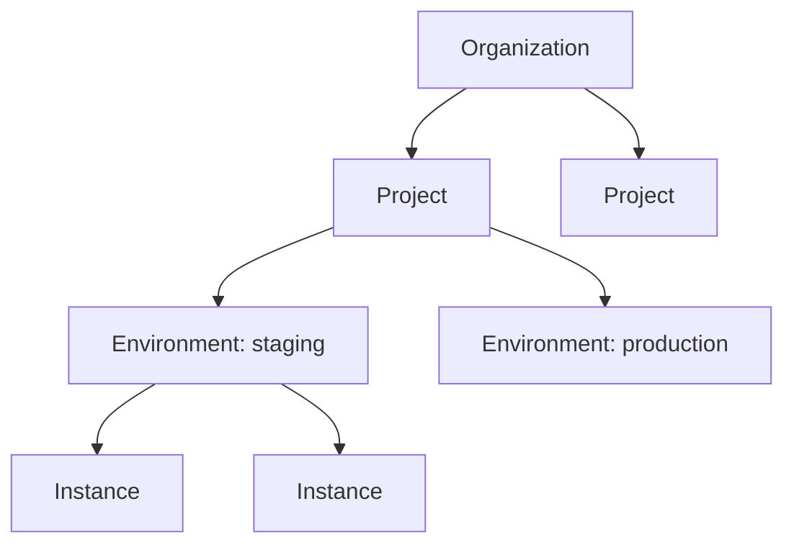

export const Bullet = () => <><span style={{ fontWeight: 'normal', fontSize: '.5em', color: 'var(--ifm-color-secondary-darkest)' }}>&nbsp;●&nbsp;</span></>

export const SpecifiedBy = (props) => <>Specification<a className="link" style={{ fontSize:'1.5em', paddingLeft:'4px' }} target="_blank" href={props.url} title={'Specified by ' + props.url}>⎘</a></>

export const Badge = (props) => <><span className={props.class}>{props.text}</span></>

import { useState } from 'react';

export const Details = ({ dataOpen, dataClose, children, startOpen = false }) => {
  const [open, setOpen] = useState(startOpen);
  return (
    <details {...(open ? { open: true } : {})} className="details" style={{ border:'none', boxShadow:'none', background:'var(--ifm-background-color)' }}>
      <summary
        onClick={(e) => {
          e.preventDefault();
          setOpen((open) => !open);
        }}
        style={{ listStyle:'none' }}
      >
      {open ? dataOpen : dataClose}
      </summary>
      {open && children}
    </details>
  );
};


The top-level account that owns all your infrastructure, projects, and team members.

An organization is the root of the Massdriver resource hierarchy. Everything you build
and deploy lives under an organization: &#x002A;&#x002A;Projects&#x002A;&#x002A; contain your infrastructure designs,
&#x002A;&#x002A;Environments&#x002A;&#x002A; (like staging and production) are where those designs come to life, and
&#x002A;&#x002A;Instances&#x002A;&#x002A; are the actual running cloud resources.



Members access resources through &#x002A;&#x002A;group memberships&#x002A;&#x002A; with role-based permissions.
Tag constraints defined at the organization level govern tagging across all child resources.


```graphql
type Organization {
  id: ID!
  name: String!
  createdAt: DateTime!
  updatedAt: DateTime!
  logo: LogoOrganization
  tagConstraints(
    sort: OrganizationTagConstraintsSort
    cursor: Cursor
  ): OrganizationTagConstraintsPage
  tagSchema(
    scope: TagConstraintScope!
  ): Map!
}
```


### Fields

#### [<code style={{ fontWeight: 'normal' }}>Organization.<b>id</b></code>](#id)<Bullet />[<code style={{ fontWeight: 'normal' }}><b>ID!</b></code>](/api/graphql/v1/types/scalars/id.mdx) <Badge class="badge badge--secondary badge--non_null" text="non-null"/> <Badge class="badge badge--secondary " text="scalar"/> \{#id\} 


#### [<code style={{ fontWeight: 'normal' }}>Organization.<b>name</b></code>](#name)<Bullet />[<code style={{ fontWeight: 'normal' }}><b>String!</b></code>](/api/graphql/v1/types/scalars/string.mdx) <Badge class="badge badge--secondary badge--non_null" text="non-null"/> <Badge class="badge badge--secondary " text="scalar"/> \{#name\} 
Display name shown in the UI and CLI.


#### [<code style={{ fontWeight: 'normal' }}>Organization.<b>createdAt</b></code>](#created-at)<Bullet />[<code style={{ fontWeight: 'normal' }}><b>DateTime!</b></code>](/api/graphql/v1/types/scalars/date-time.mdx) <Badge class="badge badge--secondary badge--non_null" text="non-null"/> <Badge class="badge badge--secondary " text="scalar"/> \{#created-at\} 
When this organization was created (UTC).


#### [<code style={{ fontWeight: 'normal' }}>Organization.<b>updatedAt</b></code>](#updated-at)<Bullet />[<code style={{ fontWeight: 'normal' }}><b>DateTime!</b></code>](/api/graphql/v1/types/scalars/date-time.mdx) <Badge class="badge badge--secondary badge--non_null" text="non-null"/> <Badge class="badge badge--secondary " text="scalar"/> \{#updated-at\} 
When this organization was last modified (UTC).


#### [<code style={{ fontWeight: 'normal' }}>Organization.<b>logo</b></code>](#logo)<Bullet />[<code style={{ fontWeight: 'normal' }}><b>LogoOrganization</b></code>](/api/graphql/v1/types/objects/logo-organization.mdx) <Badge class="badge badge--secondary " text="object"/> \{#logo\} 
The organization's logo image, or `null` if no logo has been uploaded.


#### [<code style={{ fontWeight: 'normal' }}>Organization.<b>tagConstraints</b></code>](#tag-constraints)<Bullet />[<code style={{ fontWeight: 'normal' }}><b>OrganizationTagConstraintsPage</b></code>](/api/graphql/v1/types/objects/organization-tag-constraints-page.mdx) <Badge class="badge badge--secondary " text="object"/> \{#tag-constraints\} 
Paginated list of tag constraints that govern tagging rules across this organization.
##### [<code style={{ fontWeight: 'normal' }}>Organization.tagConstraints.<b>sort</b></code>](#organization-tag-constraints-sort)<Bullet />[<code style={{ fontWeight: 'normal' }}><b>OrganizationTagConstraintsSort</b></code>](/api/graphql/v1/types/inputs/organization-tag-constraints-sort.mdx) <Badge class="badge badge--secondary " text="input"/> \{#organization-tag-constraints-sort\} 
How to sort results. Defaults to alphabetical by key.


##### [<code style={{ fontWeight: 'normal' }}>Organization.tagConstraints.<b>cursor</b></code>](#organization-tag-constraints-cursor)<Bullet />[<code style={{ fontWeight: 'normal' }}><b>Cursor</b></code>](/api/graphql/v1/types/inputs/cursor.mdx) <Badge class="badge badge--secondary " text="input"/> \{#organization-tag-constraints-cursor\} 
Cursor from a previous page to fetch the next set of results.


#### [<code style={{ fontWeight: 'normal' }}>Organization.<b>tagSchema</b></code>](#tag-schema)<Bullet />[<code style={{ fontWeight: 'normal' }}><b>Map!</b></code>](/api/graphql/v1/types/scalars/map.mdx) <Badge class="badge badge--secondary badge--non_null" text="non-null"/> <Badge class="badge badge--secondary " text="scalar"/> \{#tag-schema\} 
Returns a JSON Schema document you can use to validate tags for a given resource scope.

The schema is derived from this organization's tag constraints. It includes
`properties` for each allowed tag key and a `required` array for mandatory tags.
If no constraints exist for the scope, returns `{"type": "object"}`.
##### [<code style={{ fontWeight: 'normal' }}>Organization.tagSchema.<b>scope</b></code>](#organization-tag-schema-scope)<Bullet />[<code style={{ fontWeight: 'normal' }}><b>TagConstraintScope!</b></code>](/api/graphql/v1/types/enums/tag-constraint-scope.mdx) <Badge class="badge badge--secondary badge--non_null" text="non-null"/> <Badge class="badge badge--secondary " text="enum"/> \{#organization-tag-schema-scope\} 
The resource scope to generate the schema for (e.g., `PROJECT`, `ENVIRONMENT`).


### Returned By

[`organization`](/api/graphql/v1/operations/queries/organization.mdx)  <Badge class="badge badge--secondary badge--relation" text="query"/>

### Member Of

[`OrganizationPayload`](/api/graphql/v1/types/objects/organization-payload.mdx)  <Badge class="badge badge--secondary badge--relation" text="object"/>