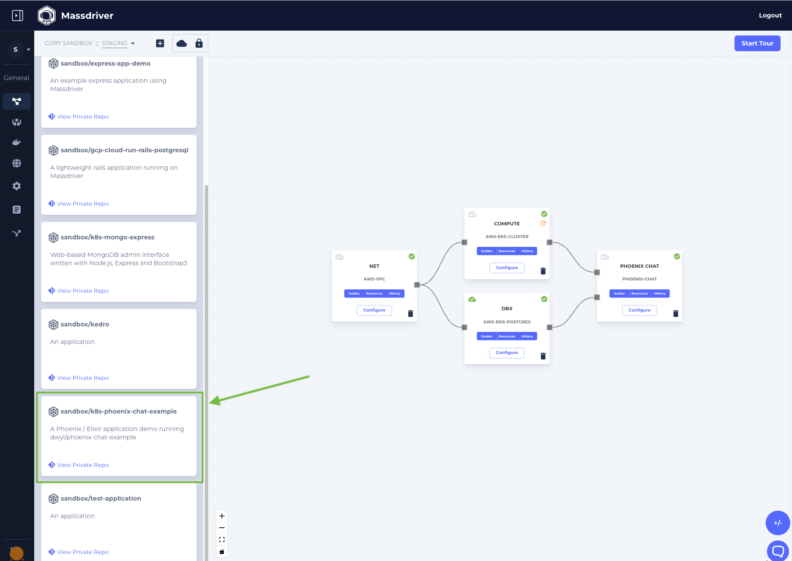

:::note

Before getting started you'll need:

* [Massdriver CLI](https://github.com/massdriver-cloud/mass/releases)
* [Service Account key](/platform/service-accounts)
* A containerized application. Quick start application examples are available [here](https://github.com/massdriver-cloud/application-examples#source-code-for-example-applications).

:::

In this guide we'll generate an `application bundle` and **publish** it to Massdriver. The application bundle will be all of the configuration your application needs to connect to runtimes (serverless, containers) and cloud resources (queues, databases, etc). Once the application bundle is published, we'll configure it in the UI and set up continuous deployments from GitHub actions.

First, create a new application bundle:

```shell
mass bundle new
```

Enter `k8s-phoenix-chat-example` as the name and a description. These will be used in the Massdriver UI to identify application bundles to users.

:::note

We recommend prefixing application and infrastructure bundles with where they run (i.e: `k8s-`) to guide users in selecting the right bundle.

:::


```shell title="Prompt"
Name: k8s-phoenix-chat-example
Description: A phoenix chat app
```

Next an [application template](https://github.com/massdriver-cloud/application-templates) will need to be chosen.

For this example we'll choose `kubernetes-deployment`:

```shell
? Template:
    aws-lambda
    azure-function
    kubernetes-cronjob
  ▸ kubernetes-deployment
    kubernetes-job
```

:::info

Application templates are cached locally the first time `mass bundle new` is run. To get the latest application templates run `mass app template refresh`.

:::

Then, [`connections`](/concepts/connections) (your application dependencies) will need to be selected.

For this example we'll choose [`massdriver/postgresql-authentication`](https://github.com/massdriver-cloud/artifact-definitions/blob/main/definitions/artifacts/postgresql-authentication.json).

```shell title="Prompt"
? What connections do you need?
  If you don't need any, just hit enter or select (None)
  [Use arrows to move, space to select, <right> to all, <left> to none, type to filter]
  [ ]  (None)
  [ ]  massdriver/aws-dynamodb-table
  ...
  [ ]  massdriver/mongo-authentication
  [ ]  massdriver/mysql-authentication
> [ ]  massdriver/postgresql-authentication
  [ ]  massdriver/redis-authentication
```

You'll be prompted to name the variable for each connection that you added. We suggest simple names like `postgres`, but if you have more complex dependencies it may make sense to use names like `inventory_database` for an inventory database or `website_cache` for a Redis website cache.

Finally, you'll be prompted for the output directory. There are different schools of thought as to if your application's cloud configuration should be stored alongside your application code or in a different directory. For `private` applications, we suggest keeping it alongside your application code to simplify CI/CD.

For this example we'll set the output directory to `k8s-phoenix-chat-example` since we are using a publicly available application and docker image.

## Files in the Application Bundle

The following directory structure will be created:

* `massdriver.yaml` - Bundle metadata, input parameter requirements / validation, connections / dependencies, and UI controls
* `src` - Infrastructure-as-code rigging for your application. This will generally be the IAM, observability, and deployment configuration of your app.
* `README.md` - It's a README 🤓

:::info

The `massdriver.yaml` is covered in detail under [Bundle Configuration](/bundles/configuration) section.

It's important to note that the generated code is a great way to _get started_, but you can customize the fields in `massdriver.yaml` and the rigging code in `src` to meet your needs.

In this example, we generated a Kubernetes deployment with a Helm chart. The generated Helm works well for most deployments, but you can replace or edit the chart as necessary. The values provided at provisioning time will be passed in similarly to `values.yaml` in a standard Helm chart.

:::

## Configuring Apps

In addition to the configuration options exposed in the _bundle guide_, two additional configuration options are exposed to application bundles:

* `app.envs` - _Map_ of environment variables to set on the running application.
* `app.policies` - _Array_ of IAM policies / permissions to attach to this application's cloud role / service account.
* `app.secrets` - _Map_ of secret **definitions**. These will be presented in your application's configuration interface in Massdriver and can be set per-package or for preview environments.

Both of these configuration options expect [jq](https://stedolan.github.io/jq/manual/) queries to extract values from `parameters` or upstream `connections`.

### Environment Variable Examples

Environment variables can be extracted from `parameters` and/or `connections`. Massdriver parses `jq` expressions to allow for rich composition of values into environment variables:

The following would set the `LOG_LEVEL` in your application based on the value a users selects from the `log_level` dropdown.

The `.params` prefix tells Massdriver where to pull the value from. The field names can be any complex expression with JQ as we'll see in the next example.

```yaml title="Simple param-based environment variable"
app:
  envs:
    LOG_LEVEL: .params.log_level
    PORT: .params.port | tostring
```

Here we set the `POSTGRES_USERNAME` to the `username` field in our Postgres connection's authentication object.

```yaml title="Simple connection-based environment variable"
app:
  envs:
    POSTGRES_USERNAME: .connections.postgres.data.authentication.username
```

While secrets are automatically converted to environment variables, they can also be parsed if necessary. More on secrets [below](#secret-examples).

:::info

The structure of each artifact type is documented [here](https://github.com/massdriver-cloud/artifact-definitions/tree/main/definitions/artifacts).

:::

In the following example we compose all of the components of the Postgres authentication object into a `POSTGRES_URL` environment variable.

```yaml title="Build a complex environment variable"
app:
  envs:
    POSTGRES_URL: '@text "postgres://" + .connections.postgres.data.authentication.username + ":" + .connections.postgres.data.authentication.password + "@" + .connections.postgres.data.authentication.hostname + ":" + (.connections.postgres.data.authentication.port|tostring) + "/chat?sslmode=disable"'
```
### Policy Examples

Similarly to Environment Variables, IAM policies can also be mapped to your running application using JQ.

Massdriver bundles will typically emit IAM Policies or Permissions information for their use case under the `security` field in the artifact. [Example](https://github.com/massdriver-cloud/artifact-definitions/blob/main/definitions/artifacts/postgresql-authentication.json#L28)

For this walkthrough our application doesn't have any requirements that need to bind IAM permissions, but here is an example _if_ our application depended on AWS SQS and we wanted to bind the `subscribe` policy. Don't add this to your bundle without including SQS as a connection dependency.

```yaml title="Binding IAM Policies to Cloud Workloads"
app:
  policies:
    - .connections.sqs.data.security.iam.subscribe
```

A breakdown of the fields:

* `.connections` - all connected infrastructure and applications.
* `.connections.sqs` - the connected SQS queue (if required & present).
* `.connections.sqs.data` - sensitive information in the SQS artifact.
* `.connections.sqs.data.security` - security-related information for SQS.
* `.connections.sqs.data.security.iam` - Principal of least privilege IAM policies exposed by this SQS bundle.
* `.connections.sqs.data.security.iam.subscribe` - The `subscribe` policy your application needs.

### Secret Examples

Secrets can be defined in your `massdriver.yaml` file. This will create forms in the Massdriver UI where 3rd party secrets can be set for your application.

Secrets will be turned into environment variables at deploy time and are also exposed to the `envs` section for JQ parsing similar to `.params` and `.connections` [above](#environment-variable-examples).


```yaml title="Parsing secrets into an environment variable"
app:
  envs:
    FOO: bar
    # SOME_SECRET is automatically created, but if you needed to map to a different var or perform parsing on the secret, you can do so
    SOME_SECRET_RENAMED: .secret.SOME_SECRET
    SOME_SECRET_UPCASED: .secret.SOME_SECRET | ascii_upcase
  secrets:
    SOME_SECRET: # This is env var name this will be converted to
      required: true # if a secret is required, Massdriver will block deployments that are missing this secret
      title: "A nice name for the UI"
      description: "A great description for the UI"
```
## Parameters

The `params` in your `massdriver.yaml` are really good defaults for a Kubernetes deployment. Feel free to add or remove values depending on what you want to expose to your users / developers.

With Helm-based applications the `values.yaml` file will be loaded as the base level defaults, and your parameters will be applied on top of those. If there are parameters that you don't want exposed to end users, simply remove the parameter from `params` and add the hard coded value to the `values.yaml` file.

A good example of where to do this is your container repository (`.params.image.repository`). For private applications it may make sense to hard code this value to something like `my-org/web-api`. You could remove this field and set the image repository manually in the `values.yaml` file.

To run this example, we'll set the `default` for the `image.repository`.

```yaml
# under params.properties.image.properties:
        repository:
          title: Repository
          default: massdrivercloud/phoenix-chat-example
```

The repository is available [here](https://hub.docker.com/repository/docker/massdrivercloud/phoenix-chat-example) and the code is on [GitHub](https://github.com/massdriver-cloud/phoenix-chat-example).

### Connections

Your generated connections should resemble those below. In this example we have two required connections:

* `kubernetes_cluster` - the cluster the app will deploy to
* `postgres` - the database the app needs

Additionally there are a few optional cloud authentication mechanisms. This bundle will use whichever cloud is connected in the UI to create IAM roles and permissions for your application.

```yaml
connections:
  required:
    - kubernetes_cluster
    - postgres
  properties:
    kubernetes_cluster:
      $ref: massdriver/kubernetes-cluster
    aws_authentication:
      $ref: massdriver/aws-iam-role
    gcp_authentication:
      $ref: massdriver/gcp-service-account
    azure_authentication:
      $ref: massdriver/azure-service-principal
    postgres:
      $ref: massdriver/postgresql-authentication
```

If you followed the prompts in this guide, you should end up with an application bundle that looks like [this](https://github.com/massdriver-cloud/application-examples/tree/main/k8s/phoenix-chat-example).

At this point the application bundle can be published to the Massdriver bundle manager:

```yaml
mass app publish
```

You should see a success message. Upon visiting a project canvas in Massdriver, your `k8s-phoenix-chat-example` should be visible in the bundle bar prefixed with your organization name.

Add Kubernetes and Postgres to your canvas, connect, and [deploy](/applications/deploying-application)!



If you would like to automatically publish your application bundle in CI/CD, see the [GitHub Actions guide](/bundles/github-action).

:::info

We have a number of pre-defined application templates available [here](https://github.com/massdriver-cloud/application-templates). We welcome PRs to add more.

:::
