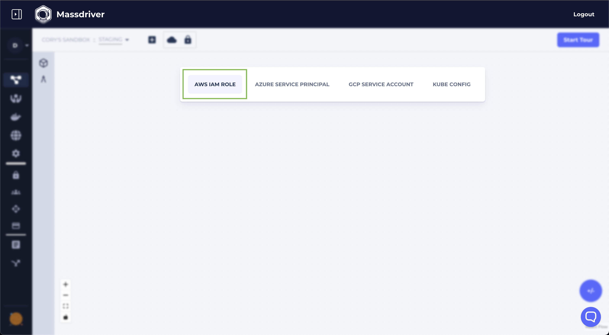
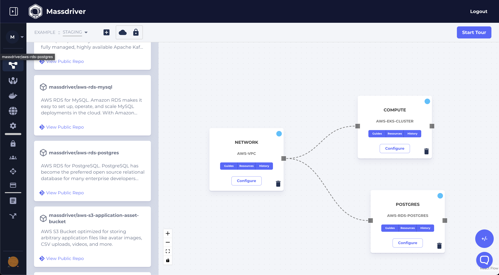

Once an application bundle has been published to the Massdriver Bundle Manager, it can be connected and configured via the UI and then deployed via UI or CLI. 

:::note

CLI access for connecting and configuring application and infrastructures is coming soon and is already available in our GraphQL API.

If you would like beta access to our API. Please contact us through chat when logged in.

:::

From the UI, you can deploy any application you have access to which includes your private applications and public open-source applications added by the community.

:::info

To finish this guide you will need:

* A connected cloud (AWS, Azure, or GCP)
* A domain name registered with your cloud
* A [Service Account](/platform/service-accounts)

:::

Log into [Massdriver](https://app.massdriver.cloud/login). 

Navigate to [Organization > Credentials](https://app.massdriver.cloud/organization/credentials) and click **AWS IAM Role** and follow the instructions on the screen.


Next navigate to [projects](https://app.massdriver.cloud/projects) and create a new project named `Example`. A [project](/concept/projects) is a parity boundary and used to replicate infrastructure and applications between _targets_ like application environments (staging, production) and/or regions (us-west-1, us-west-2, or prod us west 2).

.

Add a [targets](/concept/targets) `Staging`.


Finally attach the credential you created in the previous step:



**Design and deploy infrastructure for your application**:

If you followed the guide in the [previous section](/applications/getting-started) your application will depend on a Kubernetes Cluster and PostgreSQL.

Add and connect the following resources from the bundle sidebar. To expand the sidebar click the "package" icon.

You'll need to add:

* massdriver/aws-vpc
* massdriver/aws-eks-cluster
* massdriver/aws-rds-postgres or massdriver/aws-aurora-serverless-postgres

After adding each to the canvas click "Configure." Feel free to fine tune the configuration, but if you are new to cloud infrastructure the "Configuration Presets" are a great way to get started quickly. Select a preset like "Development" and then click "Save & Deploy."

:::note

The artifact system in Massdriver (the boxes you connect lines to) shares common types between bundles to make it possible to swap between different infrastructure bundles that provide the same functionality.

In this example you could use `massdriver/aws-rds-postgres`, `massdriver/aws-aurora-serverless-postgres`, or a version of PostgreSQL running on Kubernetes.

:::



Once all of your infrastructure has booted up, you can add and connect your application: `YOUR_ORG_PREFIX/k8s-phoenix-chat-example`.

You can now click configure and set your values. You can set any values here that makes sense for your application. A publicly hosted docker repository can be used: `massdriver/cloud/phoenix-chat-example`.

If you [registered a DNS Zone](/platform/dns-zones) check "Enable Public Internet Access" and you'll be able to set a hostname for your application. This will configure a public load balancer, TLS certificate, and DNS record for your application.

Once your application has been configured and connected, it can also be deployed from our CLI.

The `deploy` command expects the name in the format of `project-target-manifest`. If you followed the above example it will be `example-staging-phoenixchat`. If you can't remember the name of your application, mouse over its human-friendly name in the UI and it will be displayed.

`mass deploy` can be added to your CI/CD pipeline to trigger deployments to your Kubernetes cluster.

```yaml
export MASSDRIVER_ORG_ID=FOO
export MASSDRIVER_API_KEY=BAR
mass deploy example-staging-phoenixchat
```

Your Organization ID can be found by hovering over your org name in the sidebar:


