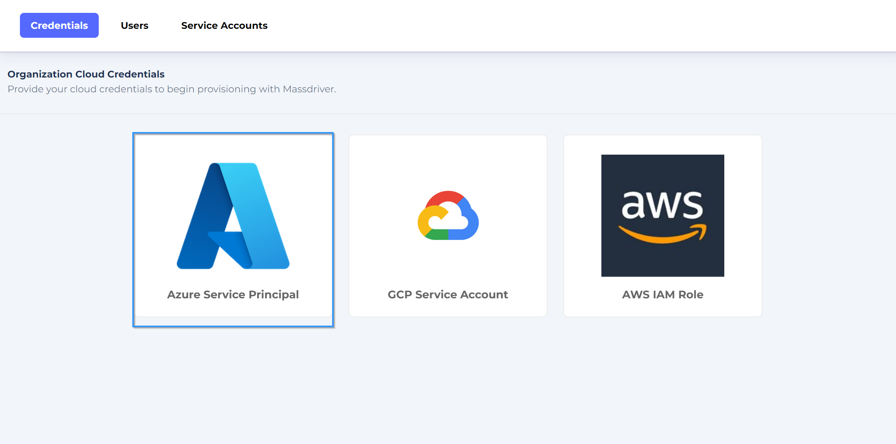
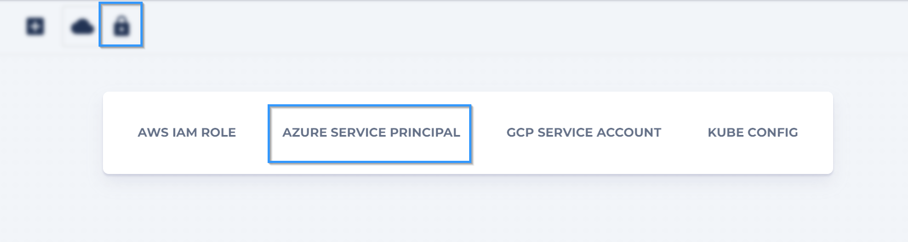
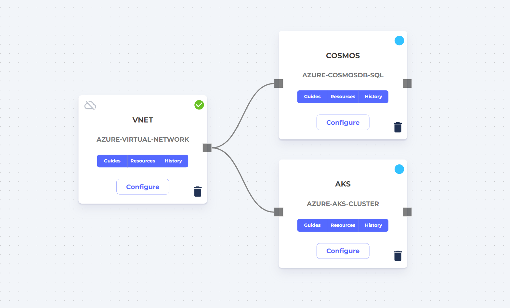

## Build

:::note

Before getting started you'll need:

* [Massdriver CLI](https://github.com/massdriver-cloud/mass/releases)
* [Service Account key](/platform/service-accounts)
* A containerized application

:::

In this guide you'll generate an `application bundle` and **publish** it to Massdriver. The application bundle will be all of the configuration your application needs to connect to Azure resources (storage, databases, etc). Once the application bundle is published, you'll configure it in the UI and set up continuous deployments from GitHub actions.

First, create a new application bundle:

```shell
mass app new
```

Enter your application name and a description. These will be used in the Massdriver UI to identify application bundles to users.

:::note

We recommend prefixing application and infrastructure bundles with where they run (i.e: `azure-`) to guide users in selecting the right bundle.

:::


```shell title="Prompt"
Name: azure-phoenix-chat-app
Description: A phoenix chat app
```

Next select the `azure-app-service` application template:

```shell
? Template:
    aws-lambda
  ▸ azure-app-service
    gcp-cloud-function
    gcp-cloud-run
    kubernetes-job
```

:::info

Application templates are cached locally the first time `mass app new` is run. To get the latest application templates run `mass app template refresh`.

:::

Then, [`connections`](/concepts/connections) (your application dependencies) will need to be selected.

```shell title="Prompt"
? What connections do you need?
  If you don't need any, just hit enter or select (None)
  [Use arrows to move, space to select, <right> to all, <left> to none, type to filter]
  [ ]  (None)
> [ ]  massdriver/azure-data-lake-storage
  [ ]  massdriver/azure-databricks-workspace
  [ ]  massdriver/azure-service-principal
  [ ]  massdriver/azure-virtual-network
```

You'll be prompted to name the variable for each connection that you added. We suggest simple names like `postgres`, but if you have more complex dependencies it may make sense to use names like `inventory_database` for an inventory database or `website_cache` for a Redis website cache.

Finally, you'll be prompted for the output directory. There are different schools of thought as to if your application's cloud configuration should be stored alongside your application code or in a different directory. For `private` applications, we suggest keeping it alongside your application code to simplify CI/CD.

### Files in the Application Bundle

The following directory structure will be created:

* `massdriver.yaml` - Bundle metadata, input parameter requirements / validation, connections / dependencies, and UI controls
* `src` - Infrastructure-as-code rigging for your application. This will generally be the IAM, observability, and deployment configuration of your app.
* `README.md` - It's a README 🤓

:::info

The `massdriver.yaml`is covered in detail under [Bundle Configuration](/bundles/configuration) section.

Its important to note that the generated code is a great way to _get started_, but you can customize the fields in `massdriver.yaml` and the rigging code in `src` to meet your needs.

:::


In addition to the configuration options exposed in the _bundle guide_, two additional configuration options are exposed to application bundles:

* `app.envs` - _Map_ of environment variables to set on the running application.
* `app.policies` - _Array_ of IAM policies / permissions to attach to this application's managed identity.

Both of these configuration options expect [jq](https://stedolan.github.io/jq/manual/) queries to extract values from `parameters` or upstream `connections`.

#### Environment Variable Examples

Environment variables can be extracted from `parameters` and/or `connections`. Massdriver parses `jq` expressions to allow for rich composition of values into environment variables:

The following would set the `LOG_LEVEL` in your application based on the value a users selects from the `log_level` dropdown.

The `.params` prefix tells massdriver where to pull the value from. The field names can be any complex expression with JQ as we'll see in the next example.

```yaml title="Simple param-based environment variable"
app:
  envs:
    LOG_LEVEL: .params.log_level
    PORT: .params.port | tostring
```

Here we set the `POSTGRES_USERNAME` to the `username` field in our Postgres connection's authentication object.

```yaml title="Simple connection-based environment variable"
app:
  envs:
    POSTGRES_USERNAME: .connections.postgres.data.authentication.username
```

:::info

The structure of each artifact type is documented [here](https://github.com/massdriver-cloud/artifact-definitions/tree/main/definitions/artifacts).

:::

In the following example we compose all of the components of the Postgres authentication object into a `POSTGRES_URL` environment variable.

```yaml title="Build a complex environment variable"
app:
  envs:
    POSTGRES_URL: '@text "postgres://" + .connections.postgres.data.authentication.username + ":" + .connections.postgres.data.authentication.password + "@" + .connections.postgres.data.authentication.hostname + ":" + (.connections.postgres.data.authentication.port|tostring) + "/chat?sslmode=disable"'
```
#### Policy Examples

Similarly to Environment Variables, IAM policies can also be mapped to your running application using JQ.

Massdriver bundles will typically emit IAM Policies or Permissions information for their use case under the `security` field in the artifact. [Example](https://github.com/massdriver-cloud/artifact-definitions/blob/main/definitions/artifacts/postgresql-authentication.json#L28)

For example: _if_ your application depended on an `Azure Storage Account` and you wanted to bind the `read/write` policy: 

```yaml title="Binding IAM Policies to Cloud Workloads"
  policies:
    - .connections.azure_storage_account.data.security.iam.read/write
```
:::note

Don't add this to your bundle without including Azure Storage Account as a connection dependency.

:::

A breakdown of the fields:

* `.connections` - all connected infrastructure and applications.
* `.connections.azure_storage_account` - the connected storage account (if required & present).
* `.connections.azure_storage_account.data` - sensitive information in the storage account artifact.
* `.connections.azure_storage_account.data.security` - security related information for the storage account.
* `.connections.azure_storage_account.data.security.iam` - Principal of least privilege IAM policies exposed by the Azure storage account bundle.
* `.connections.azure_storage_account.data.security.iam.read/write` - The `read/write` policy your application needs.

#### Parameters

The `params` in your `massdriver.yaml` are really good defaults for an Azure App Service deployment. Feel free to add or remove values depending on what you want to expose to your users / developers.

#### Connections

Your auto-generated connections:

* `azure-service-principal` - the service principal used to deploy the application
* `azure-virtual-network` - the virtual network your app will run on

Additionally there are a few optional cloud authentication mechanisms. We suggest including these only if your application requires them:

```yaml
connections:
  required:
    - azure_authentication
    - azure_network
  properties:
    azure_network:
      $ref: massdriver/azure-virtual-network
    azure_authentication:
      $ref: massdriver/azure-service-principal
    postgres:
      $ref: massdriver/postgresql-authentication
```

## Publish

At this point the application bundle can be published to the Massdriver package manager:

```yaml
mass app publish
```

You should see a success message.

If you would like to automatically publish your application bundle in CI/CD, see the [GitHub Actions guide](/bundles/github-action).

:::info

We have a number of pre-defined application templates available [here](https://github.com/massdriver-cloud/application-templates). We welcomes PRs to add more.

:::

## Deploy

Once an application bundle has been published, it can be connected and configured via the UI and then deployed via UI or CLI.

:::note

CLI access for connecting and configuring application and infrastructures is coming soon and is already available in our GraphQL API.

If you would like beta access to our API. Please contact us through chat when logged in.

:::

From the UI, you can deploy any application you have access to which includes your private applications and public open-source applications added by the community.

:::info

To finish this step you will need:

* A connected Azure cloud
* An [Azure DNS Zone](/platform/dns-zones)
* A [Service Account](/platform/service-accounts)

:::

Log into [Massdriver](https://app.massdriver.cloud/login).

Navigate to [Organization > Credentials](https://app.massdriver.cloud/organization/credentials) and click **Azure Service Principal** and follow the instructions on the screen.



Next navigate to [projects](https://app.massdriver.cloud/projects) and create a project. 


Create an [environment](/concepts/environments).


Finally attach the credential you created in the previous step:



**Design and deploy infrastructure for your application**:

Add and connect your application's dependencies from the bundle sidebar. To expand the sidebar click the "package" icon.

After adding each dependency to the canvas, click **Configure**. Feel free to fine tune the configuration, but if you are new to cloud infrastructure the `Configuration Presets` are a great way to get started quickly. When finished, click **Deploy**.

:::note

The artifact system in Massdriver (the boxes you connect lines to) shares common types between bundles to make it possible to swap between different infrastructure bundles that provide the same functionality.

:::



Once all of your infrastructure has booted up, you can add and connect your application.

Click **Configure** to set your values.

Once your application has been configured and connected, it can also be deployed from our CLI.

The `deploy` command expects the name in the format of `project-environment-manifest`. If you can't remember the name of your application, mouse over its human-friendly name in the UI and it will be displayed.

`mass deploy` can be added to your CI/CD pipeline to trigger deployments.

```yaml
export MASSDRIVER_ORG_ID=FOO
export MASSDRIVER_API_KEY=BAR
mass deploy project-environment-manifest
```

Your Organization ID can be found by hovering over your org name in the sidebar:


