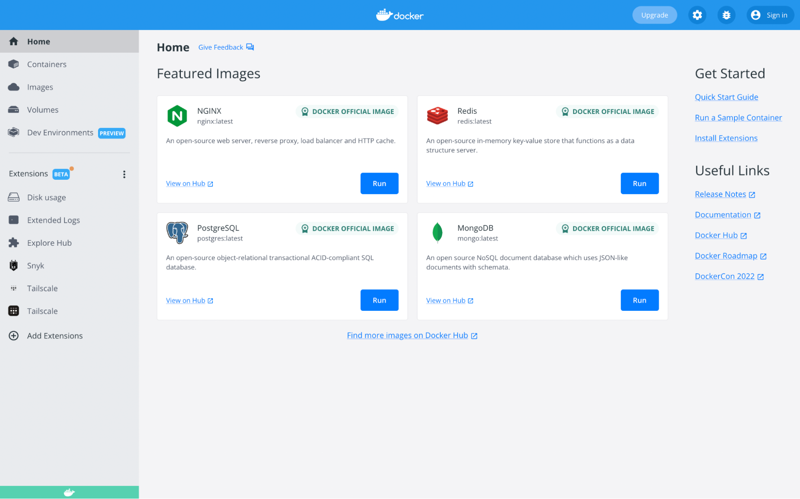

# Setup

## Installing Docker Desktop

Download and install [Docker Desktop](https://www.docker.com/products/docker-desktop/) for your OS.

Once installed, run Docker Desktop. When Docker Desktop is up and running, you should see a dashboard like this:

Docker Desktop can be closed and it should continue running in the background.

### WSL

If you're using [Windows Subsystem for Linux](https://learn.microsoft.com/en-us/windows/wsl/install), be sure to enable the integration for WSL in your Docker Desktop settings (**Settings** > **Resources** > **WSL Integration**).

## Updating Docker Desktop

You can check for updates by going to **Settings** > **Software updates** > **Check for updates**.

# Troubleshooting

## Docker Desktop stuck on starting

If Docker Desktop is stuck on starting after an update or system reboot, try the following:

1. Uninstall Docker Desktop
2. Restart computer
3. Reinstall [Docker Desktop](#installing-docker-desktop)
