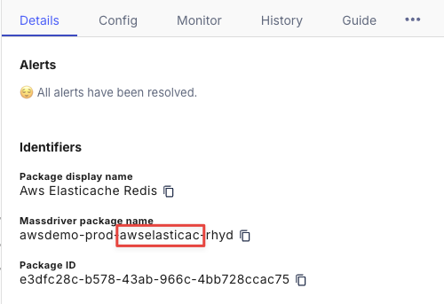

# GitHub Action

This guide will walk you through the process of setting up a GitHub Action to build, push, and deploy app changes to your chosen cloud container repository.

:::note

Before getting started, you'll need:
- A Massdriver [account](https://app.massdriver.cloud/register)
- A Massdriver [service account](/platform/service-accounts)
- A GitHub repository with your application code

:::

## Applications

### Publish your application

Before you can set up a GitHub Action to deploy your application, first you'll need to publish it to Massdriver and create a package. You can do this by following the [Create App](/applications/create) guide.

After you publish your application, you'll need to create a package. You can do this by dragging your application out from the bundle bar in the Massdriver canvas. Fill in the fields of your application and click **Save**. 

### Set secrets and vars

Once you've published your application, you'll need to set the following secrets and vars in your GitHub repository:

| Name | Description | Type | Notes |
| --- | --- | --- | --- |
| `MASSDRIVER_ORG_ID` | Your Massdriver organization ID | secret | Copy your [Organization ID](/concepts/organizations#find-your-organization-id) |
| `MASSDRIVER_API_KEY` | Your Massdriver API key | secret | Create a [Service Account](/platform/service-accounts) |
| `MASSDRIVER_ARTIFACT_ID` | The ID of the authentication artifact in Massdriver | secret | Copy your [Artifact ID](/concepts/artifacts#artifact-id) |
| `NAMESPACE` | The namespace of your build | variable | If it does not exist paired with the `IMAGE_NAME`, then it will be created for you |
| `IMAGE_NAME` | The image name of your build | variable | If it does not exist paired with the `NAMESPACE`, then it will be created for you |
| `REGION` | The region where your cloud container repository is located | variable | Must be a valid cloud region. For example: `eastus` for Azure, or `us-west-1` for AWS. |

### Workflow file

To set up the GitHub Action, create a new file named `deploy.yaml` in the `.github/workflows` directory of your GitHub repository. You can use this workflow below as a starting point:

```yaml title=".github/workflows/deploy.yaml"
name: Deploy to Massdriver
on:
  push:
    branches: [main]

jobs:
  push_and_deploy:
    runs-on: ubuntu-latest
    env:
      MASSDRIVER_ORG_ID: ${{ secrets.MASSDRIVER_ORG_ID }}
      MASSDRIVER_API_KEY: ${{ secrets.MASSDRIVER_API_KEY }}
    steps:
      - uses: actions/checkout@v4
      - name: Install Massdriver CLI
        uses: massdriver-cloud/actions@v4
      - name: Push Image
        uses: massdriver-cloud/actions/image_push@v4
        with:
          namespace: ${{ vars.NAMESPACE }}
          image-name: ${{ vars.IMAGE_NAME }}
          artifact: ${{ secrets.MASSDRIVER_ARTIFACT_ID }}
          region: ${{ vars.REGION }}
          image-tag: ${{ github.sha }}
          build-context: ./ # path to Dockerfile
      - name: Publish Bundle 
        uses: massdriver-cloud/actions/bundle_publish@v4
        with:
          build-directory: ./massdriver # path to massdriver config directory, contains massdriver.yaml
      - name: Set Image Version 
        uses: massdriver-cloud/actions/app_patch@v4
        with:
          project: <insert-project-abbreviation-here>
          env: <insert-environment-abbreviation-here>
          manifest: <insert-manifest-abbreviation-here>
          set: |
            <insert-image-tag-path> = "${{ github.sha }}"
      - name: Deploy App
        uses: massdriver-cloud/actions/app_deploy@v4
        with:
          project: <insert-project-abbreviation-here>
          env: <insert-environment-abbreviation-here>
          manifest: <insert-manifest-abbreviation-here>
```

This example is configured to trigger on pushes to the repository's `main` branch. Be sure to update the trigger to match your branching and git workflow process.

When this GitHub Action runs, it will:
* Build and push your image to your cloud container repository
* Update the tag in your application package
* Redeploy your application in Massdriver with the updated tag

## Infrastructure

## Publish your bundle

Before you can set up a GitHub Action to automate publishing your bundle, first you'll need to manually publish it to Massdriver and create a package. You can do this by following the [Bundle Creation Walkthrough](/bundles/walk-through) guide.

After you publish your bundle, you'll need to create a package. You can do this by dragging your bundle out from the bundle bar in the Massdriver canvas. Fill in the fields of your bundle and click **Save**. 

### Set secrets

| Name | Description | Type | Notes |
| --- | --- | --- | --- |
| `MASSDRIVER_ORG_ID` | Your Massdriver organization ID | secret | Copy your [Organization ID](/concepts/organizations#find-your-organization-id) |
| `MASSDRIVER_API_KEY` | Your Massdriver API key | secret | Create a [Service Account](/platform/service-accounts) |

### Workflow file

To set up the GitHub Action, create a new file named `publish.yaml` in the `.github/workflows` directory of your GitHub repository. You can use this workflow below as a starting point:

```yaml title=".github/workflows/publish.yaml"
name: Publish to Massdriver
on:
  push:
    branches: [main]

jobs:
  publish:
    runs-on: ubuntu-latest
    env:
      MASSDRIVER_ORG_ID: ${{ secrets.MASSDRIVER_ORG_ID }}
      MASSDRIVER_API_KEY: ${{ secrets.MASSDRIVER_API_KEY }}
    steps:
      - uses: actions/checkout@v4
      - name: Install Massdriver CLI
        uses: massdriver-cloud/actions@v4
      - name: Publish Bundle 
        uses: massdriver-cloud/actions/bundle_publish@v4
        with:
          build-directory: ./ # path to massdriver config directory, contains massdriver.yaml
```

This example is configured to trigger on pushes to the repository's `main` branch. Be sure to update the trigger to match your branching and git workflow process.

## FAQs

### Where can I find my secrets, project, target, and manifest names?

* [Secrets & vars](#set-secrets-and-vars)
* [Projects](/concepts/projects) are found on the Projects page of Massdriver
* [Environments](/concepts/environments) are found listed inside your project
* [Manifests](/concepts/manifests) are the abbreviated name of your bundle or application



### Where can I find my image tag path?

The image tag path is the [`jq`](https://stedolan.github.io/jq/manual/) formatted path to the image tag field in the params section of your application's `massdriver.yaml` file. For example, if your `massdriver.yaml` file looks like this:

```yaml title="massdriver.yaml"
runtime:
  type: object
  title: Runtime Settings
  required:
    - image
  properties:
    image:
      type: object
      title: Container Image
      required:
        - tag
      properties:
        tag:
          title: ECR image tag
          description: Specific version of the container to pull on each deployment of the lambda function.
          type: string
          default: latest
```
Then your image tag path would be `.runtime.image.tag`. 

### I have subdirectories in my repository. How do I set the build context?

* If your `Dockerfile` is in a subdirectory, you can update the `build-context` to point to that directory. For example, if your `Dockerfile` is in the `./app` directory, you can set the `build-context` to `./app`.
* If your `massdriver.yaml` file is in a subdirectory, you can update the `build-directory` to point to that directory. For example, if your `massdriver.yaml` file is in the `./app/massdriver` directory, you can set the `build-directory` to `./app/massdriver`.

View the Massdriver GitHub Actions on the [GitHub Marketplace](https://github.com/marketplace/actions/massdriver-actions).