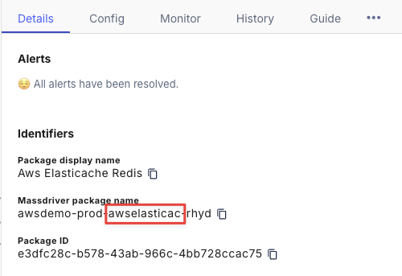

# Azure DevOps Pipeline

This guide will walk you through the process of setting up an Azure DevOps Pipeline to build, push, and deploy app changes to your Azure container repository.

:::note

Before getting started, you'll need:
- A Massdriver [account](https://app.massdriver.cloud/register)
- A Massdriver [service account](/security/service-accounts)
- An Azure DevOps repository with your application code
- The [Mass CLI extension](https://marketplace.visualstudio.com/items?itemName=Massdriver.mass-cli) for Azure DevOps

:::

## Applications

## Publish your application

Before you can set up an Azure DevOps Pipeline to deploy your application, first you'll need to publish it to Massdriver and create a package. You can do this by following the [Create App](/applications/create) guide.

After you publish your application, you'll need to create a package. You can do this by dragging your application out from the bundle bar in the Massdriver canvas. Fill in the fields of your application and click **Save**. 

## Set secrets and vars

Once you've published your application, you'll need to set the following variables in your Azure DevOps Pipeline:

| Name                     | Description                                                 | Type     | Notes                                                                                  |
| ------------------------ | ----------------------------------------------------------- | -------- | -------------------------------------------------------------------------------------- |
| `MASSDRIVER_ORG_ID`      | Your Massdriver organization ID                             | secret   | Copy your [Organization ID](/concepts/organizations#find-your-organization-id)         |
| `MASSDRIVER_API_KEY`     | Your Massdriver API key                                     | secret   | Create a [Service Account](/security/service-accounts)                                 |
| `MASSDRIVER_ARTIFACT_ID` | The ID of the authentication artifact in Massdriver         | secret   | Copy your [Artifact ID](/concepts/artifacts#artifact-id)                               |
| `NAMESPACE`              | The namespace of your build                                 | variable | If it does not exist paired with the `IMAGE_NAME`, then it will be created for you     |
| `IMAGE_NAME`             | The image name of your build                                | variable | If it does not exist paired with the `NAMESPACE`, then it will be created for you      |
| `REGION`                 | The region where your cloud container repository is located | variable | Must be a valid cloud region. For example: `eastus` for Azure, or `us-west-1` for AWS. |

## Workflow file

To set up the pipeline, create a new pipeline and select where your code is, then select your repository. When selecting a template, select `Starter Pipeline`. You can then use this example below as a starting point:

```yaml title="azure-pipelines.yml"
trigger:
  branches:
    include:
    - main

pool:
  vmImage: 'ubuntu-latest'

variables:
  MASSDRIVER_ORG_ID: $(MASSDRIVER_ORG_ID)
  MASSDRIVER_API_KEY: $(MASSDRIVER_API_KEY)

stages:
- stage: DeployToMassdriver
  jobs:
  - job: push_and_deploy
    steps:
    - checkout: self

    - task: mass-cli-install@0
      displayName: 'Install Massdriver CLI'

    - task: mass-image-push@0
      displayName: 'Push Image'
      inputs:
        namespace: $(NAMESPACE)
        imageName: $(IMAGE_NAME)
        artifact: $(MASSDRIVER_ARTIFACT_ID)
        region: $(REGION)
        imageTag: $(Build.SourceVersion) # Sets image tag to git commit sha
        buildContext: './' # Path to Dockerfile

    - task: mass-bundle-publish@0
      displayName: 'Publish Bundle'
      inputs:
        buildDirectory: './massdriver' # Path to massdriver.yaml file

    - task: mass-app-patch@0
      displayName: 'Set Image Version'
      inputs:
        project: <insert-project-name-here>
        env: <insert-environment-name-here>
        manifest: <insert-manifest-name-here>
        set: '.image.tag="$(Build.SourceVersion)"'

    - task: mass-app-deploy@0
      displayName: 'Deploy App'
      inputs:
        project: <insert-project-name-here>
        env: <insert-environment-name-here>
        manifest: <insert-manifest-name-here>
```

This example is configured to trigger on pushes to the repository's `main` branch. Be sure to update the trigger to match your branching and git workflow process.

When this DevOps Pipeline runs, it will:
* Build and push your image to your Azure container repository
* Update the tag in your application package
* Redeploy your application in Massdriver with the updated tag

## Infrastructure

## Publish your bundle

Before you can set up an Azure DevOps Pipeline to automate publishing your bundle, first you'll need to manually publish it to Massdriver and create a package. You can do this by following the [Bundle Creation Walkthrough](/bundles/walk-through) guide.

After you publish your bundle, you'll need to create a package. You can do this by dragging your bundle out from the bundle bar in the Massdriver canvas. Fill in the fields of your bundle and click **Save**. 

### Set secrets

| Name                 | Description                     | Type   | Notes                                                                          |
| -------------------- | ------------------------------- | ------ | ------------------------------------------------------------------------------ |
| `MASSDRIVER_ORG_ID`  | Your Massdriver organization ID | secret | Copy your [Organization ID](/concepts/organizations#find-your-organization-id) |
| `MASSDRIVER_API_KEY` | Your Massdriver API key         | secret | Create a [Service Account](/security/service-accounts)                         |

### Workflow file

To set up the pipeline, create a new pipeline and select where your code is, then select your repository. When selecting a template, select `Starter Pipeline`. You can then use this example below as a starting point:

```yaml title="azure-pipelines.yml"
trigger:
  branches:
    include:
    - main

pool:
  vmImage: 'ubuntu-latest'

variables:
  MASSDRIVER_ORG_ID: $(MASSDRIVER_ORG_ID)
  MASSDRIVER_API_KEY: $(MASSDRIVER_API_KEY)

stages:
- stage: PublishToMassdriver
  jobs:
  - job: publish
    steps:
    - checkout: self

    - task: mass-cli-install@0
      displayName: 'Install Massdriver CLI'

    - task: mass-bundle-publish@0
    displayName: 'Publish Bundle'
    inputs:
      buildDirectory: './massdriver' # Path to massdriver.yaml file
```

## FAQs

### Where can I find my secrets, project, target, and manifest names?

* [Secrets & vars](#set-secrets-and-vars)
* [Projects](/concepts/projects) are found on the Projects page of Massdriver
* [Environments](/concepts/environments) are found listed inside your project
* [Manifests](/concepts/manifests) are the abbreviated name of your bundle or application



### Where can I find my image tag path?

The image tag path is the [`jq`](https://stedolan.github.io/jq/manual/) formatted path to the image tag field in the params section of your application's `massdriver.yaml` file. For example, if your `massdriver.yaml` file looks like this:

```yaml title="massdriver.yaml"
runtime:
  type: object
  title: Runtime Settings
  required:
    - image
  properties:
    image:
      type: object
      title: Container Image
      required:
        - tag
      properties:
        tag:
          title: ACR image tag
          description: Specific version of the container to pull.
          type: string
          default: latest
```
Then your image tag path would be `.runtime.image.tag`. 

### I have subdirectories in my repository. How do I set the build context?

* If your `Dockerfile` is in a subdirectory, you can update the `buildContext` to point to that directory. For example, if your `Dockerfile` is in the `./app` directory, you can set the `buildContext` to `./app`.
* If your `massdriver.yaml` file is in a subdirectory, you can update the `buildDirectory` to point to that directory. For example, if your `massdriver.yaml` file is in the `./app/massdriver` directory, you can set the `buildDirectory` to `./app/massdriver`.
