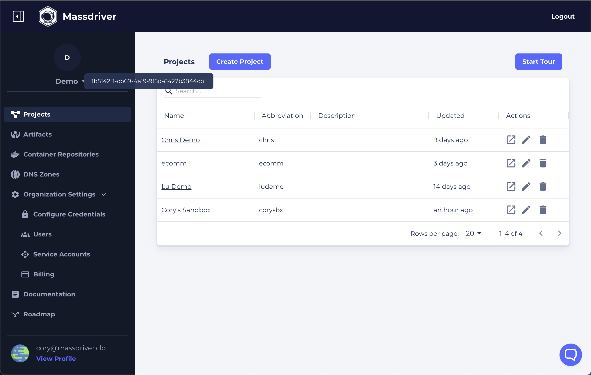
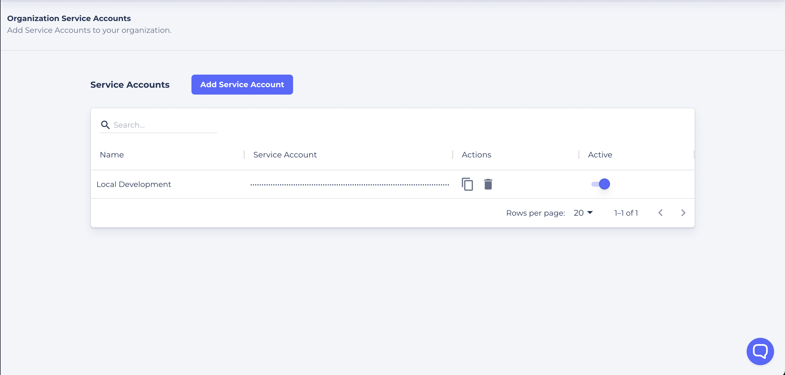

The Mass CLI is a powerful command line interface for interacting with the Massdriver platform. It is used to build and publish bundles, manage deployments, and more.

## Installation

### Brew Installation

To install the Mass CLI using [Homebrew](https://formulae.brew.sh/formula/massdriver), run the following command:

```bash
brew install massdriver
```

### Manual Installation

To install (or update) the Mass CLI manually, download the latest release from the [Mass CLI releases page](https://github.com/massdriver-cloud/mass/releases).

Select the file that matches your operating system and architecture, i.e. `mass_darwin_amd64.zip` for Mac OS users.

Unzip the `mass` file and move it to a directory in your `$PATH`, i.e. `/usr/local/bin`.

:::note

For Mac OS users, you will need to allow `mass` to run by opening the `System Preferences` app, clicking on `Security & Privacy`, and clicking on the `Open Anyway` button. You may need to do this a second time after attempting to invoke the `mass` command.

:::

### Setup

In order to execute commands against your Massdriver organization, you must set environment variables for the CLI to use.

#### Find your organization ID

To find your organization ID, hover over your organization name logo in the top left corner of the Massdriver UI and click the copy button next to your organization ID.

#### Use your organization ID in the Massdriver CLI

To use your organization ID in the Massdriver CLI, export the `MASSDRIVER_ORG_ID` environment variable to the value of your Organization UUID.

```bash
export MASSDRIVER_ORG_ID=your-org-id
```


#### Setting The Serivce Account

1. Visit the [Service Accounts page](https://app.massdriver.cloud/organization/api-keys)
2. Click 'Add Service Account'
3. Give the service account a name
4. Click the 'clipboard' icon.



You'll need to export your key to the following environment variable:

```bash
export MASSDRIVER_API_KEY=fookey9000!
```

## Commands

### Applications

* `mass app configure` - [Configures applications](/cli/application/configure) on Massdriver
* `mass app deploy` - [Deploys applications](/cli/application/deploy) to Massdriver
* `mass app patch` - [Patches application configuration](/cli/application/patch) on Massdriver

### Bundles

* `mass bundle new` - Interactive wizard to create a new bundle from a template
* `mass bundle build` - Hydrates a bundle with necessary schema files and validates the `massdriver.yaml` file
* `mass bundle publish` - Publishes a bundle to your Massdriver organization
* `mass bundle lint` - Validates a bundle's `massdriver.yaml` file
* `mass bundle template list` - [Lists](/cli/bundle/template-list) all available bundle templates
* `mass bundle template refresh` - [Refreshes the list](/cli/bundle/template-refresh) of available bundle templates

### Image

* `mass image push` - [Builds and pushes an image](/cli/image/push) to a cloud image registry (e.g. ACR, ECR, or GCR)

### Infrastructure

* `mass infra configure` - [Configures infrastructure](/cli/infrastructure/configure) on Massdriver
* `mass infra deploy` - [Deploys infrastructure](/cli/infrastructure/deploy) to Massdriver
* `mass infra patch` - [Patches infrastructure configuration](/cli/infrastructure/patch) on Massdriver

### Preview

* `mass pv decommission` - [Decommissions an initialized preview](/cli/preview/decommission) in your project
* `mass pv deploy` - [Deploys a preview](/cli/preview/deploy) in your project
* `mass pv init` - [Generates a preview](/cli/preview/init) config file