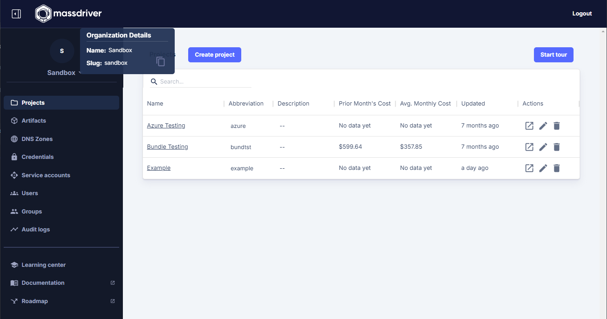

The Mass CLI is a powerful command line interface for interacting with the Massdriver platform. It is used to build and publish bundles, manage deployments, and more.

## Installation

### Brew Installation

To install the Mass CLI using [Homebrew](https://formulae.brew.sh/formula/massdriver), run the following command:

```bash
brew install massdriver
```

<details>
    <summary>Installing a specific version</summary>

To install a specific version of the Mass CLI, follow these steps:


1. Find the version you want to install from the [Mass CLI homebrew-core commit history](https://github.com/Homebrew/homebrew-core/commits/HEAD/Formula/m/massdriver.rb)
2. Copy the commit hash of the version you want to install. **NOTE:** Copy the commit hash for `massdriver: update x.y.z bottle` commit.
3. Run the following command to install the specific version:

*(If you have already installed the Mass CLI, you will need to uninstall it first using `brew uninstall massdriver`)*

```bash
curl -L https://raw.githubusercontent.com/Homebrew/homebrew-core/<commit-hash-here>/Formula/m/massdriver.rb > massdriver.rb && brew install massdriver.rb
```

If you want to pin the version you installed, run the following command:

```bash
brew pin massdriver
```

</details>

### Go Installation

To install using go:

```shell
go install github.com/massdriver-cloud/mass@latest
```

Make sure that your `$GOPATH/bin` is in your path.

### Manual Installation

To install (or update) the Mass CLI manually, download the latest release from the [Mass CLI releases page](https://github.com/massdriver-cloud/mass/releases).

Select the file that matches your operating system and architecture, i.e. `mass_darwin_amd64.zip` for Mac OS users.

Unzip the `mass` file and move it to a directory in your `$PATH`, i.e. `/usr/local/bin`.

:::note

For Mac OS users, you will need to allow `mass` to run by opening the `System Preferences` app, clicking on `Security & Privacy`, and clicking on the `Open Anyway` button. You may need to do this a second time after attempting to invoke the `mass` command.

:::

## Configuration

The Massdriver CLI requires configuration to authenticate and interact with your organization's resources. This configuration can be supplied via environment variables or a configuration file, with environment variables taking precedence.

Specifically, the CLI requires the following configuration values:
* **Organization ID**: A short string identifying your organization (e.g. acme, not a UUID)
* **API Key**: A Massdriver Service Account token with appropriate permissions
An optional third configuration is:
* **URL**: Used only for self-hosted environments to point the CLI at a custom Massdriver API endpoint.

#### Find your organization ID

To find your organization slug, hover over your organization name logo in the top left corner of the Massdriver UI and click the copy button next to your organization slug.



#### Creating a Service Account

1. Visit the [Service Accounts page](https://app.massdriver.cloud/service-accounts)
2. Click 'Add Service Account'
3. Give the service account a name
4. Click the 'clipboard' icon.


### Configuration Sources

#### Environment Variables

You can configure the CLI entirely via environment variables:

| Variable | Description |
|---|---|
| `MASSDRIVER_ORGANIZATION_ID` | Your organization identifier. (Note: `MASSDRIVER_ORG_ID` is also supported for this value) |
| `MASSDRIVER_API_KEY` | Your API key |
| `MASSDRIVER_URL` | (Optional) Custom API endpoint |
| `MASSDRIVER_PROFILE` | (Optional) Profile name to use from config file |

#### Configuration File

If environment variables are not set, the CLI will fall back to a YAML configuration file if present:

```yaml
# ~/.config/massdriver/config.yaml

version: 1

profiles:
  default:
    organization_id: acme
    api_key: your-api-key
  sandbox:
    organization_id: acme-sandbox
    api_key: sandbox-api-key
  self-hosted:
    organization_id: internal
    api_key: internal-api-key
    url: https://api.massdriver.yourdomain.com
```

By default, this file should be located at `$HOME/.config/massdriver/config.yaml`, however it will respect the `XDG_CONFIG_HOME` environment variable if present in which case the file should be located at `$XDG_CONFIG_HOME/massdriver/config.yaml`.

The CLI will select a profile based on the following logic:

1. If the `MASSDRIVER_PROFILE` environment variable is set, use that profile.
2. Otherwise, fall back to the `default` profile (if it exists).

#### Precedence

When resolving configuration, the CLI follows this precedence:

1. Environment variables
2. Profile from config file

Values provided via environment variables will always override those from the config file, even if a matching profile is found.

## See the Commands

* [mass](/cli/commands/mass)	 - Massdriver Cloud CLI
