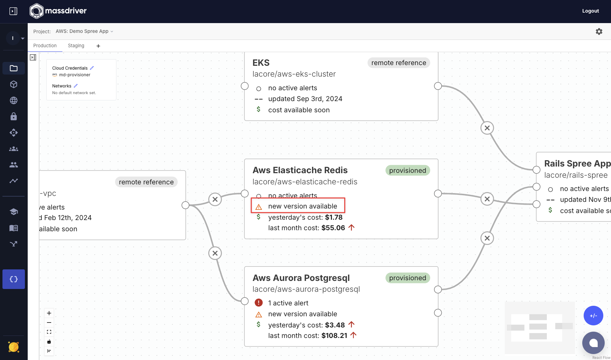

Bundles are the basic building blocks of infrastructure, applications, and architectures in Massdriver. They are composed of Terraform modules or Helm charts.

Massdriver includes a number of pre-built [best practices and reference architecture bundles](https://github.com/massdriver-cloud), but you may also [develop your own](/bundles).

A Massdriver bundle typically serves a single purpose rather than abstracting an entire cloud service. Instead of terraform modules like "AWS RDS" they will typically be designed around the use case a software engineering is looking for like "AWS RDS MySQL". In Massdriver, we advise against bundles like 'S3 Bundle' and instead suggest bundles like 'S3 Logging Bucket' or 'CDN' (using S3 & CloudFront).

Bundles can be added from the bundle sidebar when viewing a project.

Keeping infrastructure and applications up to date can be tedious. Whenever an update is published to a Massdriver bundle, an indicator lets you know it's time to update. Official Massdriver bundles are forward compatible and include Open Policy Agent rules to prevent accidental deletion of critical resources.

