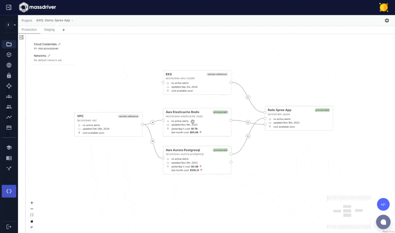

## Projects

Projects are the _blueprints_ of infrastructure and application architectures in Massdriver. A project acts as the parity boundary for deploying your architecture against multiple environments.

All environments in the same project will always have the same diagram, but scale and authentication can be customized per environment.

This allows for:

* Running cost-efficient staging or preview environments that have architectural parity with production
* Managing applications and infrastructure in isolated tenant environments
* Replicating infrastructure and applications between regions

## Environments

An environment is the _workspace_ that a bundle will be deployed to. Massdriver doesn't enforce any governance on how you design your environments.

Environments can be modeled by:
- **Application stage**: production, staging, development
- **Region**: prod-usw, prod-eu
- **Developer**: alice-dev, bob-dev (ephemeral)

Massdriver separates authentication and scale from the parity that is enforced by a project. This allows environments to share the same "architecture" for staging and production, but have different scale for cost-saving purposes.

## Environment Comparison

It can be difficult to figure the differences in configuration between two different environments. Massdriver Environments support a visual comparison, quickly highlighting the difference between staging and production, US West and the EU, or any combination of environments.

## Related Documentation

- [Getting Started](/getting-started/overview) - Deploy your first infrastructure
- [Manifests, Packages & Deployments](/concepts/manifests-packages-deployments) - The deployment lifecycle
