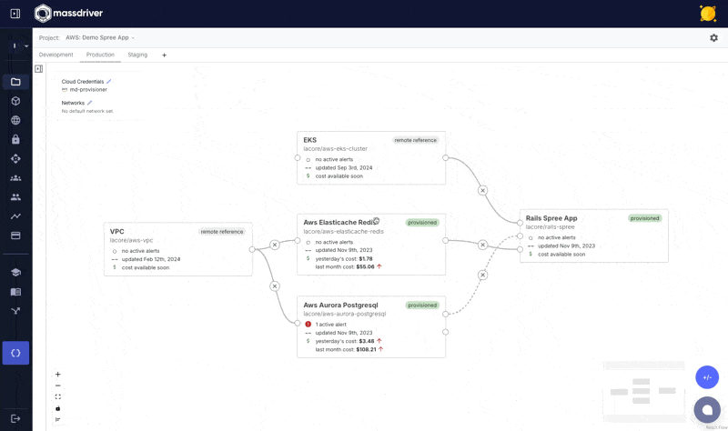

This page covers the lifecycle of infrastructure from blueprint to deployed resources.

## Components

A **component** (previously called a "manifest") is a [bundle](/concepts/bundles) that has been added to a project's blueprint with a specific use case.

For example: You may add the `aws-elasticache-redis` bundle to a project for multiple use cases — one component for `user-sessions` and a second component for `caching`.

In the example below, an **SNS Topic** is added to the project for tracking _created orders_ in an e-commerce application.

<video controls loop muted playsInline width="100%">
  <source src="/img/screenshots/add-component.webm" type="video/webm" />
</video>

## Instances

An **instance** (previously called a "package") is a component as it exists in a specific [environment](/concepts/projects-and-environments) (e.g. production, staging, US West, etc).

> An instance is the intersection of an environment and a component.

In Massdriver, naming conventions for cloud resources are managed for you. The instance's identifier can be seen by clicking on the component and selecting the `Details` tab. The `ID` will be the naming prefix for all resources created when this instance is deployed.


### Instance Alarms

Instances surface alarms in the **Monitor** tab of the instance pane. Click any component on the canvas, open **Monitor**, and Massdriver lists the alarms wired up for that instance. See [Monitoring & Alarms](/platform-operations/monitoring-and-alarms) for how to declare them.

<video controls loop muted playsInline width="100%">
  <source src="/img/screenshots/instance-alarms.webm" type="video/webm" />
</video>

### Instance Resources

Every cloud resource an instance creates is tracked on the instance itself. Click an instance, open the **Resources** tab, and Massdriver shows the resource entries the provisioner produced — along with the ABAC tags attached to each. Drill into a single resource to see its individual properties (hostname, port, username, etc.), copy any value to your clipboard, or pull the URL straight from the panel.

<video controls loop muted playsInline width="100%">
  <source src="/img/screenshots/instance-resources.webm" type="video/webm" />
</video>

## Deployments

Deployments are a record of provisioning or decommissioning infrastructure or applications in Massdriver.

Massdriver keeps a record of every deployment, whether provisioning or decommissioning infrastructure or applications.

<video controls loop muted playsInline width="100%">
  <source src="/img/screenshots/deploy-instance.webm" type="video/webm" />
</video>

### Deployment Comparison

Massdriver makes it easy to view the difference in configuration between deployments. It's a great way to provide information to auditors, or to debug issues related to a recent deployment.



## The Lifecycle

```
Bundle → Component → Instance → Deployment
   ↓         ↓          ↓           ↓
Template  Blueprint  Env-bound    Record
```

1. **Bundle**: A reusable infrastructure template (e.g., "PostgreSQL Database")
2. **Component**: A bundle added to a project for a specific purpose (e.g., "User Database")
3. **Instance**: A component as it exists in a specific environment (e.g., "User Database in Production")
4. **Deployment**: A record of provisioning or decommissioning that instance

## Related Documentation

- [Bundles](/concepts/bundles) - Understanding bundle structure
- [Projects & Environments](/concepts/projects-and-environments) - Organizing your infrastructure
- [Resources & Resource Types](/concepts/resources-and-types) - How instances connect
