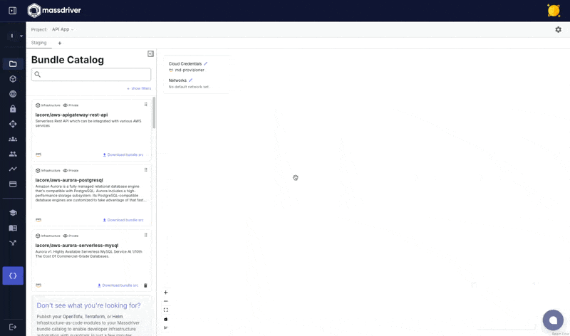

This page covers the lifecycle of infrastructure from blueprint to deployed resources.

## Manifests

Manifests are [bundles](/concepts/bundles) that have been added to a project with a specific use case.

For example: You may add the `aws-elasticache-redis` bundle to a project for multiple use cases, one instance for `user-sessions` and a second instance for `caching`.

In the example below, an **SNS Topic** is added to the project for tracking _created orders_ in an e-commerce application.



## Packages

A _package_ is a [manifest](#manifests) that has been deployed to a specific [environment](/concepts/projects-and-environments) (e.g., production, staging, US West, etc).

In Massdriver, naming conventions for cloud resources are managed for you. The package's identifier can be seen by clicking on the manifest and selecting the `Details` tab. The `ID` will be the naming prefix for all resources created when this package is deployed.


### Package Alarms

Packages can integrate monitors and alarms into Massdriver's notification system. In the example below, a number of Cloudwatch Alarms are visible for Aurora Postgres.


### Package Resources

Cloud resources created by the package are tracked within Massdriver. Below is a view of the resources created by the [AWS EKS Cluster](https://github.com/massdriver-cloud/aws-eks-cluster) bundle.


## Deployments

Deployments are a record of provisioning or decommissioning infrastructure or applications in Massdriver.

Massdriver keeps a record of every deployment, whether provisioning or decommissioning infrastructure or applications.


### Deployment Comparison

Massdriver makes it easy to quickly view the difference in configuration between different deployments. It's a great way to provide information to auditors, or to debug issues related to a recent deployment.


## The Lifecycle

```
Bundle → Manifest → Package → Deployment
   ↓         ↓          ↓          ↓
Template  Blueprint  Instance    Record
```

1. **Bundle**: A reusable infrastructure template (e.g., "PostgreSQL Database")
2. **Manifest**: A bundle added to a project for a specific purpose (e.g., "User Database")
3. **Package**: A manifest deployed to an environment (e.g., "User Database in Production")
4. **Deployment**: A record of provisioning that package

## Related Documentation

- [Bundles](/concepts/bundles) - Understanding bundle structure
- [Projects & Environments](/concepts/projects-and-environments) - Organizing your infrastructure
- [Artifacts & Definitions](/concepts/artifacts-and-definitions) - How packages connect
