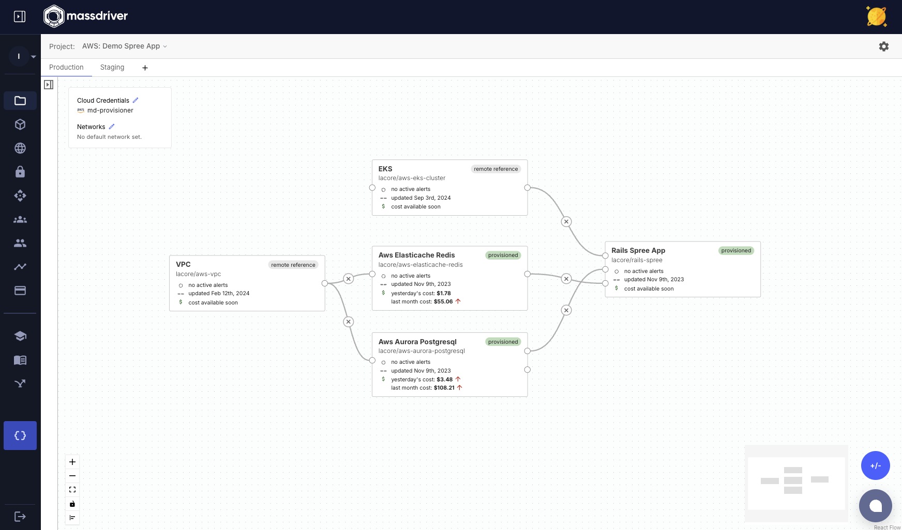

Projects are the _blueprints_ of infrastructure and application architectures in Massdriver. A project acts as the parity boundary for deploying your architecture against multiple [environments](/concepts/environments) (e.g.: application environments, tenants, or regions).

All environments in the same project will always have the same diagram, but scale and authentication can be customized per environment.

This allows for:

* running cost-efficient staging or preview environments that have architectural parity with production
* managing applications and infrastructure in isolated tenant environments
* replicating infrastructure and applications between regions
