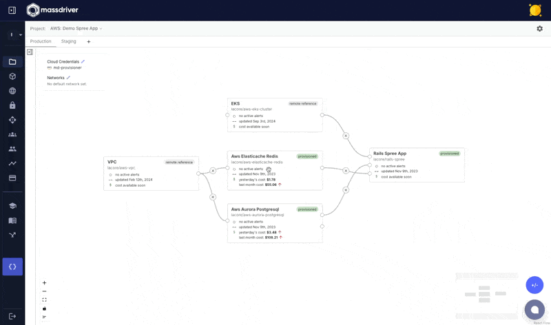
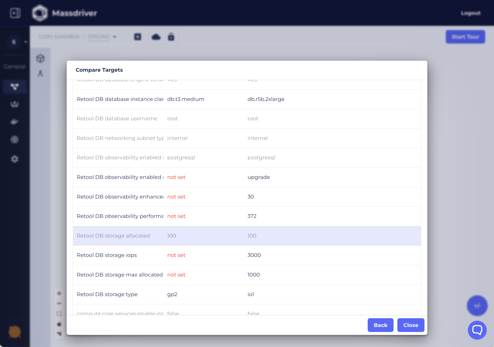

An _application environment_ or _workspace_ that a bundle will be deployed to. Massdriver doesn't enforce any governance on how you design your targets. Targets can be modeled by application stage (production, staging, development), by region (prod-usw, prod-eu), and even ephemerally per developer (alice-dev, bob-dev).

<figure>

<figcaption>Changing targets from staging to production, and adding a 'beta' environment.</figcaption>

</figure>

Massdriver separates authentication and scale from the parity that is enforced by a project. This allows targets to share the same 'architecture' for staging and production, but have a different scale for cost savings purposes.

It can be difficult to figure out the differences in configuration between two different environments. Massdriver Targets support a visual comparison, quickly highlighting the difference between staging and production, US West and the EU, or any combination of targets.

<figure>

<figcaption>Staging and production environment with different storage configurations and instance sizes.</figcaption>

</figure>
