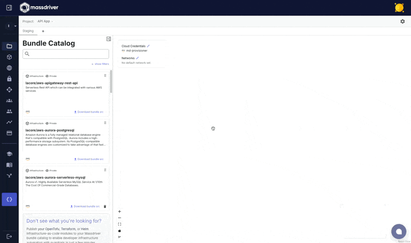

Manifests are [bundles](/concepts/bundles) that have been added to a project with a specific use case.

For example: You may add the `aws-elasticache-redis` bundle to a project for multiple use cases, one instance for `user-sessions` and a second instance for `caching`.

In the example below, an **SNS Topic** is added to the project for tracking _created orders_ in an e-commerce application.

