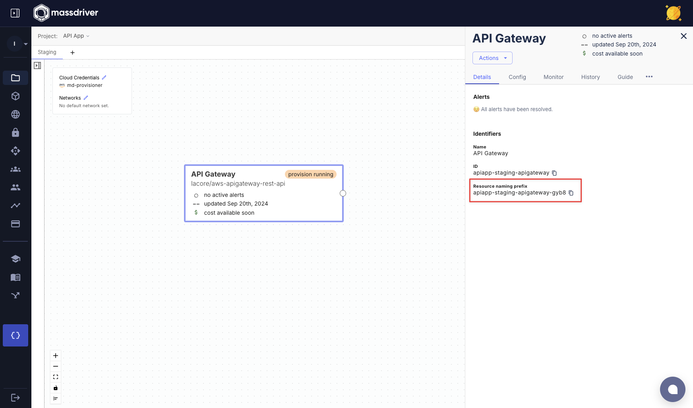
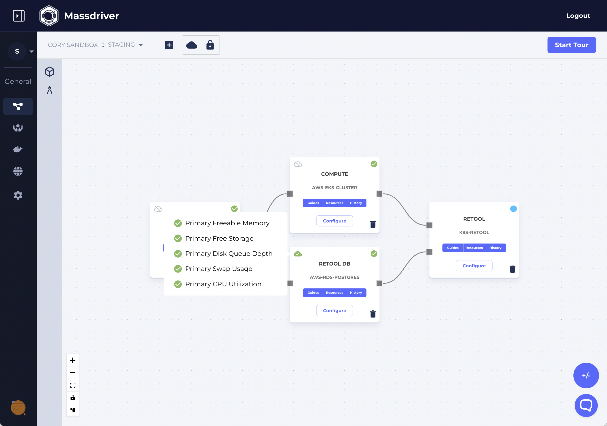
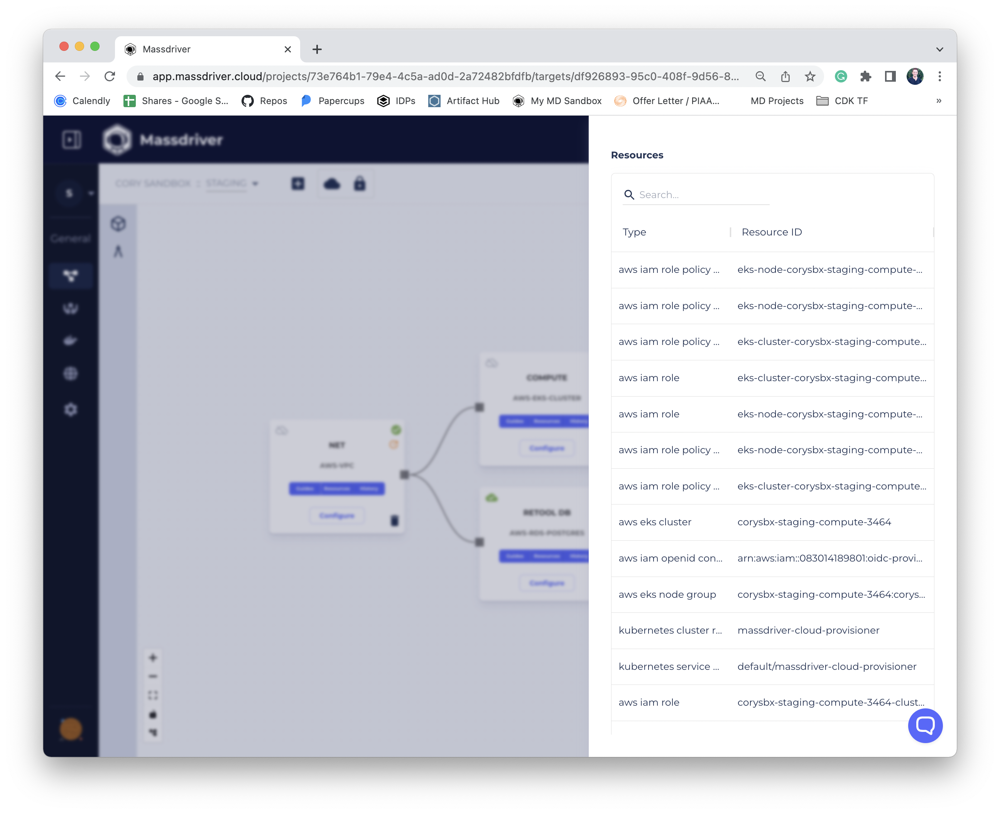

A _package_ is a [manifest](/concepts/manifests) that has been deployed to a specific [target](/concepts/targets) (e.g.: production, staging, US West, etc).

In Massdriver naming conventions for cloud resources are managed for you. The package's identifier can be seen by hovering over the _name_. This will be the naming prefix for all resources created when this package is deployed.

### Package Alarms

Packages can also integrate monitors and alarms into Massdriver's notification system. In the example below a number of Cloudwatch Alarms are visible for RDS Postgres.

### Package Resources

Cloud resources created by the package are tracked within massdriver. Below is a view of the resources created by the [AWS EKS Cluster](https://github.com/massdriver-cloud/aws-eks-cluster) bundle.

