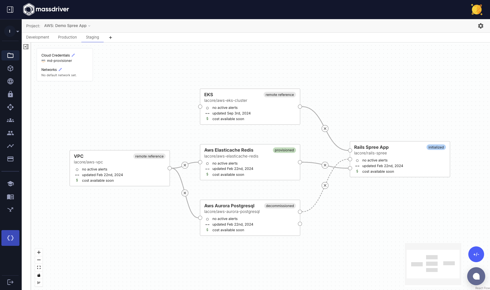

Connections are the lines between [manifests](#manifest) in the Massdriver UI. They can be thought of as an "input" that is another package's artifact.

Connections are unidirectional. The always flow from "left" to "right" and are the _edges_ of a directed acyclic graph defining the dependency hierachy of your infrastructure and applications.

A dotted line indicates that an [artifact](#artifact) _has not_ been provisioned yet for the connection.

A solid lines indicates that an [artifact](#artifact) _has_ been provisioned for the connection.

