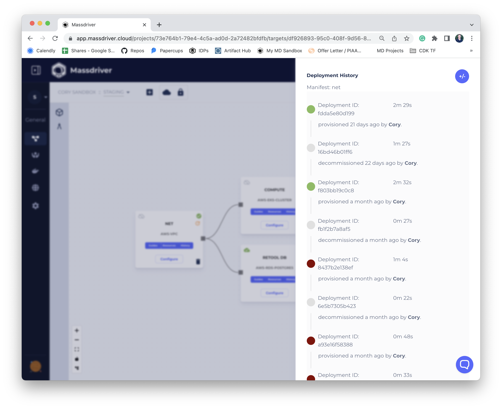
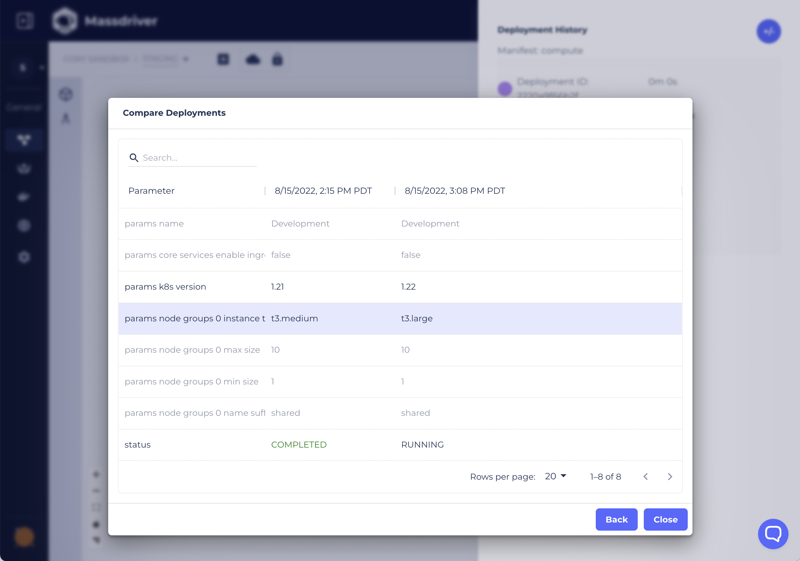

Deployments are a record of provisioning or decommissioning infrastructure or applications in Massdriver.

Massdriver keeps a record of every deployment, whether provisioning or decommissioning infrastructure or applications.

### Deployment Comparison

Massdriver makes it easy to quickly view the difference in configuration between different deployments. It's a great way to provide information to auditors, or to debug issues related to a recent deployment.

