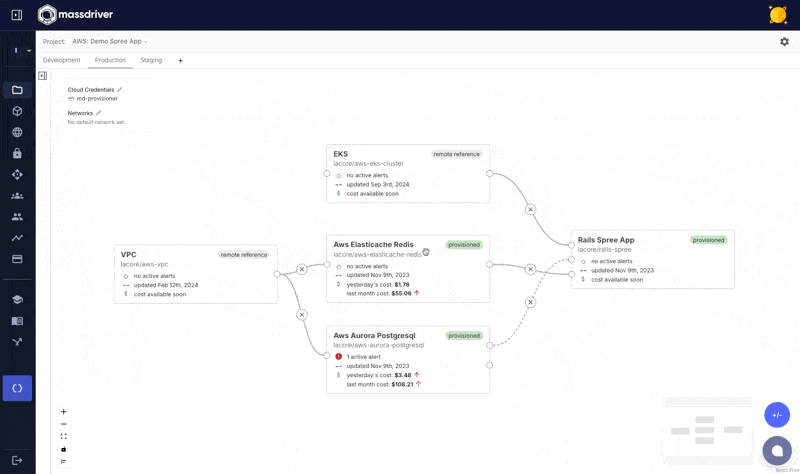
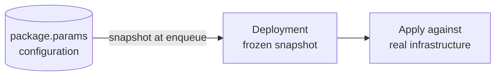
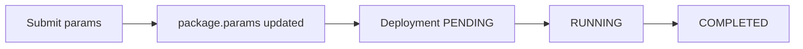
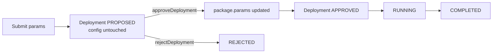
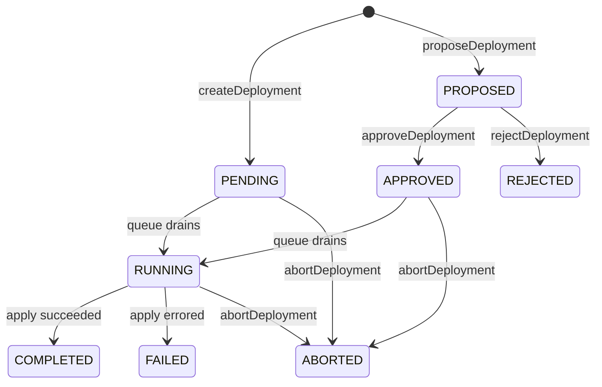
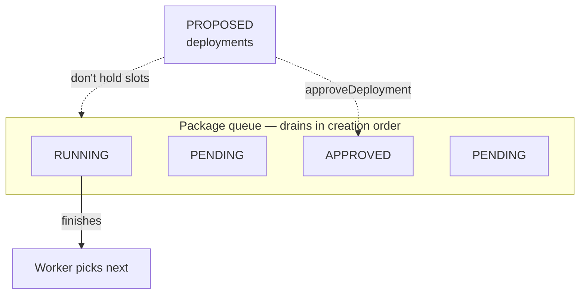

When you change the configuration of a piece of infrastructure in Massdriver and ship it, the system creates a **deployment** — a single, queued attempt to make the running infrastructure match the configuration you saved. Deployments are immutable records: they capture exactly what was tried, with what params, when, and what happened.

This page walks through how params get from your hands onto the queue, how the queue drains, and what each deployment status means.

## Packages and deployments

Massdriver tracks two things separately:

- **The [package](/concepts/packages)** — a deployed piece of infrastructure in an environment (a database, a Kubernetes cluster, a Lambda function). It has a `params` field that holds its current configuration.
- **A deployment** — a queued change against that package. It carries a frozen snapshot of `package.params` from the moment it was created, plus the bundle version to run.

Edit the package and you've changed what the next deployment will use. Create a deployment and you've pinned a copy of the current config and asked the system to apply it.

> **Coming from Terraform?** `package.params` is like your `terraform.tfvars`. A deployment is one `terraform apply` against a pinned plan. Real cloud resources are like your `tfstate`.

## Two ways to advance the configuration

Massdriver gives you two ways to ship a change. The difference is **when `package.params` is updated** and **who has to sign off** before the apply runs.

### Direct — `createDeployment`

`package.params` is overwritten immediately, and the deployment goes straight into the queue at `PENDING`.

Use when you have authority to ship directly.

### Propose-and-approve — `proposeDeployment` + `approveDeployment`

The proposed params live only on the deployment record while it sits in `PROPOSED`. `package.params` is untouched. On approval, the snapshot is copied into `package.params` and the deployment joins the queue. On rejection, neither moves.

Use when a change needs another set of eyes — production environments, tagged resources requiring elevated approval, propose/on-call-approve workflows.

`PLAN` deployments aren't part of this flow; a plan is already a dry-run, so there's nothing to gate.

## The lifecycle

Once a deployment is created, it walks through a state machine. Direct pushes enter at `PENDING`; proposals enter at `PROPOSED`.

| Status | Meaning |
|---|---|
| `PROPOSED` | Awaiting human approval. Doesn't hold a queue slot. |
| `REJECTED` | Proposal denied. Terminal. |
| `APPROVED` | Proposal accepted. `package.params` advanced. Queued. |
| `PENDING` | Queued, waiting its turn. |
| `RUNNING` | The provisioner is applying changes right now. |
| `COMPLETED` | Apply succeeded. Infrastructure matches the snapshot. |
| `FAILED` | Apply errored. See [What happens when a deployment fails](#what-happens-when-a-deployment-fails) below. |
| `ABORTED` | Operator cancelled. |

`COMPLETED`, `FAILED`, `REJECTED`, and `ABORTED` are terminal. To try again, create a new deployment.

## The queue

Every package has its own queue. **Only one deployment per package can be `RUNNING` at a time.**

- **`PROPOSED` is outside the queue.** Open proposals don't block direct-push work. Approval is what puts a proposal in line.
- **`APPROVED` and `PENDING` drain together** in creation order. Approval gives no priority.
- **Per-package.** Two packages in the same environment deploy independently.
- **No rebasing of queued items.** Each queued deployment carries the snapshot it captured at enqueue, even if earlier items in the queue change the infrastructure.
- **`PLAN` takes a slot.** A plan is still a real deployment record.

## What gets snapshotted

When a deployment is created, Massdriver freezes everything it needs for a deterministic apply.

**Snapshotted into the deployment:**

- `params` — the package's configuration values
- `connection_params` — resolved connection wire-up (see [Connections](/concepts/connections))
- `version` — the bundle release to run
- `md_metadata` — system metadata (package name, tags, the deployment's id for observability)

**Looked up live at run time:**

- **Secrets** — encrypted at rest, fetched fresh on dispatch. Rotating a secret takes effect on the *next* deployment, without re-queuing.
- **Bundle release contents** — the snapshot pins the version string; the bundle artifact is pulled from the registry at run time. Bundle releases are immutable once published, so the result is still deterministic.

You can audit any past deployment via its `params` field, or compare two deployments side-by-side with the deployment comparison view.

## What happens when a deployment fails

The apply step is non-transactional, same as `terraform apply`. The provisioner makes a series of API calls to one or more cloud providers, and any of those can fail partway through. There's no way to atomically roll back a half-provisioned RDS instance + half-attached IAM role + half-uploaded S3 bucket across three providers' APIs.

When a `RUNNING` deployment transitions to `FAILED`:

- **`package.params` has already moved.** It reflects what you asked for.
- **Infrastructure is in whatever shape the provisioner reached** before the error.
- **There is no rollback mutation.** Same reason `terraform apply` doesn't have `--undo`.

To recover, edit `package.params` to something that can reconcile cleanly and deploy again. To revert, write the previous params back to `package.params` and create a new deployment — analogous to reverting a commit and re-applying.

`ABORTED` is the same shape: it stops further work but doesn't unwind work already done.

## Things that surprise people

- **Editing package params after queueing doesn't affect the queued deployment.** Only the next one. To pick up your edit on a queued deployment, abort it and create a new one.
- **A failed deployment doesn't roll anything back.** `package.params` advanced; real infrastructure is partial.
- **`PROPOSED` doesn't move `package.params`.** Only `approveDeployment` writes the proposed snapshot back to the package.
- **`PROPOSED` deployments don't hold queue slots.** Stacking proposals doesn't block anything.
- **The queue is strictly per-package.** Long deployments on one package don't slow down others.
- **`PLAN` is a real deployment.** It takes a slot and produces a record.
- **`ABORTED` is not "undo."** It stops further work; it doesn't unwind.

## Compared to a merge queue

If you've used a merge queue with apply-before-merge semantics (GitHub merge queue, Bors, Aviator), you'll notice the shapes are similar — a per-target queue, snapshotted entries, an optional review step — but the failure semantics are reversed:

| | Merge queue with apply-before-merge | Massdriver deployment |
|---|---|---|
| What runs first | The check ("apply"). Main only advances if the check passes. | Desired state advances. The apply runs against it. |
| Failed entry | Main is unchanged. The PR drops out of the queue. | `package.params` has already moved. Real infrastructure is in a partial state. |
| Recovery | None needed — nothing changed. | Edit params and deploy again, or write previous params back and deploy. |
| Why it works | Git is transactional. The "world" only changes at merge. | Cloud APIs aren't transactional. The "world" changes as the apply runs. |

**The honest answer to "why doesn't Massdriver work like a merge queue":** because apply-before-merge isn't possible for infrastructure.

A merge queue can speculatively integrate and test PRs before merging because tests run against a sandbox version of the world (a CI runner) and merging is atomic. Infrastructure has neither property:

- **There's no sandbox.** The apply *is* the change. `terraform plan` is approximate — plenty of failures (quota limits, IAM evaluation, race conditions with sibling resources, provider bugs) only show up at apply time. You can't validate an apply without doing the apply.
- **There's no atomic merge.** An apply makes a series of API calls across one or more cloud providers. Each call commits to the world the moment it returns 200. There's no way to "uncommit" the half that succeeded if the second half fails.
- **Applies are slow.** Provisioning an RDS instance or an EKS cluster takes 10–40 minutes. Speculatively integrating a queue of these in parallel isn't realistic the way it is for CI builds.

The merge-queue model is the right tool for code: code changes are reversible, tests are fast and deterministic, and main is transactional. Massdriver's model is the right tool for infrastructure: changes are partially reversible at best, the apply is the only honest test, and the cloud is not transactional.

The trade-off vs. a merge queue: you don't get automatic, clean rollback on failure. What you get in its place is an immutable audit record of every reconcile attempt, per-package serialization, deterministic snapshots, an optional propose-and-approve gate, and a fast recovery path — fix params, deploy again.

## API quick reference

| Mutation | Effect on `package.params` | Deployment status |
|---|---|---|
| `createDeployment` | **Overwritten immediately** with the supplied params | `PENDING` |
| `proposeDeployment` | **Not touched** — params live only on the deployment | `PROPOSED` |
| `approveDeployment` | **Overwritten** with the proposal's snapshot | `PROPOSED` → `APPROVED` |
| `rejectDeployment` | Not touched | `PROPOSED` → `REJECTED` |
| `abortDeployment` | Not touched | `PENDING` / `APPROVED` / `RUNNING` → `ABORTED` |

## See also

- [Packages](/concepts/packages) — the runtime entity a deployment operates on.
- [Connections](/concepts/connections) — what `connection_params` resolves from.
