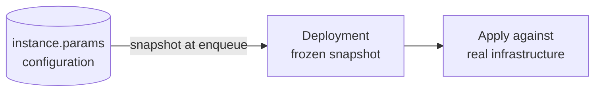
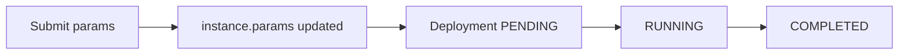
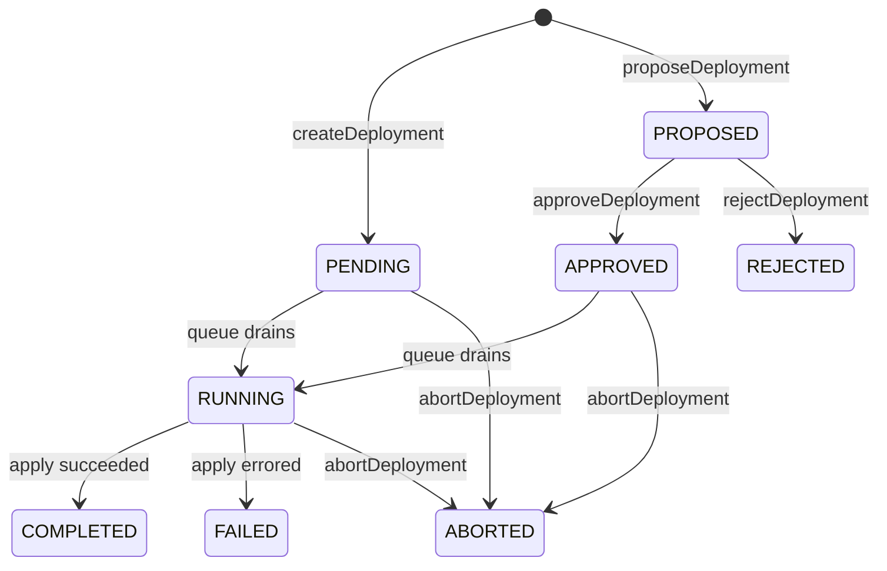

A **deployment** is a queued attempt to make running infrastructure match an [instance's](/concepts/components-instances-deployments#instances) saved configuration. Deployments are immutable records: they capture what was tried, with what params, when, and what happened.

This page covers how params reach the queue, how the queue drains, and what each deployment status means.

<video controls loop muted playsInline width="100%">
  <source src="/img/screenshots/deploy-instance.webm" type="video/webm" />
</video>

## Instances and deployments

An instance has a `params` field that holds its current configuration. A deployment carries a frozen snapshot of `instance.params` from the moment it was created, plus the bundle version to run.

> Editing an instance changes what the next deployment will use. Creating a deployment pins a copy of the current configuration and asks the system to apply it.

## Two ways to deploy a change

Massdriver supports two ways to deploy a change to an instance. The difference is **when `instance.params` is updated** and **whether human approval is required** before the apply runs.

### Direct — `createDeployment`

`instance.params` is overwritten immediately and the deployment enters the queue at `PENDING`.

Use this when the change does not require review.

### Propose-and-approve — `proposeDeployment` + `approveDeployment`

The proposed params live only on the deployment record while it sits in `PROPOSED`. `instance.params` is untouched. On approval, the snapshot is copied into `instance.params` and the deployment enters the queue at `APPROVED`. On rejection, neither moves.

Use this when a change requires review before applying — for example, production environments or tagged resources requiring elevated approval.

> `PLAN` deployments are not part of the propose-and-approve flow. A plan is a non-destructive preview, so it does not require approval.

## The lifecycle

A deployment walks through a state machine after creation. Direct pushes enter at `PENDING`; proposals enter at `PROPOSED`.

| Status | Meaning |
|---|---|
| `PROPOSED` | Awaiting human approval. Does not hold a queue slot. |
| `REJECTED` | Proposal denied. Terminal. |
| `APPROVED` | Proposal accepted. `instance.params` advanced. Queued. |
| `PENDING` | Queued, waiting its turn. |
| `RUNNING` | The provisioner is applying changes. |
| `COMPLETED` | Apply succeeded. Infrastructure matches the snapshot. |
| `FAILED` | Apply errored. See [What happens when a deployment fails](#what-happens-when-a-deployment-fails). |
| `ABORTED` | Operator cancelled. |

`COMPLETED`, `FAILED`, `REJECTED`, and `ABORTED` are terminal. To try again, create a new deployment.

## The queue

Every instance has its own queue. Only one deployment per instance can be `RUNNING` at a time.

- `PROPOSED` deployments are outside the queue. Open proposals do not block direct-push work. Approval moves a proposal into the queue.
- `APPROVED` and `PENDING` drain together in creation order. Approval gives no priority.
- The queue is per-instance. Two instances in the same environment deploy independently.
- Queued deployments are not rebased. Each queued deployment carries the snapshot it captured at enqueue, even if earlier items in the queue change the infrastructure.
- `PLAN` deployments take a queue slot. A plan is a real deployment record.

## What gets snapshotted

When a deployment is created, the following are frozen into the deployment record:

- `params` — the instance's configuration values
- `connection_params` — the resolved [connections](/concepts/connections)
- `version` — the bundle release to run
- `md_metadata` — system metadata (instance name, tags, deployment id)

The following are looked up at run time, not snapshotted:

- **Secrets** — encrypted at rest and fetched fresh on dispatch. Rotating a secret takes effect on the next deployment without re-queuing.
- **Bundle release contents** — the snapshot pins the version string; the bundle artifact is pulled from the registry at run time. Bundle releases are immutable once published, so the result is still deterministic.

Past deployments can be audited via the `params` field. Two deployments can be compared side-by-side with the deployment comparison view.

## What happens when a deployment fails

The apply step is non-transactional. The provisioner makes a series of API calls across one or more cloud providers, and any of those calls can fail partway through. Cloud APIs do not support atomic rollback across providers.

When a `RUNNING` deployment transitions to `FAILED`:

- `instance.params` has already moved to reflect the requested configuration.
- Real infrastructure is in whatever state the provisioner reached before the error.
- There is no rollback mutation.

To recover, edit `instance.params` to a configuration that can reconcile cleanly and create a new deployment. To revert, write the previous params back to `instance.params` and create a new deployment.

`ABORTED` behaves the same way: it stops further work but does not unwind work already done.

## Common behaviors to know

- Editing `instance.params` after a deployment has been queued does not affect that queued deployment. The edit only affects deployments created afterward. To pick up an edit on an already-queued deployment, abort it and create a new one.
- A failed deployment does not roll anything back. `instance.params` has advanced; real infrastructure is partial.
- `PROPOSED` does not move `instance.params`. Only `approveDeployment` writes the proposed snapshot to the instance.
- `PROPOSED` deployments do not hold queue slots. Open proposals do not block direct-push work.
- The queue is strictly per-instance. Long deployments on one instance do not slow others down.
- `PLAN` is a real deployment. It takes a queue slot and produces a record.
- `ABORTED` is not undo. It stops further work but does not unwind work already done.

## Compared to a merge queue

Massdriver's deployment queue resembles a merge queue with apply-before-merge semantics (GitHub merge queue, Bors, Aviator) in shape — a per-target queue, snapshotted entries, an optional review step — but the failure semantics are reversed.

| | Merge queue with apply-before-merge | Massdriver deployment |
|---|---|---|
| What runs first | The check ("apply"). Main only advances if the check passes. | Desired state advances. The apply runs against it. |
| Failed entry | Main is unchanged. The PR drops out of the queue. | `instance.params` has already moved. Real infrastructure is in a partial state. |
| Recovery | None needed — nothing changed. | Edit params and create a new deployment. |
| Why it works | Git is transactional. The "world" only changes at merge. | Cloud APIs are not transactional. The "world" changes as the apply runs. |

Apply-before-merge is not possible for infrastructure. A merge queue can speculatively integrate and test PRs before merging because tests run against a sandboxed copy of the world (a CI runner) and merging is atomic. Infrastructure provisioning has neither property:

- **There is no sandbox.** The apply is the change. A plan is approximate — many failures (quota limits, IAM evaluation, race conditions with sibling resources, provider bugs) only surface at apply time.
- **There is no atomic merge.** An apply makes a series of API calls across one or more cloud providers. Each call commits to the world the moment it returns 200. There is no way to undo the half that succeeded if the second half fails.
- **Applies are slow.** Provisioning an RDS instance or an EKS cluster can take 10–40 minutes. Speculatively integrating a queue of these in parallel is not practical the way it is for CI builds.

The trade-off compared to a merge queue: there is no automatic, clean rollback on failure. In its place, Massdriver provides an immutable audit record of every reconcile attempt, per-instance serialization, deterministic snapshots, an optional propose-and-approve gate, and a recovery path — edit params and create a new deployment.

## API quick reference

| Mutation | Effect on `instance.params` | Deployment status |
|---|---|---|
| `createDeployment` | Overwritten immediately with the supplied params | `PENDING` |
| `proposeDeployment` | Not touched — params live only on the deployment | `PROPOSED` |
| `approveDeployment` | Overwritten with the proposal's snapshot | `PROPOSED` → `APPROVED` |
| `rejectDeployment` | Not touched | `PROPOSED` → `REJECTED` |
| `abortDeployment` | Not touched | `PENDING` / `APPROVED` / `RUNNING` → `ABORTED` |

## Related Documentation

- [Components, Instances & Deployments](/concepts/components-instances-deployments) — how deployments fit into the overall lifecycle.
- [Connections](/concepts/connections) — what `connection_params` resolves from.
