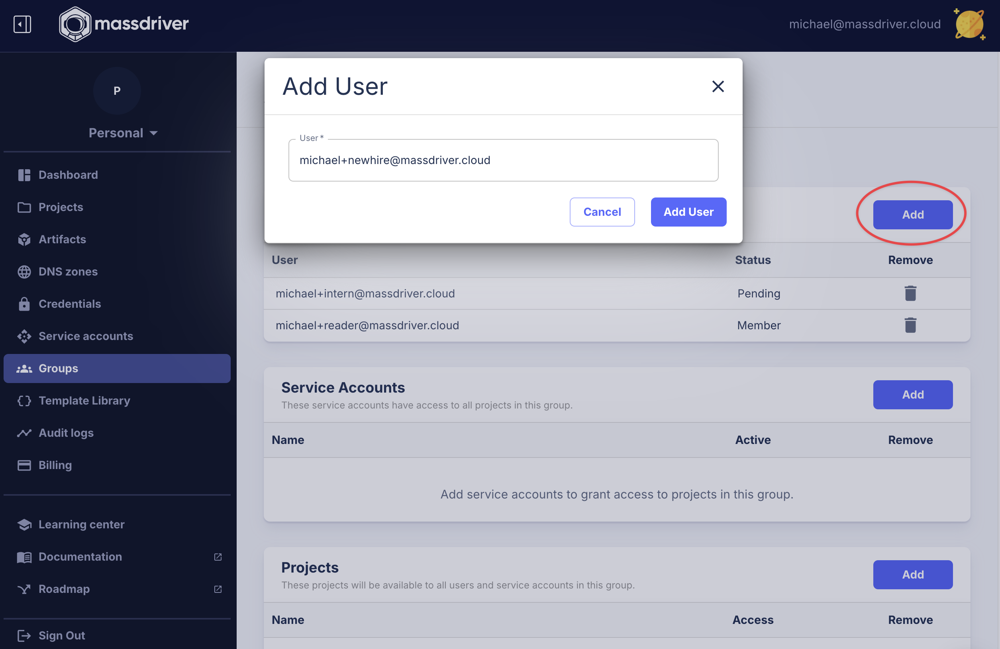

Organizations are the top-level entity in Massdriver. They are the primary way to manage access to Massdriver.

## Invite a user to your organization

1. To invite a user to your organization, click on `Groups` in the sidebar.
2. Click on the group you want to invite your user to (e.g., `Organization Admin` or `E-commerce App Reader`).
3. Click `Add`, enter the email of the user you wish to invite and click `Add User`.




## Find your organization ID

To find your organization ID, hover over your organization name logo in the top left corner of the Massdriver UI and click the copy button next to your organization ID.

### Use your organization ID in the Massdriver CLI

To use your organization ID in the Massdriver CLI, export the `MASSDRIVER_ORG_ID` environment variable to the value of your organization ID.

```bash
export MASSDRIVER_ORG_ID=your-org-id
```
