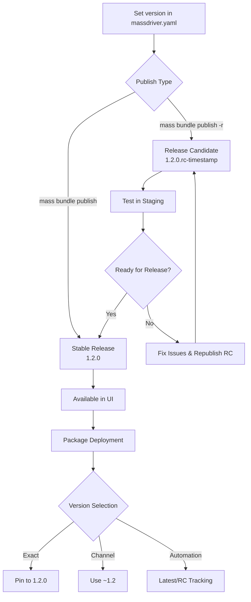

# Versions

Massdriver uses [semantic versioning](https://semver.org/) (SemVer) to manage bundle versions and deployments. This provides predictable versioning behavior and enables sophisticated release management workflows.

## Semantic Versioning

All bundle versions in Massdriver follow the semantic versioning specification `MAJOR.MINOR.PATCH`:

- **MAJOR**: Incremented for incompatible API changes
- **MINOR**: Incremented for backwards-compatible functionality additions  
- **PATCH**: Incremented for backwards-compatible bug fixes

### Examples

```
1.0.0    # Initial release
1.0.1    # Patch release (bug fixes)
1.1.0    # Minor release (new features)
2.0.0    # Major release (breaking changes)
```

## Release Candidates

Release candidates allow you to test versions before they become official releases. They use the format `MAJOR.MINOR.PATCH.rc-TIMESTAMP`:

```
1.2.0.rc-1701234567    # Release candidate for 1.2.0
1.2.0                  # Final release
```

### Key Properties

- **Ordering**: Release candidates are sorted **before** their corresponding release version
- **Testing**: Perfect for staging environments and pre-production testing
- **Timestamps**: Multiple release candidates are ordered by timestamp (higher = newer)

### Rapid Infrastructure Testing

Release candidates are a powerful means of rapidly testing Infrastructure as Code (IaC) changes against real cloud resources:

**Local Development + Real Infrastructure:**
- Develop bundle changes locally on your machine
- Publish release candidates without affecting production bundles
- Deploy RCs to real cloud environments for comprehensive testing

**Opt-in Testing Network:**
- Set up multiple packages using the "release-candidate" automation rule
- These packages automatically pick up your latest RCs for testing
- Run Terraform plans and compliance scans against actual provisioned resources
- Validate infrastructure changes with real cloud provider APIs

**Practical Workflow:**
```bash
# 1. Make IaC changes locally
vim src/main.tf

# 2. Publish RC for testing
mass bundle publish --release-candidate

# 3. Packages with "release-candidate" rule automatically test your changes
# 4. Review Terraform plans and compliance results from real infrastructure
# 5. Iterate with new RCs or publish final release
```

This approach lets you stand up multiple real-world examples of your infrastructure changes before committing to a final release, ensuring your bundles work correctly across different cloud environments and configurations.

## Release Channels

Release channels use tilde (`~`) constraints to specify compatible version ranges. Massdriver supports three types of release channels:

### Major Channel (`~1`)
Matches the latest version within major version 1:
- `~1` could resolve to `1.5.3` (latest in major 1)
- Will **not** upgrade to `2.0.0`

### Minor Channel (`~1.1`)  
Matches the latest patch within minor version 1.1:
- `~1.1` could resolve to `1.1.7` (latest patch in 1.1.x)
- Will **not** upgrade to `1.2.0`

## Version Management in Massdriver

### Bundle Development and Publishing

#### Setting Bundle Version

In your `massdriver.yaml`, you now specify a `version` field:

```yaml
schema: draft-07
name: aws-rds-postgres
description: "PostgreSQL database on AWS RDS"
version: "1.2.3"  # Must be valid semantic version
```

**Version Rules:**
- **Required Format**: Must be `MAJOR.MINOR.PATCH` (e.g., `1.2.3`)
- **Default Fallback**: If omitted, defaults to `0.0.0` (for backwards compatibility)
- **Immutable Releases**: `0.0.0` is the only mutable version (legacy bundles)

#### Publishing Options

**Standard Release:**
```bash
mass bundle publish
```
- Publishes the exact version from `massdriver.yaml`
- Creates an immutable release
- Available immediately for use by your end users

**Release Candidate:**
```bash
mass bundle publish --release-candidate
# or
mass bundle publish -r
```
- Adds `.rc-TIMESTAMP` to your base version (e.g., `1.2.3.rc-1701234567`)
- Base version (`1.2.3`) must not have been published yet
- Allows testing before the final release
- Perfect for feature branches and testing workflows

### Package Version Management

#### Version Selection Interface

In the package configuration panel, developers see a **"Set Version"** dropdown with multiple options:

**Published Versions:**
- `1.0.0`, `1.1.0`, `1.1.5`, `2.0.0` (exact versions)
- Release candidates are **hidden** from this interface

**Release Channels:**
- `~1`, `~1.1`, `~2`, `~2.1` (auto-generated tilde patterns)

**Automation Rules:**

1. **"Release Candidate"** - Automatically tracks the next RC chain
   - Keeps you on release candidates for the next version increment
   - If currently on `2.0.1`, will upgrade to `2.0.2.rc-*` or `2.1.0.rc-*`
   - Will **not** upgrade to older RCs like `1.2.3.rc-*`
   - Always follows chronological version progression
   - **Perfect for testing environments**: Automatically validates new IaC changes
   - **Real infrastructure validation**: Runs actual Terraform plans and compliance scans

2. **"Latest"** - Automatically upgrades to newest stable releases
   - Upgrades to any new published version greater than current
   - Excludes release candidates (stable releases only)
   - Ensures you're always on the latest production-ready version

#### Version Constraints

**Upgrade-Only Policy:**
- ✅ Can upgrade: `1.0.0` → `1.1.0` → `2.0.0`
- ❌ Cannot downgrade: `2.0.0` → `1.1.0`
- ✅ Can rollback: Restore previous configuration with its original version

**Configuration Snapshots:**
Each version change creates a configuration snapshot, enabling safe rollbacks to previous states while maintaining the upgrade-only constraint for new deployments.

## Upgrade Strategies

### Feature Upgrades  
Use minor channels for new features:
```
~1.1    # Minor and patch updates (1.1.0 → 1.1.5, 1.2.0)
```

### Major Upgrades
Use major channels for latest features:
```
~1      # All updates within major 1 (1.0.0 → 1.9.5)
```

## Best Practices

### For Bundle Developers

1. **Set Explicit Versions**: Always specify `version` in `massdriver.yaml`
   ```yaml
   version: "1.2.3"  # Explicit semantic version
   ```

2. **Development Workflow**: Use release candidates for testing
   ```bash
   # Set version in massdriver.yaml
   version: "1.5.0"
   
   # Publish RC for testing
   mass bundle publish --release-candidate  # Creates 1.5.0.rc-timestamp
   
   # Test in staging environments...
   
   # Publish final release
   mass bundle publish  # Creates 1.5.0
   ```

3. **Follow SemVer Guidelines**:
   - **Patch** (`1.0.1`): Bug fixes, security updates, documentation
   - **Minor** (`1.1.0`): New optional features, additional cloud regions
   - **Major** (`2.0.0`): Breaking changes, removed parameters, incompatible updates

4. **Version Progression**: Ensure each version is greater than the previous
   - ✅ `1.0.0` → `1.0.1` → `1.1.0` → `2.0.0`
   - ❌ Don't skip versions unnecessarily

### For Platform Users

1. **Production Environments**: Use exact versions for stability
   ```
   Set Version: "1.2.3"  # Pinned version for production
   ```

2. **Development/Staging**: Use automation for latest features
   ```
   Set Version: "Latest"  # Auto-upgrade to stable releases
   ```

3. **Infrastructure Testing**: Use release candidate tracking for real-world validation
   ```
   Set Version: "Release Candidate"  # Follow RC chain for next version
   ```
   - Ideal for staging/dev environments that mirror production
   - Automatically tests new IaC changes against real cloud resources
   - Provides early feedback on Terraform plans and compliance issues

4. **Release Channels**: Use tilde patterns for controlled updates
   ```
   Set Version: "~1"    # Auto-update within major version
   Set Version: "~1.2"    # Auto-update within minor version
   ```

## Version Lifecycle



**Workflow Steps:**

1. **Version Definition**: Set semantic version in `massdriver.yaml`
2. **Release Candidate**: Optional RC publishing for testing (`-r` flag)
3. **Testing Phase**: Validate RCs in staging environments
4. **Stable Release**: Publish final immutable version
5. **Package Selection**: Choose version strategy in UI dropdown
6. **Deployment**: Package runs with selected version/automation rule

## Version Filtering

Massdriver automatically filters out invalid versions:

- ✅ `1.2.3` - Valid semantic version
- ✅ `1.2.3.rc-1701234567` - Valid release candidate  
- ❌ `latest` - Not a semantic version
- ❌ `abc123` - Not a semantic version
- ❌ `v1.2.3` - Invalid prefix

This ensures only proper semantic versions are used in deployments. 
