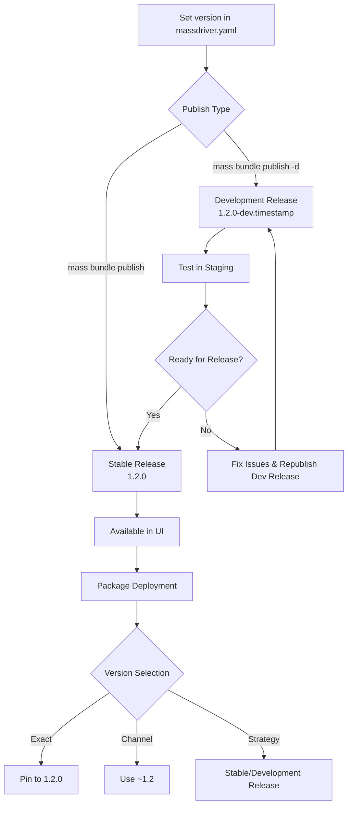
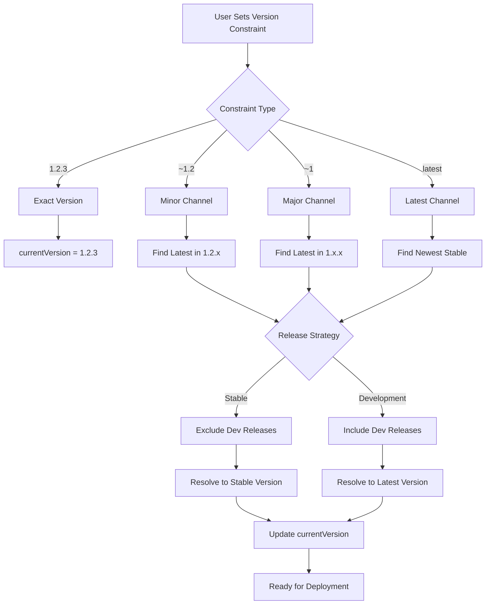

# Versions

Massdriver uses [semantic versioning](https://semver.org/) (SemVer) to manage bundle versions and deployments. This provides predictable versioning behavior and enables sophisticated release management workflows that automate infrastructure updates across your environments.

## Development Releases and **Real Infrastructure** Testing

Development releases let you test infrastructure changes against **actual cloud resources** before promoting a version to release. Publishing a development release outputs a monitoring URL for every package configured to test it. These packages automatically deploy the development release and run their full validation pipeline—Terraform plans, compliance checks, and deployments—against live cloud APIs.

This process validates infrastructure changes across multiple environments and configurations simultaneously, revealing issues like API drift, quota limits, and provider-specific behaviors that static analysis tools can't catch.

## Automated Version Distribution with Release Channels

Release channels automate version distribution across environments. Instead of updating every package manually, you publish once, and packages automatically upgrade based on their configured version constraints.

For example, a package on channel `~2.5` will automatically deploy any patch release (`2.5.1`, `2.5.2`, etc.), while staging or dev environments may use wider channels for faster updates. This keeps environments current within defined boundaries and ensures security patches flow automatically—without coordination or manual promotion steps.

## Semantic Versioning

All bundle versions in Massdriver follow the semantic versioning specification `MAJOR.MINOR.PATCH`:

- **MAJOR**: Incremented for incompatible API changes
- **MINOR**: Incremented for backwards-compatible functionality additions  
- **PATCH**: Incremented for backwards-compatible bug fixes

### Examples

```
1.0.0    # Initial release
1.0.1    # Patch release (bug fixes)
1.1.0    # Minor release (new features)
2.0.0    # Major release (breaking changes)
```

## Development Releases

Development releases allow you to test versions before they become official releases. They use the format `MAJOR.MINOR.PATCH-dev.TIMESTAMP`:

```
1.2.0-dev.20060102T150405Z    # Development release for 1.2.0
1.2.0                        # Final release
```

### Key Properties

- **Ordering**: Development releases are sorted **before** their corresponding release version
- **Testing**: Perfect for staging environments and pre-production testing
- **Timestamps**: Multiple development releases are ordered by timestamp (higher = newer)

### Rapid Infrastructure Testing

Development releases are a powerful means of rapidly testing Infrastructure as Code (IaC) changes against real cloud resources:

**Local Development + Real Infrastructure:**
- Develop bundle changes locally on your machine
- Publish development releases without affecting production bundles
- Deploy development releases to real cloud environments for comprehensive testing

**Opt-in Testing Network:**
- Set up multiple packages using release channels with "Enable Development Releases" toggle
- These packages automatically pick up your latest development releases and run the full deploy/apply pipeline
- Run Terraform plans and compliance scans against actual provisioned resources
- Validate infrastructure changes with real cloud provider APIs

**Practical Workflow:**
```bash
# 1. Make IaC changes locally
vim src/main.tf

# 2. Publish development release for testing
mass bundle publish --development-release

# 3. Visit the output URL to monitor all test infrastructure
# 4. Watch plan/apply/compliance pipelines execute automatically
# 5. Review Terraform plans and compliance results from real infrastructure
# 6. Iterate with new development releases or publish final release
```

This approach lets you stand up multiple real-world examples of your infrastructure changes before committing to a final release, ensuring your bundles work correctly across different cloud environments and configurations.

## Release Channels

Release channels use tilde (`~`) constraints to specify compatible version ranges. When a package uses a release channel, it **automatically runs the full deploy/apply pipeline** whenever a new version matching that channel is published. This includes compliance checks, Terraform plans, and all other validation steps. This automates infrastructure version management.

### Major Channel (`~1`)
Matches the latest version within major version 1:
- `~1` could resolve to `1.5.3` (latest in major 1)
- Will **not** upgrade to `2.0.0`
- Automatically deploys when new minor or patch versions are published (e.g., `1.6.0`, `1.5.4`)

### Minor Channel (`~1.1`)  
Matches the latest patch within minor version 1.1:
- `~1.1` could resolve to `1.1.7` (latest patch in 1.1.x)
- Will **not** upgrade to `1.2.0`
- Automatically deploys when new patch versions are published (e.g., `1.1.8`)

### Latest Channel (`latest`)
Matches the newest stable release:
- `latest` could resolve to `2.3.1` (newest stable release)
- Will upgrade to any newer stable version
- Automatically deploys when any new stable version is published
- Excludes development releases (stable only)

## Version Management in Massdriver

### Bundle Development and Publishing

#### Setting Bundle Version

In your `massdriver.yaml`, you now specify a `version` field:

```yaml
schema: draft-07
name: aws-rds-postgres
description: "PostgreSQL database on AWS RDS"
version: "1.2.3"  # Must be valid semantic version
```

**Version Rules:**
- **Required Format**: Must be `MAJOR.MINOR.PATCH` (e.g., `1.2.3`)
- **Default Fallback**: If omitted, defaults to `0.0.0` (for backwards compatibility)
- **Immutable Releases**: All versions are immutable once published, **except `0.0.0`**
  - Version `0.0.0` can be republished multiple times
  - This allows teams to iterate and work through an initial release without version management overhead
  - Once you publish any other version (e.g., `0.0.1` or `1.0.0`), it becomes immutable (TBD)

#### Publishing Options

**Standard Release:**
```bash
mass bundle publish
```
- Publishes the exact version from `massdriver.yaml`
- Creates an immutable release
- Available immediately for use by your end users

**Development Release:**
```bash
mass bundle publish --development-release
# or
mass bundle publish -d
```
- Adds `-dev.TIMESTAMP` to your base version (e.g., `1.2.3-dev.20060102T150405Z`)
- Base version (`1.2.3`) must not have been published yet
- Allows testing before the final release
- Perfect for feature branches and testing workflows
- **Outputs a URL** to view all test infrastructure using this development release
  - See plan/apply/compliance pipelines executing in real-time
  - Monitor all packages configured to test this development release

### Package Version Management

#### Version Selection Interface

In the package configuration panel, developers can set the version constraint:

**Published Versions (Strict SemVer):**
- `1.0.0`, `1.1.0`, `1.1.5`, `2.0.0` (exact published versions only)
- Not free-form - must select from published versions
- Development releases are **hidden** from this interface

**Generated Release Channels:**
- `~1`, `~1.1`, `~2`, `~2.1` (auto-generated tilde patterns for each possible)
- `latest` - Newest stable release
- When you set a version constraint, `currentVersion` gets updated to show what will deploy

**Development Releases Toggle:**
- Available when selecting any release channel (`~1`, `~1.1`, `latest`, etc.)
- When enabled, the channel will also match and automatically deploy development releases
- Example: `~1.0` with development releases enabled will automatically deploy `1.0.5-dev.*` versions
- **Perfect for testing environments**: Automatically validates new IaC changes

#### Version Constraints

**Upgrade-Only Policy:**
- ✅ Can upgrade: `1.0.0` → `1.1.0` → `2.0.0`
- ❌ Cannot downgrade: `2.0.0` → `1.1.0`
- ✅ Can rollback: Restore previous configuration with its original version

**Configuration Snapshots:**
Each version change creates a configuration snapshot, enabling safe rollbacks to previous states while maintaining the upgrade-only constraint for new deployments.

## Upgrade Strategies

### Feature Upgrades  
Use minor channels for patch updates:
```
~1.1    # Patch updates only (1.1.0 → 1.1.5)
```

### Major Upgrades
Use major channels for latest features:
```
~1      # All updates within major 1 (1.0.0 → 1.9.5)
```

## Best Practices

### For Bundle Developers

1. **Set Explicit Versions**: Always specify `version` in `massdriver.yaml`
   ```yaml
   version: "1.2.3"  # Explicit semantic version
   ```

2. **Development Workflow**: Use development releases for testing
   ```bash
   # Set version in massdriver.yaml
   version: "1.5.0"
   
   # Publish development release for testing
   mass bundle publish --development-release  # Creates 1.5.0-dev.timestamp
   # Outputs URL to view all test infrastructure and pipeline executions
   
   # Monitor plan/apply/compliance pipelines in real-time
   
   # Publish final release
   mass bundle publish  # Creates 1.5.0
   ```

3. **Follow SemVer Guidelines**:
   - **Patch** (`1.0.1`): Bug fixes, security updates, documentation
   - **Minor** (`1.1.0`): New optional features, additional cloud regions
   - **Major** (`2.0.0`): Breaking changes, removed parameters, incompatible updates

4. **Version Progression**: Ensure each version is greater than the previous
   - ✅ `1.0.0` → `1.0.1` → `1.1.0` → `2.0.0`
   - ❌ Don't skip versions unnecessarily

### For Platform Users

1. **Production Environments**: Use exact versions for stability
   ```
   Set Version: "1.2.3"  # Pinned version for production
   ```

2. **Development/Staging**: Use "Latest" automation for newest features
   ```
   Set Version: "Latest"  # Auto-deploy to stable releases
   ```

3. **Release Channels**: Use tilde patterns for controlled automatic deployments
   ```
   Set Version: "~1"    # Auto-deploy within major version
   Set Version: "~1.2"  # Auto-deploy within minor version
   ```

4. **Infrastructure Testing**: Enable development releases on a channel
   ```
   Set Version: "~1.0"  # Then set Release Strategy to "Development Release"
   ```
   - Ideal for staging/dev environments that mirror production
   - Automatically deploys and tests development releases against real cloud resources
   - Provides early feedback on Terraform plans and compliance issues

## Version Lifecycle



**Workflow Steps:**

1. **Version Definition**: Set semantic version in `massdriver.yaml`
2. **Development Release**: Optional development release publishing for testing (`-d` flag)
3. **Testing Phase**: Validate development releases in staging environments
4. **Stable Release**: Publish final immutable version
5. **Package Selection**: Choose version strategy in UI dropdown
6. **Deployment**: Package runs with selected version/automation rule

## Version Fields and Properties

Each package in Massdriver has several version-related fields that control how it behaves:

### Package Version Fields

- **`version`** - The version constraint (e.g., `"1.2.3"`, `"~1.2"`, `"latest"`)
- **`currentVersion`** - The resolved semantic version that will be deployed next
- **`deployedVersion`** - The version that was last successfully deployed to infrastructure
- **`availableUpgrade`** - The newest version available for upgrade based on the constraint
- **`releaseStrategy`** - Whether the package receives stable releases only or also development releases

### Version Constraint Types

**Exact Versions:**
- `"1.2.3"` - Use exactly this version
- `"2.0.0"` - Pin to specific release

**Release Channels:**
- `"~1"` - Latest version in major 1.x.x
- `"~1.2"` - Latest patch in 1.2.x
- `"latest"` - Newest stable release

**Development Releases:**
- `"1.2.3-dev.20060102T150405Z"` - Specific development release
- `"~1.2+dev"` - Latest in 1.2.x including development releases

### Release Strategies

**Stable (Default):**
- Only receives stable releases
- Excludes development releases
- Recommended for production environments

**Development Release:**
- Receives both stable and development releases
- Automatically includes development releases when using release channels
- Recommended for testing and staging environments

## GraphQL API Examples

### Query Package Version Information

```graphql
query GetPackageVersions($packageId: ID!) {
  package(id: $packageId) {
    id
    version
    currentVersion
    deployedVersion
    availableUpgrade
    releaseStrategy
    bundle {
      version
      name
    }
  }
}
```

### Set Package Version and Strategy

```graphql
mutation SetPackageVersion(
  $organizationId: ID!
  $packageId: ID!
  $version: String!
  $releaseStrategy: ReleaseStrategy
) {
  setPackageVersion(
    organizationId: $organizationId
    id: $packageId
    version: $version
    releaseStrategy: $releaseStrategy
  ) {
    package {
      id
      version
      currentVersion
      releaseStrategy
    }
    errors {
      message
    }
  }
}
```

### Query Available Bundle Versions

```graphql
query GetBundleVersions($bundleId: ID!) {
  bundle(id: $bundleId) {
    id
    name
    version
    releases {
      version
      createdAt
      isDevelopmentRelease
    }
  }
}
```

## User Interface

### Bundle Version Browser

*[Screenshot placeholder: Bundle version browser showing list of available versions with filters for stable vs development releases]*

The bundle version browser allows you to:
- View all published versions of a bundle
- Filter between stable and development releases
- See version metadata and publication dates
- Compare version differences

### Package Version Configuration

*[Screenshot placeholder: Package configuration panel showing version dropdown and release strategy toggle]*

The package configuration interface provides:
- **Version Dropdown**: Select from published versions or release channels
- **Release Strategy Toggle**: Choose between stable-only or development releases
- **Current Version Display**: Shows the resolved version that will be deployed
- **Available Upgrade Indicator**: Highlights when newer versions are available

## Version Filtering

Massdriver automatically filters out invalid versions:

- ✅ `1.2.3` - Valid semantic version
- ✅ `1.2.3-dev.20060102T150405Z` - Valid development release
- ❌ `latest` - Not a semantic version (use as release channel constraint)
- ❌ `abc123` - Not a semantic version
- ❌ `v1.2.3` - Invalid prefix

This ensures only proper semantic versions are used in deployments.

## Automatic Upgrades

### How Automatic Upgrades Work

When a new bundle version is published, Massdriver automatically:

1. **Identifies Upgrade Candidates**: Finds packages using release channels that would resolve to the new version
2. **Updates Package References**: Changes the package's `bundleReleaseId` to point to the new version
3. **Updates currentVersion**: Sets the package's `currentVersion` to the new version
4. **Triggers Deployment**: Automatically runs the IaC apply with the new version

### Upgrade Scenarios

**Stable Release Published:**
- Finds all packages with stable release channels that resolve to the new version
- Updates their `currentVersion` and runs IaC apply
- Examples: `~1.2` packages → upgrade to new patch, `latest` packages → upgrade to newest stable

**Development Release Published:**
- Finds all packages with development release channels that resolve to the new version
- Updates their `currentVersion` and runs IaC apply
- If a new patch level is published, development releases will do a final upgrade to that version

## Version Resolution Logic

When you set a version constraint on a package, the `currentVersion` field gets updated to reflect what will be deployed next. This resolved version is based on the constraint and release strategy:

- **Exact versions** (`1.2.3`) → `currentVersion` = `1.2.3`
- **Release channels** (`~1.2`, `~1`, `latest`) → `currentVersion` = resolved latest matching version
- **Development releases** → Only included when release strategy is set to "Development Release"

### Version Constraint Resolution



This ensures predictable version resolution across all package configurations.

## Defaults and Initialization

### Package Initialization Defaults

When a bundle is added to the canvas, Massdriver automatically:

**Uses `"latest"` release channel** to get the newest stable version
- Resolves to the latest published stable release
- Pins the package to that exact version (e.g., `1.2.3`)
- The `currentVersion` field shows the resolved version

**Sets Release Strategy to `stable`**
- New packages only receive stable releases by default
- Provides stability for production workloads
- Can be changed to `development_release` for testing environments

**Note**: Version `0.0.0` is always present as a fallback for bundles without explicit versions.

### Bundle Publishing Defaults

**Version in massdriver.yaml**: `"0.0.0"`
- Default fallback if no version is specified
- Allows iterative development without version management overhead
- Can be republished multiple times (unlike other versions)

**Publishing Type**: Stable release
- `mass bundle publish` creates stable releases by default
- Use `--development-release` flag for testing versions
- Development releases are automatically filtered from production interfaces

### Environment-Specific Recommendations

**Production Environments:**
- Use exact versions (`"1.2.3"`) for maximum stability
- Keep `releaseStrategy` as `stable`
- Avoid automatic upgrades for critical systems

**Staging/Development Environments:**
- Use release channels (`"~1.2"`) for automatic updates
- Set `releaseStrategy` to `development_release` for testing
- Enable automatic upgrades to catch issues early

**Testing Environments:**
- Use `"latest"` constraint for newest features
- Enable `development_release` strategy for early testing
- Monitor upgrade notifications for breaking changes

## Migration and Upgrades

### Upgrading Package Versions

**Manual Upgrade:**
1. Navigate to package configuration
2. Select new version from dropdown
3. Review changes and deploy

**Automatic Upgrade:**
1. Set package to use release channel (`~1.2`)
2. New versions automatically upgrade matching packages
3. Monitor deployment status and rollback if needed

### Rollback Strategy

**Configuration Snapshots:**
- Each version change creates a configuration snapshot
- Rollbacks restore previous configuration with its original version
- Maintains upgrade-only policy for new deployments

**Deployment Version Tracking:**
- When you deploy, the version gets burned into the deployment
- `deployedVersion` field tracks what was actually deployed to infrastructure
- Rollbacks use these snapshots to restore previous working state

## Troubleshooting

### Common Version Issues

**Version Not Found:**
- Check if version exists in bundle releases
- Verify version constraint syntax
- Ensure release strategy matches version type

**Upgrade Not Available:**
- Confirm package uses release channel (not exact version)
- Check if release strategy includes development releases
- Verify new version matches constraint pattern

**Deployment Failures:**
- Check `currentVersion` vs `deployedVersion` mismatch
- Review package parameters for breaking changes
- Use development releases to test before stable deployment

### Version Resolution Debugging

Use GraphQL queries to inspect version resolution:

```graphql
query DebugVersionResolution($packageId: ID!) {
  package(id: $packageId) {
    version
    currentVersion
    availableUpgrade
    releaseStrategy
    bundle {
      releases {
        version
        createdAt
      }
    }
  }
}
```

This helps identify why a package isn't upgrading or why a version isn't resolving as expected. 
