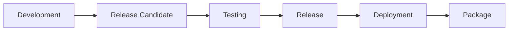

# Versions

Massdriver uses [semantic versioning](https://semver.org/) (SemVer) to manage bundle versions and deployments. This provides predictable versioning behavior and enables sophisticated release management workflows.

## Semantic Versioning

All bundle versions in Massdriver follow the semantic versioning specification `MAJOR.MINOR.PATCH`:

- **MAJOR**: Incremented for incompatible API changes
- **MINOR**: Incremented for backwards-compatible functionality additions  
- **PATCH**: Incremented for backwards-compatible bug fixes

### Examples

```
1.0.0    # Initial release
1.0.1    # Patch release (bug fixes)
1.1.0    # Minor release (new features)
2.0.0    # Major release (breaking changes)
```

## Release Candidates

Release candidates allow you to test versions before they become official releases. They use the format `MAJOR.MINOR.PATCH.rc-TIMESTAMP`:

```
1.2.0.rc-1701234567    # Release candidate for 1.2.0
1.2.0                  # Final release
```

### Key Properties

- **Ordering**: Release candidates are sorted **before** their corresponding release version
- **Testing**: Perfect for staging environments and pre-production testing
- **Timestamps**: Multiple release candidates are ordered by timestamp (higher = newer)

## Release Channels

Release channels use tilde (`~`) constraints to specify compatible version ranges. Massdriver supports three types of release channels:

### Major Channel (`~1`)
Matches the latest version within major version 1:
- `~1` could resolve to `1.5.3` (latest in major 1)
- Will **not** upgrade to `2.0.0`

### Minor Channel (`~1.1`)  
Matches the latest patch within minor version 1.1:
- `~1.1` could resolve to `1.1.7` (latest patch in 1.1.x)
- Will **not** upgrade to `1.2.0`

### Patch Channel (`~1.1.1`)
Matches versions >= 1.1.1 within the same minor:
- `~1.1.1` could resolve to `1.1.5` (≥ 1.1.1 in 1.1.x)
- Will **not** upgrade to `1.2.0`

## Version Management in Massdriver

### Bundle Publishing

When you publish a bundle to Massdriver:

1. **Version Validation**: Only valid semantic versions are accepted
2. **Immutability**: Published versions cannot be changed
3. **Uniqueness**: Each version can only be published once

### Package Deployments

When deploying packages:

- **Pinned Versions**: Deploy exactly `1.2.3`
- **Release Channels**: Deploy using `~1.2` for automatic patch updates
- **Latest**: Deploy the newest available version

### Version Selection

Massdriver provides intelligent version selection:

```javascript
// Available versions: ["1.0.0", "1.1.0", "1.1.5", "2.0.0", "2.1.0"]

// Release channels suggested:
["~1", "~1.1", "~1.1.5", "~2", "~2.1", "~2.1.0"]
```

Only the **newest** version at each level is suggested to avoid version debt.

## Upgrade Strategies

### Conservative Upgrades
Use patch channels for maximum stability:
```
~1.1.1  # Only patch updates (1.1.1 → 1.1.5)
```

### Feature Upgrades  
Use minor channels for new features:
```
~1.1    # Minor and patch updates (1.1.0 → 1.1.5, 1.2.0)
```

### Major Upgrades
Use major channels for latest features:
```
~1      # All updates within major 1 (1.0.0 → 1.9.5)
```

## Best Practices

### For Bundle Developers

1. **Follow SemVer**: Use semantic versioning correctly
   - Patch: Bug fixes, security updates
   - Minor: New optional features, new cloud regions
   - Major: Breaking changes, removed parameters

2. **Use Release Candidates**: Test in staging before production
   ```
   1.5.0.rc-1701234567  # Test first
   1.5.0                # Release when ready
   ```

3. **Document Changes**: Clear changelog for each version

### For Platform Users

1. **Pin Critical Environments**: Use exact versions for production
   ```
   version: "1.2.3"  # Exact version for production
   ```

2. **Use Channels for Development**: Allow automatic updates in dev/staging
   ```
   version: "~1.2"   # Auto-update patches and features
   ```

3. **Test Release Candidates**: Validate RCs before they become releases

## Version Lifecycle



1. **Development**: Create new bundle features
2. **Release Candidate**: Publish RC for testing (`1.2.0.rc-timestamp`)
3. **Testing**: Validate in staging environments
4. **Release**: Publish final version (`1.2.0`)
5. **Deployment**: Deploy to environments using versions or channels
6. **Package**: Running instance of the bundle in an environment

## Version Filtering

Massdriver automatically filters out invalid versions:

- ✅ `1.2.3` - Valid semantic version
- ✅ `1.2.3.rc-1701234567` - Valid release candidate  
- ❌ `latest` - Not a semantic version
- ❌ `abc123` - Not a semantic version
- ❌ `v1.2.3` - Invalid prefix

This ensures only proper semantic versions are used in deployments. 
