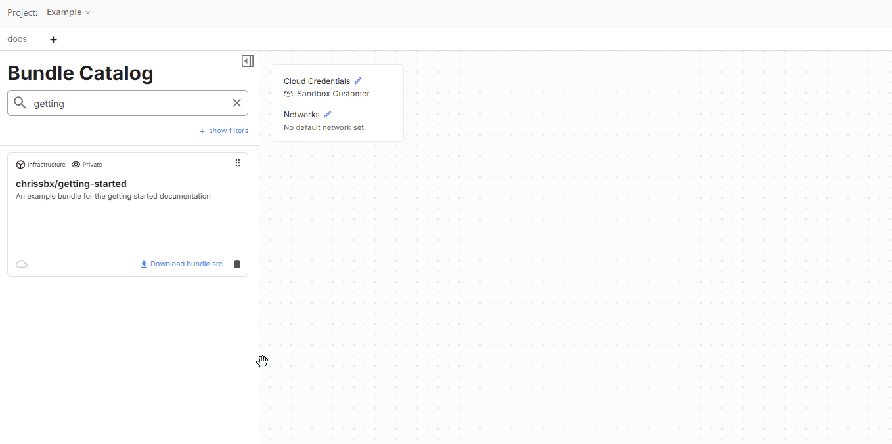
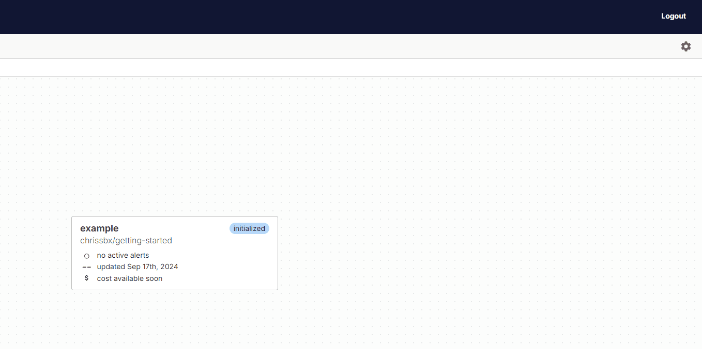

Welcome to Massdriver! This guide will walk you through your first experience with the platform by publishing, configuring, and deploying a simple bundle. By the end of this guide, you'll understand the core workflow of working with Massdriver bundles.

## Prerequisites

Before you begin, make sure you have completed the [prerequisites](https://docs.massdriver.cloud/getting-started/overview#prerequisites) to install the Massdriver CLI and authenticate with the platform.

## Step 1: Download the Getting Started Repository

In order to follow along with these guides, be sure to download Massdriver's [`getting-started`](https://github.com/massdriver-cloud/getting-started) repository which has all the materials you'll need.

1. Clone the getting-started repository:

    ```bash
    git clone https://github.com/massdriver-cloud/getting-started.git
    cd getting-started
    ```

2. Take a moment to explore the bundle structure:

    ```bash
    ls -la
    ```

    You should see:
    - `massdriver.yaml` - Bundle definition and parameters
    - `src/` - Directory containing infrastructure code
    - `operator.md` - Documentation explaining the bundle, presented in the Massdriver UI

:::tip 

If you inspect the `src/main.tf` file, you'll see that this bundle is a terraform module which creates a few `random` resources. Nothing in these Getting Started guides will required connectivity to any of your cloud accounts.

:::

## Step 2: Publish the Bundle

Now you'll publish this bundle to your Massdriver organization, making it available for deployment.

1. From the bundle directory, publish the bundle:

    ```bash
    mass bundle publish
    ```

2. The CLI will package the bundle and upload it to Massdriver. You should see output similar to:

    ```
    Publishing getting-started to organization yourorg...
    Packaging bundle getting-started...
    Package getting-started created with digest: sha256:39ce534f78fadb5fba4c7734c5dd2fb429e3000e53b1eabc909656ac65e7e258
    Pushing getting-started to package manager
    Bundle getting-started successfully published to organization yourorg!
    ```

## Step 3: Deploy the Bundle

Now that you've published your bundle, its available to deploy into Massdriver organization.

### Access the Platform

1. Log into [Massdriver Cloud](https://massdriver.cloud)
2. Navigate to (or create) a project where you want to deploy the bundle
3. Select or create an environment (such as "development" or "staging")

### Add the Bundle to Your Canvas

1. Look for your **getting-started** bundle in the sidebar under "Your Bundles"
2. Drag the bundle from the sidebar onto the canvas



3. Give your bundle instance a meaningful name (like "my-first-bundle")

### Configure the Bundle

This is where you'll see Massdriver's parameter system in action!

1. Click on your bundle instance on the canvas
2. Navigate to the **Config** tab
3. You'll see a form with several configuration options:

#### Bundle Presets
Notice the preset dropdown at the top - this demonstrates how bundles can include pre-configured parameter sets:

- **Preset 1**: Conservative settings good for testing
- **Preset 2**: More robust configuration for production-like scenarios

Try selecting different presets and watch how the form fields automatically populate!

#### Parameter Types
The form demonstrates different parameter types that Massdriver supports:

- **Pet Configuration**: Shows an enum field (dropdown with specific values)
- **Password Configuration**: Demonstrates integer fields with validation (minimum/maximum values)
- **Shuffle Configuration**: Shows array fields where you can add/remove items

#### Key Features to Notice

**Immutable Fields**: Some fields are marked as immutable (indicated by a lock icon). These cannot be changed after deployment, demonstrating Massdriver's safety features.

**Validation**: Try entering invalid values (like a password length of 5) - you'll see real-time validation that prevents misconfiguration.

**Field Descriptions**: Hover over the info icons to see helpful descriptions for each parameter.

### Deploy Your Bundle

1. After configuring your parameters, click the **Deploy** button
2. Massdriver will show you a deployment plan - this is what infrastructure will be created
3. Confirm the deployment



4. Watch the deployment progress in real-time through the platform

## Step 4: Explore the Results

Once deployed, you can explore what was created:

1. **View Resources**: Click on your deployed bundle to see the infrastructure resources that were created
2. **Check Outputs**: Look at the outputs to see the generated values (like the random pet name and unique ID)
3. **Monitor Status**: The bundle will show its current status and any relevant metrics

## Understanding What You Just Did

Congratulations! You've just experienced the core Massdriver workflow:

### 📨 **Bundle Publishing**
You took infrastructure code and published it as a reusable bundle that others in your organization can deploy.

### 🔧 **Parameter Configuration**
You saw how JSON Schema in the bundle automatically creates user-friendly forms with validation, presets, and safety features.

### 🚀 **Platform Deployment**
You deployed infrastructure through a visual interface while maintaining all the power and flexibility of Infrastructure-as-Code.

### 🔒 **Safety Features**
You experienced validation, immutable fields, and other safety features that prevent common infrastructure mistakes.

## What's Next?

Now that you understand the basics, you can:

1. **Experiment**: Try changing parameters and redeploying to see how the infrastructure updates
2. **Learn More**: Explore the bundle's `README.md` for detailed explanations of each concept
3. **Create Custom Bundles**: Use this as a template to create your own infrastructure bundles
4. **Connect Bundles**: Learn about artifacts and connections to build more complex architectures

## Key Takeaways

✅ **Bundles are reusable** - Write once, deploy many times with different configurations  
✅ **Parameters drive UI** - JSON Schema automatically creates user-friendly forms  
✅ **Safety first** - Built-in validation and immutable fields prevent accidents  
✅ **Visual deployment** - Complex infrastructure becomes as easy as drag-and-drop  

Ready to dive deeper? Check out our advanced guides on [artifacts and connections](https://docs.massdriver.cloud/concepts/connections) or learn how to [create custom bundles](https://docs.massdriver.cloud/bundles/development) from scratch!

## Need Help?

- 📄 [Documentation](https://docs.massdriver.cloud)
- 💬 [Community Slack](https://join.slack.com/t/massdrivercommunity/shared_invite/zt-1smvckvdj-jVFpBG2jF5XiYzX2njDCWA)
- 🐛 [Report Issues](https://github.com/massdriver-cloud/getting-started/issues)

Welcome to the Massdriver community! 🎉
