import UUIDProvider, { UUIDContext } from '@site/src/components/UUIDFetcher';
import UUIDLink from '@site/src/components/UUIDLink';
import UUID from '@site/src/components/UUID';

<UUIDProvider>

follow the specific cloud and preferred method to create the necessary credentials below:

## AWS

<details>
<summary>One Click Role</summary>

## How Massdriver uses your role

To keep your environment secure, Massdriver uses a role with a trust policy to access your AWS account for provisioning and monitoring of your infrastructure. The account that assumes this role is private and has no access from the public internet.

## Step 1

### Click the quick add button

todo: add UUID into URL somehow

This <UUIDLink /> will run a hosted CloudFormation stack on AWS which will create a new role in your account with the permissions required to provision infrastructure in Massdriver. The external ID for the role (required to prevent confused deputy attacks) will be auto populated in the CloudFormation stack. Do not change this value in the form to the left.

## Step 2

### Run the CloudFormation stack

The button will take you to the AWS console and allow you to approve of the resource creation. Click the `Create stack` button to provision the role.

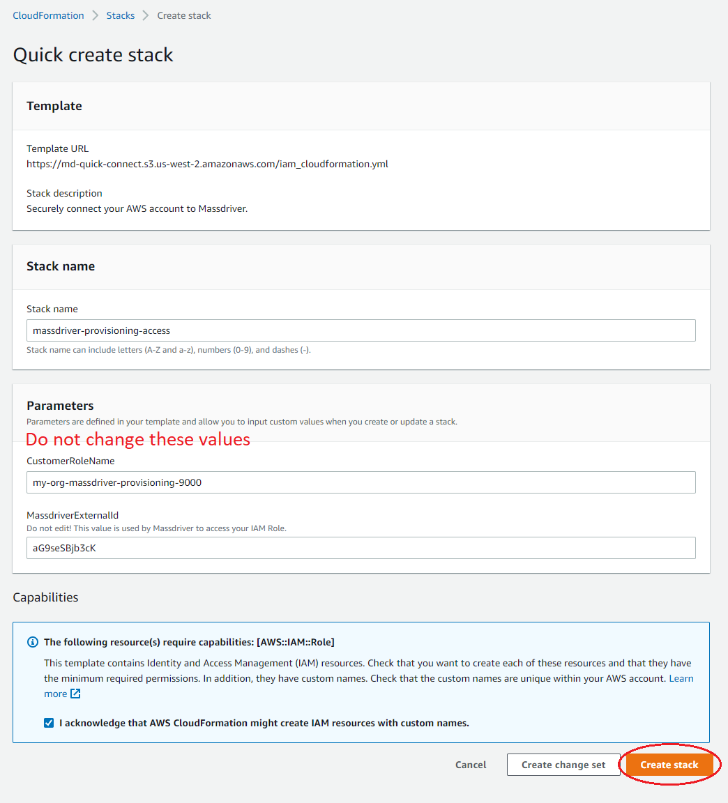

## Step 3

### Copy the role ARN to Massdriver

Once the CloudFormation stack has completed its task select the outputs tab and copy the value of the `CustomProvisioningRoleArn` output. Paste this value in to the form on the left in the field marked **AWS ARN**.

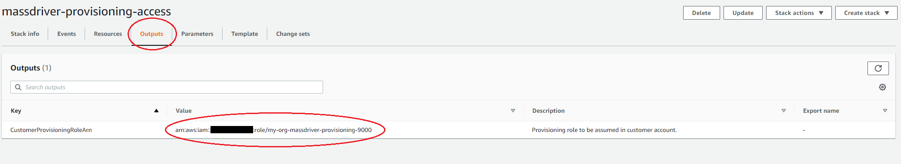

## Step 4

Submit the role to Massdriver by clicking the save button and head to the [projects page](/projects) to begin provisioning infrastruture.

</details>

<details>
<summary>CLI</summary>

### How Massdriver uses your role

To keep your environment secure, Massdriver uses a role with a trust policy to access your AWS account for provisioning and monitoring of your infrastructure. The account that assumes this role is private and has no access from the public internet.

### Create a role with a trust policy

Run the following command with the [AWS CLI](https://docs.aws.amazon.com/cli/latest/userguide/getting-started-install.html). Replace `<UUID HERE>` with <UUID />. Save it for importing the role in to Massdriver.

```bash
aws iam create-role --role-name=massdriver-provisioner --description="Massdriver Cloud Provisioning Role" --assume-role-policy-document='{"Version":"2012-10-17","Statement":[{"Sid":"MassdriverCloudProvisioner","Effect":"Allow","Principal":{"AWS":["308878630280"]},"Action":"sts:AssumeRole","Condition":{"StringEquals":{ "sts:ExternalId":"<UUID HERE>"}}}]}'
```

### Assign the role administrator privileges

Fill in the role name used above and run this command to give Massdriver administrator privileges.

```bash
aws iam attach-role-policy --role-name={{ROLE_NAME}} --policy-arn arn:aws:iam::aws:policy/AdministratorAccess
```

## Import role to Massdriver

In the form to the left, name the credential as your AWS account for use within Massdriver and fill in both the aws arn as `arn:aws:iam::YOUR_AWS_ACCOUNT_ID:role/{{ROLE_NAME}}` and the external ID. Click submit and head to the projects page to start building your infrastructure.

</details>

<details>

<summary>Console</summary>

### How Massdriver uses your role

To keep your environment secure, Massdriver uses a role with a trust policy to access your AWS account for provisioning and monitoring of your infrastructure. The account that assumes this role is private and has no access from the public internet.

### Create a role

1. Sign in to the [AWS Management Console](https://aws.amazon.com/console/)
2. In the search bar, type `IAM` and select the IAM service
3. In the left-hand menu, select `Roles`
4. Click `Create role`

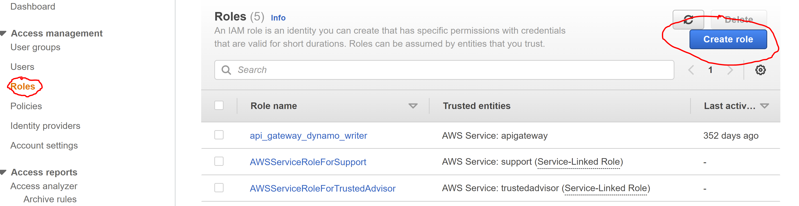

5. Select `Another AWS account` for the role type

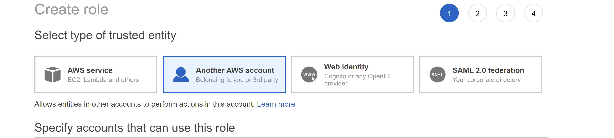

6. For the account ID enter `308878630280`. This is the Massdriver account which contains the role that will use the one you are creating now
7. Check the Require external ID box and enter <UUID />.
8. Make sure that the Require MFA option is unchecked

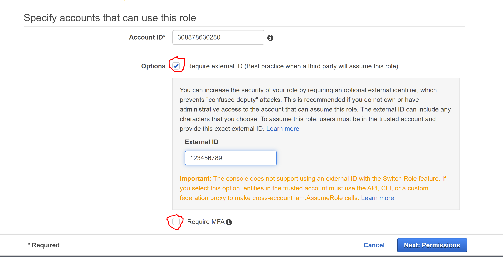

9. Click "Next: Permissions"
10. Select the `AdministratorAccess` policy

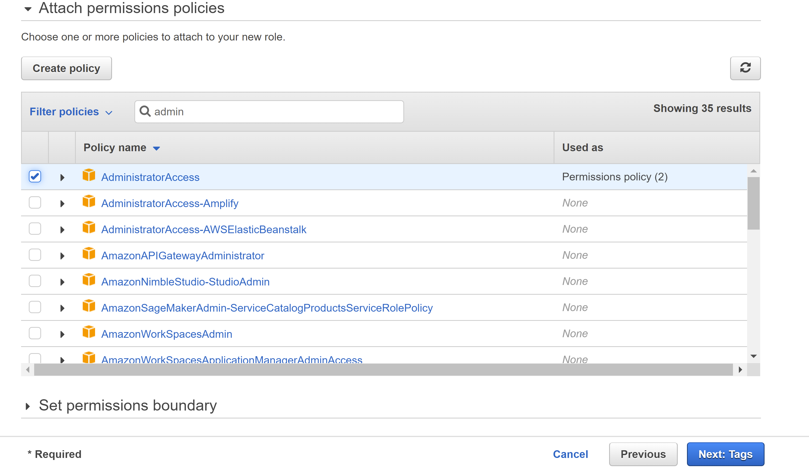

11. Select `Next: Tags`
12. Add a tag with the key `massdriver`

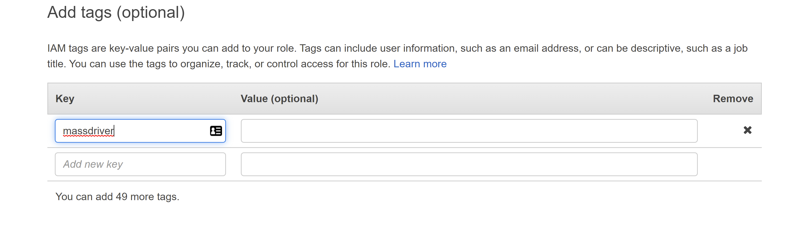

13. Add a name and a description to the role. Save the role name for entry in to the form to the left


14. In Massdriver, name the credential as your AWS account
15. Paste the AWS arn for the role in the appropriate field with the format:

```bash
arn:aws:iam::YOUR_AWS_ACCOUNT_ID:role/ROLE_NAME
```

16. If you haven't already paste your external ID in to the appropriate field
17. Submit the role to Massdriver and head to the projects page to begin provisioning infrastruture.

</details>

## Azure

<details>
<summary>CLI</summary>

### Install Azure CLI

To get started, you'll need the [Azure CLI](https://learn.microsoft.com/en-us/cli/azure/install-azure-cli) installed locally on your machine. The Azure Cloud Shell available in the Azure Portal does **not** have the ability to grant the service principal the required permissions.

2. Obtain your **subscription ID**

Paste this script into the command-line to list your subscriptions:

```bash
az account list --output table
```

Copy the value of the `SubscriptionId` and `TenantId` you want to use and paste it into Massdriver under **Subscription ID** and **Tenant ID**, and also store the `SubscriptionId` for the next step.

3. Paste this script in the command-line to create an Azure service principal, and replace `<mySubscriptionID>` with the subscription ID you copied from the last step:

```bash
az ad sp create-for-rbac --name massdriver-service-principal \
                         --role owner \
                         --scopes /subscriptions/<mySubscriptionID>
```

4. Copy the following attributes and paste them into Massdriver:

- appId &rarr; **Client ID**
- password &rarr; **Client Secret**

Once finished, click the **Submit** button in Massdriver to create your credential.

</details>

<details>
<summary>Console</summary>

### Registering the service principal app in Azure AD

1. Sign into your Azure account through the [Azure portal](https://portal.azure.com/)
2. Search for and select **Microsoft Entra ID**
3. Select **App registration**
4. Select **New registration**

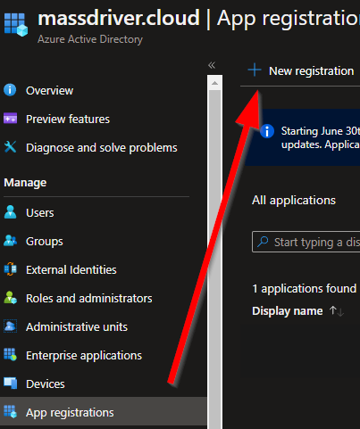

5. Name your application: `massdriver-service-principal`
6. Select **Accounts in this organization directory only**
7. Leave **Redirect URI** blank

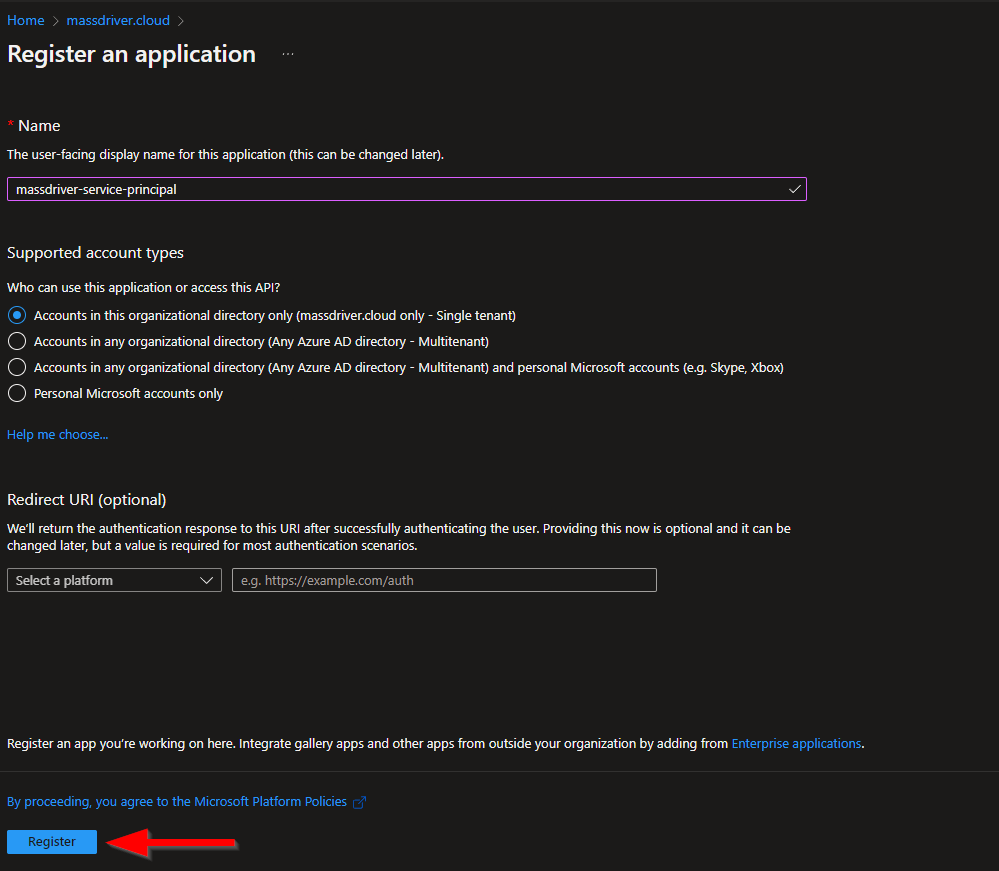

8. Click **Register**
9. On the Overview menu, copy the following values and paste them into Massdriver:

- Application (client) ID &rarr; **Client ID**
- Directory (tenant) ID &rarr; **Tenant ID**

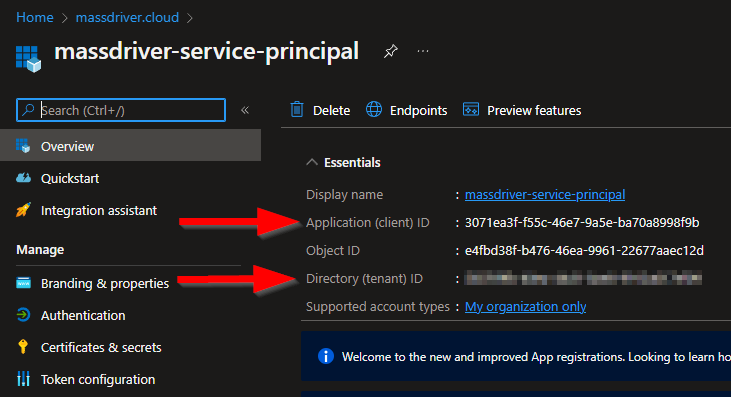

10. Select **Certificates & secrets** on the left
11. Select **New client secret**
12. Set the description to `platform`, set expiration date, and click **Add**

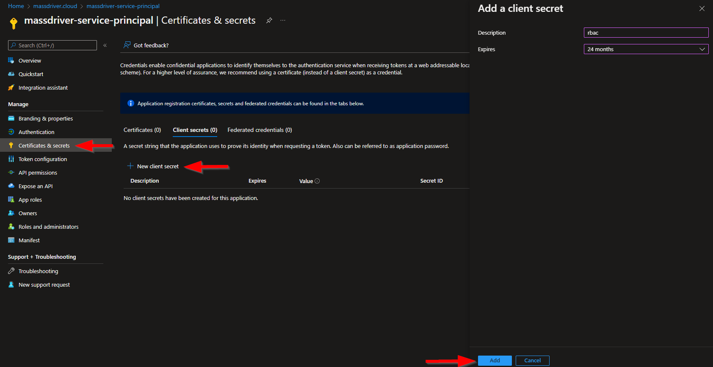

1. Copy the **Value** password and paste into Massdriver under **Client Secret**. <span style={{ color: 'red' }}>**Do not use the Secret ID**</span>.

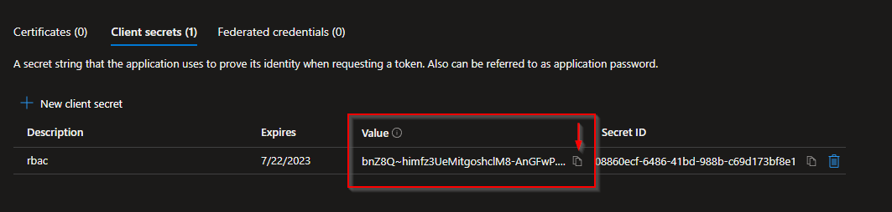

### Assign subscription Owner the service principal

1. In the Azure portal, search for and select **Subscription**
2. Select the subscription you want to use in Massdriver
3. In the Overview menu, copy your **Subscription ID** and paste it into Massdriver under **Subscription ID**
4. Select **Access control (IAM)**
5. Select **Add** > **Add role assignment**
6. Select **Privileged Administrator Roles** tab and then the **Owner** role and click **Next**
7. Select **Select members**, search for `massdriver-service-principal`, click on the service principal, and then click **Select** at the bottom, then **Next**
8. Select **Allow user to assign all roles except privileged administrator roles** and click **Next** then **Review + assign** twice to finish.

### Adding the Azure service principal to your Massdriver organization

1. In Massdriver, click on the menu on the top left and expand **Organization Settings**
2. Click **Configure Credentials**
3. Select **Azure Service Principal**
4. Set the credential name to your subscription name
5. Fill in the fields as guided below:

- Client ID (appId in Azure CLI)
- Client Secret (service principal password)
- Subscription ID
- Tenant ID (tenant in Azure CLI)

</details>

## GCP

<details>
<summary>CLI</summary>

</details>

<details>
<summary>Console</summary>

</details>

</UUIDProvider>
