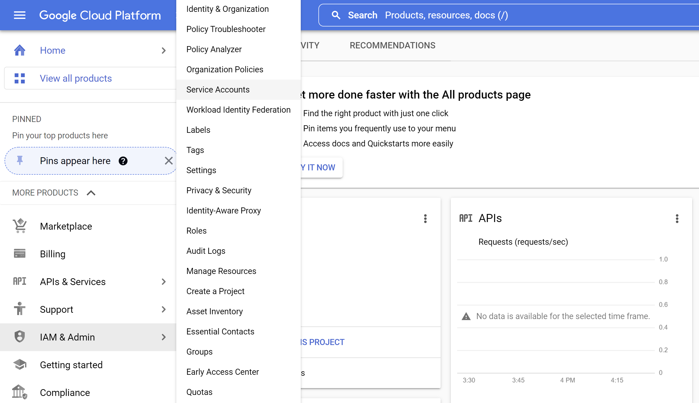
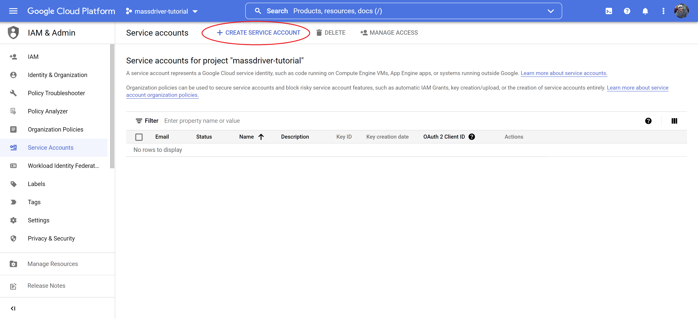
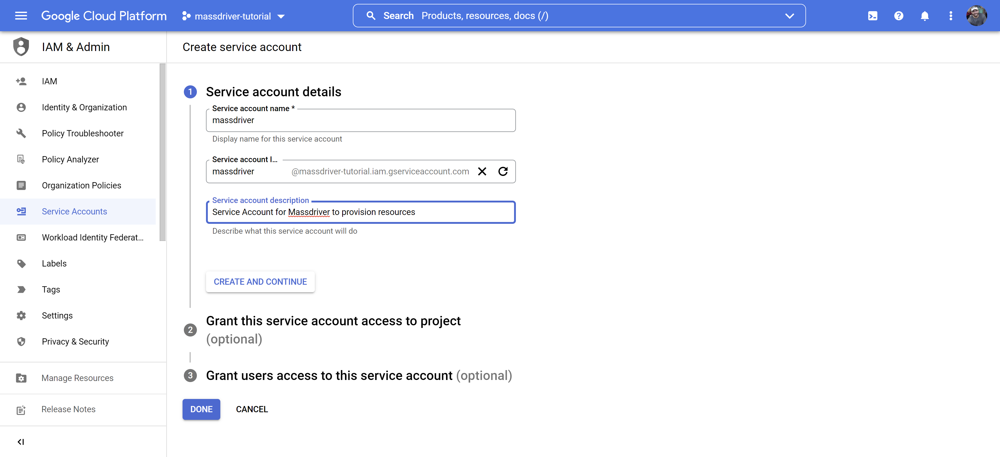
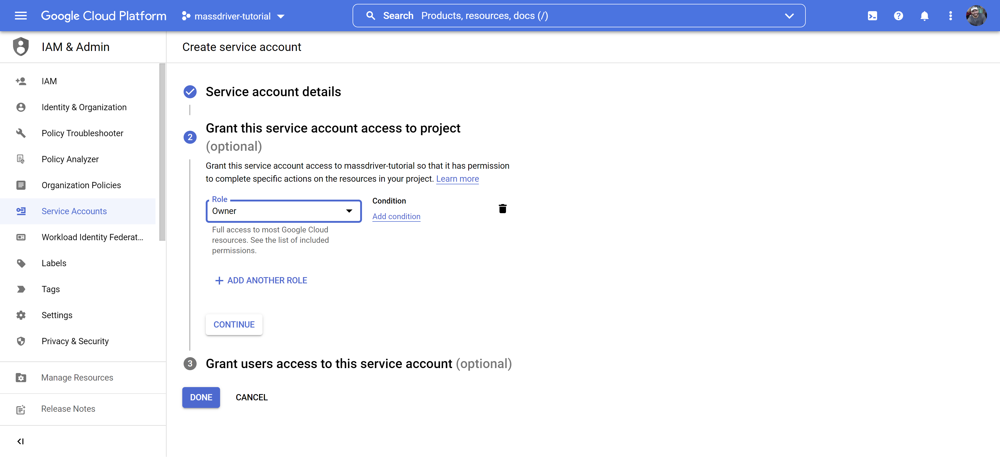
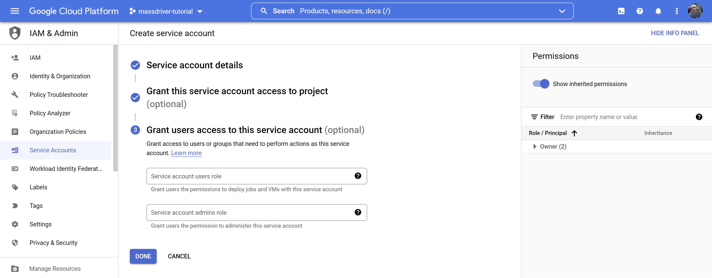
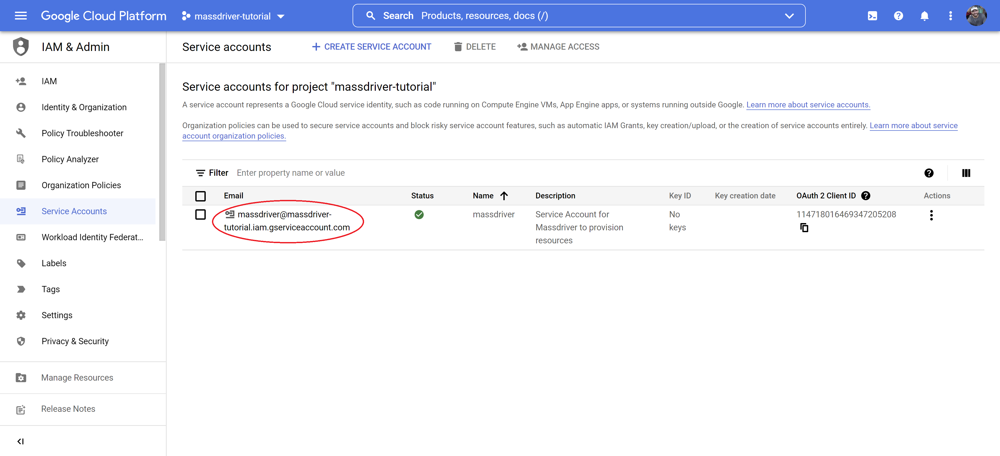
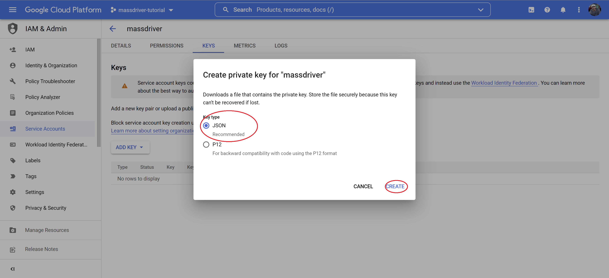

import UUIDProvider, { UUIDContext } from '@site/src/components/UUIDFetcher';
import UUIDLink from '@site/src/components/UUIDLink';
import UUID from '@site/src/components/UUID';
import { DynamicTrustPolicy, DynamicRolePrivileges, DynamicServicePrincipal, DynamicServiceAccount, DynamicProjectPolicy, DynamicAccountKeys } from '@site/src/components/DynamicCodeBlock';
import DocInputProvider from '@site/src/components/DocInputProvider';
import DocInput from '@site/src/components/DocInput';
import DisplayDocInput from '@site/src/components/DisplayDocInput';

<UUIDProvider>
<DocInputProvider>

Follow the specific cloud and preferred method to create the necessary credentials below:

## AWS

<details>
<summary>One Click Role</summary>

### How Massdriver uses your role

To keep your environment secure, Massdriver uses a role with a trust policy to access your AWS account for provisioning and monitoring of your infrastructure. The account that assumes this role is private and has no access from the public internet.

### Click the quick add button

<DocInput
    fieldName='awsRoleName'
    placeholder='massdriver-provisioner'
    label='Enter a friendly name for your AWS role here: '
    initialValue='massdriver-provisioner'
/><br />

Click **<UUIDLink />** to run a hosted CloudFormation stack on AWS which will create a new role in your account with the permissions required to provision infrastructure in Massdriver. The external ID for the role (required to prevent confused deputy attacks) will be unique and auto-generated in the URL for the CloudFormation stack. Do not change this value in the URL.

### Run the CloudFormation stack

Once you are in your AWS console, review the resource creation. Click the `Create stack` button to provision the role.


### Import rol to Massdriver

Once the CloudFormation stack has completed its task, select the outputs tab and copy the value of the `CustomProvisioningRoleArn` output.


- Paste the ARN into the `AWS ARN` field.
- Set <DisplayDocInput fieldName='awsRoleName' /> as the `Credential Name`.
- Set **<UUID />** as the `External ID`.

Click `Create` to add the credential to Massdriver and head to the projects page to start building your infrastructure.

</details>

<details>
<summary>CLI</summary>

### How Massdriver uses your role

To keep your environment secure, Massdriver uses a role with a trust policy to access your AWS account for provisioning and monitoring of your infrastructure. The account that assumes this role is private and has no access from the public internet.

### Create a role with a trust policy

<DocInput
    fieldName='awsRoleName'
    placeholder='massdriver-provisioner'
    label='Enter a friendly name for your AWS role here: '
    initialValue='massdriver-provisioner'
/><br />

Run the following command with the [AWS CLI](https://docs.aws.amazon.com/cli/latest/userguide/getting-started-install.html) to create an IAM Role with a trust policy (the external ID is unique and auto-generated):

<DynamicTrustPolicy />

### Assign the role administrator privileges

Run this command to give Massdriver administrator privileges:

<DynamicRolePrivileges />

### Import role to Massdriver

- Set **<DisplayDocInput fieldName='awsRoleName' />** in the `Credential Name` field.
- Set **arn:aws:iam::YOUR_AWS_ACCOUNT_ID:role/<DisplayDocInput fieldName='awsRoleName' />** as `AWS ARN`.
- Set **<UUID />** as the `External ID`.

Click `Create` and head to the projects page to start building your infrastructure.

</details>

<details>

<summary>Console</summary>

### How Massdriver uses your role

To keep your environment secure, Massdriver uses a role with a trust policy to access your AWS account for provisioning and monitoring of your infrastructure. The account that assumes this role is private and has no access from the public internet.

### Create a role

<DocInput
  fieldName='awsRoleName'
  placeholder='massdriver-provisioner'
  label='Enter a friendly name for your AWS role here: '
  initialValue='massdriver-provisioner'
/><br />

1. Sign in to the [AWS Management Console](https://aws.amazon.com/console/)
2. In the search bar, type `IAM` and select the IAM service
3. In the left-hand menu, select `Roles`
4. Click `Create role`


5. Select `Another AWS account` for the role type


6. For the account ID enter **308878630280**. This is the Massdriver account which contains the role that will use the one you are creating now
7. Check the Require external ID box and enter **<UUID />**.
8. Make sure that the `Require MFA` option is **unchecked**


9. Click `Next: Permissions`
10. Select the `AdministratorAccess` policy


11. Select `Next: Tags`
12. Add a tag with the key `massdriver`


13. Set `Role name` to **<DisplayDocInput fieldName='awsRoleName' />** and add a description to the role


14. Set `Credential Name` to **<DisplayDocInput fieldName='awsRoleName' />**
15. Paste the AWS ARN for the role in the `AWS ARN` field: **arn:aws:iam::YOUR_AWS_ACCOUNT_ID:role/<DisplayDocInput fieldName='awsRoleName' />**

16. Paste **<UUID />** in to the `External ID` field
17. Click `Create` to add the credential to Massdriver and head to the projects page to start building your infrastructure.

</details>

## Azure

<details>
<summary>CLI</summary>

### Install Azure CLI

To get started, you'll need the [Azure CLI](https://learn.microsoft.com/en-us/cli/azure/install-azure-cli) installed locally on your machine. The Azure Cloud Shell available in the Azure Portal does **not** have the ability to grant the service principal the required permissions.

<DocInput
  fieldName='azureServicePrincipalName'
  placeholder='massdriver-provisioner'
  label='Enter a friendly name for your Azure service principal here: '
  initialValue='massdriver-provisioner'
/><br />

1. Obtain your **subscription ID**

Paste this script into the command-line to list your subscriptions:

```bash
az account list --output table
```

<DocInput
  fieldName='azureSubscriptionId'
  placeholder='12345678-1234-1234-1234-123456789012'
  label='Enter your Azure subscription ID here: '
  initialValue=''
/><br />

2. Paste this script in the command-line to create an Azure service principal:

<DynamicServicePrincipal />

3. Copy the outputs and paste them into Massdriver:

- <DisplayDocInput fieldName='azureServicePrincipalName' /> &rarr; <b>Credential Name</b>
- appId &rarr; **Client ID**
- password &rarr; **Client Secret**
- <DisplayDocInput fieldName='azureSubscriptionId' /> &rarr; <b>SubscriptionId</b>
- tenant &rarr; **Tenant ID**

Once finished, click the `Create` button in Massdriver to create your credential.

</details>

<details>
<summary>Console</summary>

### Registering the service principal app in Azure AD

<DocInput
  fieldName='azureServicePrincipalName'
  placeholder='massdriver-provisioner'
  label='Enter a friendly name for your Azure service principal here: '
  initialValue='massdriver-provisioner'
/><br />

1. Sign into your Azure account through the [Azure portal](https://portal.azure.com/)
2. Search for and select `Microsoft Entra ID`
3. Select `App registration`
4. Select `New registration`


5. Name your application: **<DisplayDocInput fieldName='azureServicePrincipalName' />**
6. Select `Accounts in this organization directory only`
7. Leave `Redirect URI` blank


8. Click `Register`
9. In the `Overview` menu, copy the `Application (client) ID`
10. <DocInput
      fieldName='azureClientId'
      placeholder='12345678-1234-1234-1234-123456789012'
      label='Enter your Azure service principal client ID here: '
    /><br />
11. Copy the `Directory (tenant) ID`
12. <DocInput
      fieldName='azureTenantId'
      placeholder='12345678-1234-1234-1234-123456789012'
      label='Enter your Azure tenant ID here: '
    /><br />


13. Select `Certificates & secrets` on the left
14. Select `New client secret`
15. Set the description to `platform`, set expiration date, and click `Add`


16. Copy the `Value` password. <span style={{ color: 'red' }}>**Do not use the Secret ID**</span>
17. <DocInput
      fieldName='azureClientSecret'
      placeholder='super-secret-password'
      label='Enter your Azure service principal client secret here: '
    /><br />


### Assign subscription Owner the service principal

1. In the Azure portal, search for and select `Subscription`
2. Select the subscription you want to use in Massdriver
3. In the Overview menu, copy your `Subscription ID`
4. <DocInput
     fieldName='azureSubscriptionId'
     placeholder='12345678-1234-1234-1234-123456789012'
     label='Enter your Azure subscription ID here: '
   /><br />
5. Select `Access control (IAM)`
6. Select `Add` > `Add role assignment`
7. Select `Privileged Administrator Roles` tab and then the `Owner` role and click `Next`
8. Select `Select members`, search for **<DisplayDocInput fieldName='azureServicePrincipalName' />**, click on the service principal, and then click `Select` at the bottom, then `Next`
9. Select `Allow user to assign all roles except privileged administrator roles` and click `Next` then `Review + assign` twice to finish.

### Adding the Azure service principal to your Massdriver organization

1. In Massdriver, click on the menu on the top left and expand **Organization Settings**
2. Click `Configure Credentials`
3. Select `Azure Service Principal`
4. Fill in the fields as guided below:

- Credential Name (**<DisplayDocInput fieldName='azureServicePrincipalName' />**)
- Client ID (**<DisplayDocInput fieldName='azureClientId' />**)
- Client Secret (**<DisplayDocInput fieldName='azureClientSecret' />**)
- Subscription ID (**<DisplayDocInput fieldName='azureSubscriptionId' />**)
- Tenant ID (**<DisplayDocInput fieldName='azureTenantId' />**)

Click `Create` to add the credential to Massdriver and head to the projects page to start building your infrastructure.

</details>

## GCP

<details>
<summary>CLI</summary>

### Create the service account

<DocInput
  fieldName='gcpServiceAccountName'
  placeholder='massdriver-provisioner'
  label='Enter a friendly name for your GCP service account here: '
  initialValue='massdriver-provisioner'
/><br />

Using [GCloud CLI](https://cloud.google.com/sdk/docs/install), paste the following command in a terminal to create a service account for Massdriver to use:

<DynamicServiceAccount />

### Assign the service account the owner role

<DocInput
  fieldName='gcpProjectId'
  placeholder='my-project-id'
  label='Enter your GCP project ID here: '
/><br />

Paste the following command to assign the service account the `owner` role:

<DynamicProjectPolicy />

### Create a service account key

Massdriver needs a service account key to access the GCP API. To create one paste the following command into a terminal:

<DynamicAccountKeys />

Attach the `.json` file created in the above command in to the `Artifact Data` field on the form.

Set the `Credential Name` to **<DisplayDocInput fieldName='gcpServiceAccountName' />** and click `Create` to add the credential to Massdriver. Head to the projects page to start building your infrastructure.

</details>

<details>
<summary>Console</summary>

### Create a service account

<DocInput
  fieldName='gcpServiceAccountName'
  placeholder='massdriver-provisioner'
  label='Enter a friendly name for your GCP service account here: '
  initialValue='massdriver-provisioner'
/><br />

1. Log in to the [Google Cloud Console](https://console.cloud.google.com/) and navigate to the IAM/Service Accounts page.



2. Click `Create service account`



3. Fill in the form with the following details:

- Service account name: **<DisplayDocInput fieldName='gcpServiceAccountName' />**
- Service account ID: **<DisplayDocInput fieldName='gcpServiceAccountName' />**
- Service account description: **Massdriver Service Account** (optional)

4. Click `Create and Continue`



5. Give your new service account `Owner` permissions so Massdriver can manage your infrastructure
6. Click `Continue`



7. Leave the grant users section blank. Click `Done`



8. Click the ID of the newly created service account



9. Click the `Keys` tab
10. Using the add key dropdown, select `Create new key`


11. Select `JSON` and click `Create`



Attach the `.json` file created in the above step in to the `Artifact Data` field on the form.

Set the `Credential Name` to **<DisplayDocInput fieldName='gcpServiceAccountName' />** and click `Create` to add the credential to Massdriver. Head to the projects page to start building your infrastructure.

</details>

</DocInputProvider>
</UUIDProvider>
