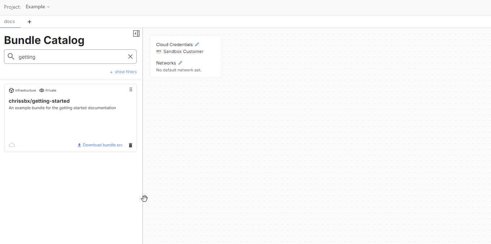
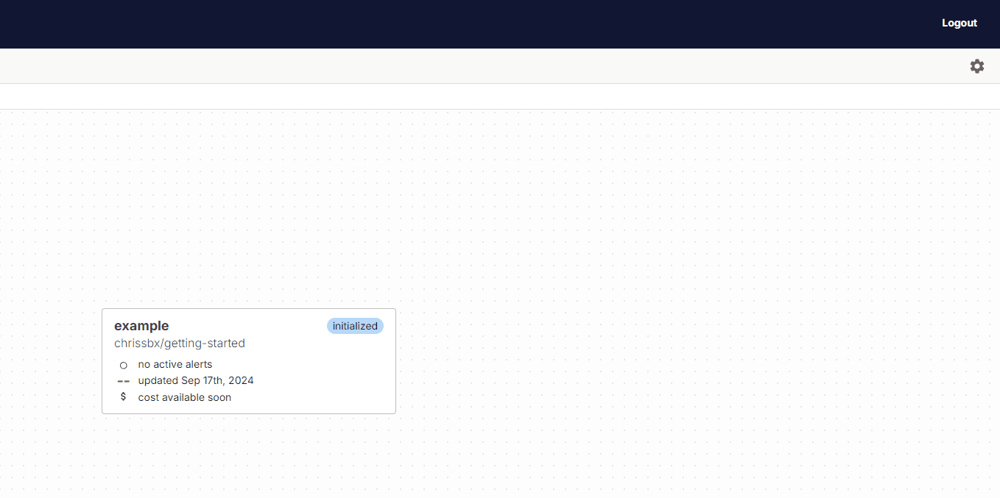

# Create a Bundle from an OpenTofu Module

If you already have existing Infrastructure-as-Code (IaC) modules you'd like to deploy and manage through Massdriver, you'll need to import the IaC into a Massdriver [bundle](https://docs.massdriver.cloud/concepts/bundles). Fortunately, the Massdriver CLI makes it easy to create bundles from existing IaC. To demonstrate, this guide provides step-by-step instructions on how to create a new bundle in Massdriver from an existing OpenTofu module.

:::note
Be sure to complete the [prerequisites](https://docs.massdriver.cloud/getting-started/prerequisites) in order to complete this guide.
:::

## Step 1: Create a New Massdriver Bundle

1. Navigate to where you would like to store the Massdriver bundle, and run:

    ```bash
    mass bundle new
    ```

2. This command will walk you through a wizard to configure a new Massdriver bundle. Give the bundle a useful name and description. When you are prompted to select the template, select `opentofu-module` (or optionally, you can select `terraform module`):

    ```bash
    $ mass bundle new
    Name: bundle-name
    Description: Description of the bundle
    Use the arrow keys to navigate: ↓ ↑ → ←
    ? Template:
    ↑   kubernetes-deployment
        kubernetes-job
    ▸ opentofu-module
        phoenix-kubernetes
    ↓   rails-kubernetes
    ```

3. Next, you will be prompted to specify the path to your existing module. This will allow the CLI to inspect your existing module, generate the proper configuration, and copy over the necessary files:

    ```bash
    ✔ Path to an existing opentofu-module to generate params from, leave blank to skip: path/to/your/module█
    ```

4. Next you will be prompted to specify any [connections](https://docs.massdriver.cloud/concepts/connections). [Connections](https://docs.massdriver.cloud/concepts/connections) are dependencies your module has on external bundles or inputs. If your module needs to authenticate to AWS, GCP or Azure, be sure to specify the appropriate credential:

    | Cloud | Connection                           | Name                      |
    |-------|--------------------------------------|---------------------------|
    | AWS   | `massdriver/aws-iam-role`            | `aws_authentication`      |
    | GCP   | `massdriver/gcp-service-account`     | `gcp_authentication`      |
    | Azure | `massdriver/azure-service-principal` | `azure_service_principal` |

5. Next you'll be prompted to name your connections. If you selected a cloud credential as a connection, use the appropriate name in the above table to simplify your bundle.

    ```bash
    Please enter a name for the connection: "massdriver/aws-iam-role"
    This will be the variable name used to reference it in your app|bundle IaC
    ✔ Name: aws_authentication
    ```

6. Finally, you'll be asked where you would like the bundle to be written. This will vary depending on your IaC management strategy, but for now you can use the default of `massdriver`.

## Step 2: Customize Bundle

Next, we will review the bundle configuration files and make necessary updates.

1. Open the `massdriver.yaml` file and review the imported parameters. You'll notice that all variables declared in the module should be imported into the `params` block.

2. Open the `src/_providers.tf` file. This file is generated by the template to simplify bundle creation. However, if you have your own provider configuration, it can be discarded. Just be sure to copy the appropriate provider authentication configuration into your own file.

3. Publish the bundle to Massdriver:

    ```bash
    mass bundle publish
    ```

## Step 3: Deploy the Bundle Using Massdriver

Once the bundle is published, you can deploy it using the Massdriver platform.

1. Log into [Massdriver Cloud](https://massdriver.cloud).
2. Navigate to (or create) a project and environment in which to deploy the bundle.
    :::note
    Be sure this environment has the proper cloud credential specified
    :::
3. Drag your new bundle from the sidebar onto the canvas.



4. Specify a name for the bundle.
5. Click on the bundle, navigate to the Config tag, specify your desired configuration



6. Click Deploy

## Conclusion

Congratulations, you've deployed your first custom Massdriver bundle!