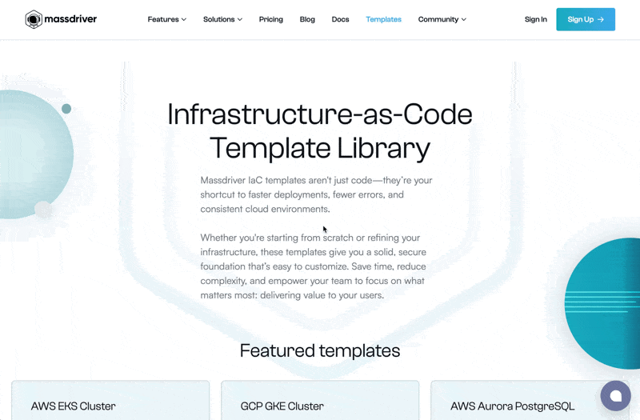
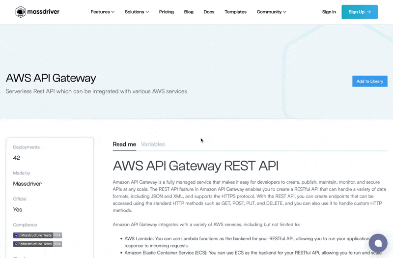
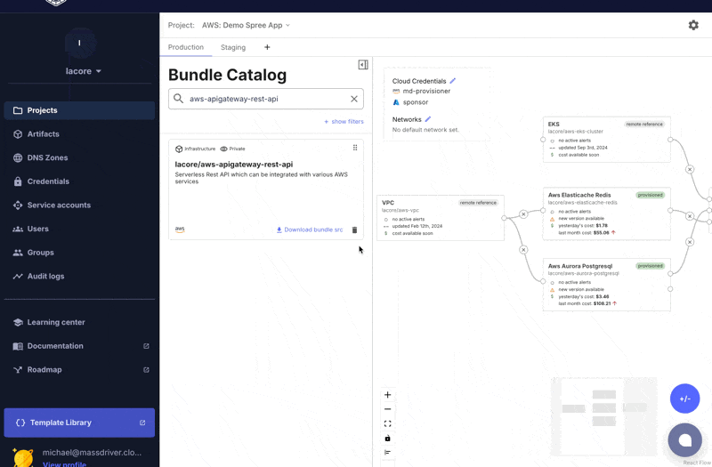

## Massdriver Template Library

Running production-grade infrastructure in the cloud has never been easier with the Massdriver Template Library. The library is a collection of professionally curated infrastructure-as-code (IaC) templates that are designed to help you get started quickly with your cloud infrastructure. The templates are designed to be modular and can be easily customized to fit your specific needs.

This guide will walk you through how to import a template from the [Massdriver Template Library](https://www.massdriver.cloud/templates).

## Prerequisites

- A [Massdriver](https://app.massdriver.cloud) account
- `Org Admin` role of a Massdriver [organization](/docs/concepts/10-organizations.md)

## Import a template

### Step 1: Find a template

Browse the [Massdriver Template Library](https://www.massdriver.cloud/templates) and find a template that you would like to import.

Prior to adding the template to your organization, you can review the template details, including the description and available variables.

### Step 2: Import a template

When you're ready, click `Add to Library` to add the template to your organization. Then, select the organization you would like to import the template to.

## Deploy a template

### Step 1: Customize the template

You can download and customize your template before deploying it. Click on `Download bundle src` button from the `Bundle Catalog`. This will download a zip file containing the template source code.

### Step 2: Deploy the template

Once you have customized the template to your liking, you can deploy it to your cloud provider. Open the `Bundle Catalog` and drag your bundle out onto the canvas.

Once you've configured the template, click `Deploy` to deploy the template to your cloud provider.

## Next steps

### Store your custom template in source control

After you have [customized](#step-1-customize-the-template) and [deployed](#step-2-deploy-the-template) your template, it is a good practice to store your template in source control (e.g. GitHub, Azure Repos, etc.). This will allow you to track changes to your template over time and collaborate with others.

### Integrate CI/CD

You can integrate CD pipelines with your source control to automatically publish changes to your infrastructure. This will help you maintain a consistent and reliable infrastructure.

Check out our [GitHub Actions](/docs/ci_cd/01-github.md) or [Azure DevOps Pipelines](/docs/ci_cd/02-devops.md) guides to learn more about setting up CI/CD pipelines.
