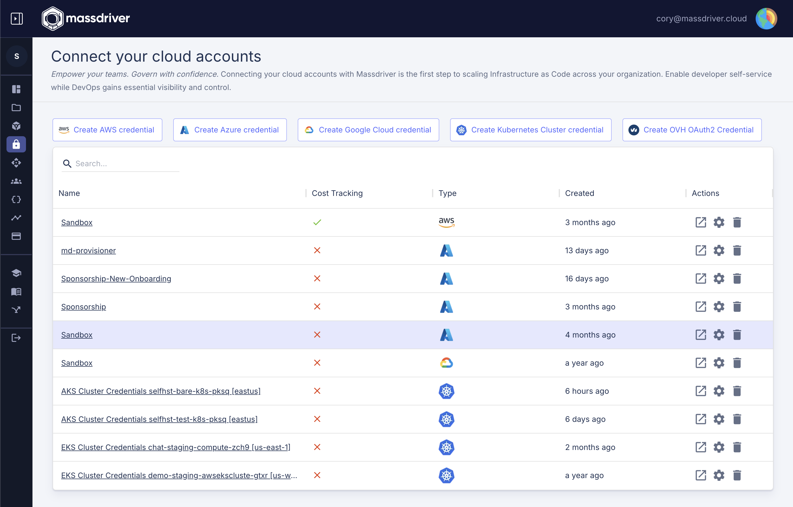
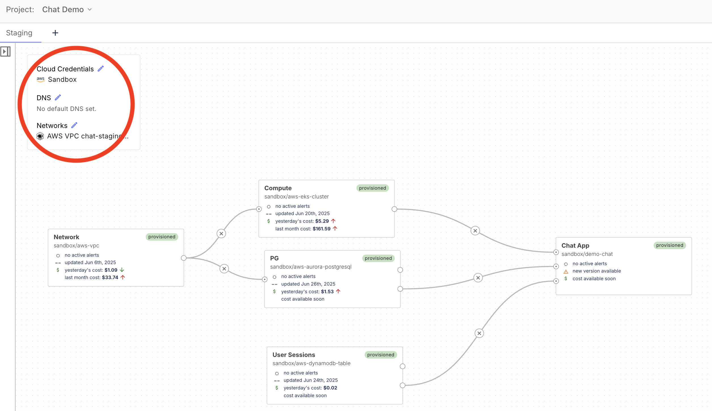

<iframe width="560" height="315" src="https://www.youtube.com/embed/Am2_CJAsuSQ?si=GUf7QR1qBRRJFBeC" title="YouTube video player" frameborder="0" allow="accelerometer; autoplay; clipboard-write; encrypted-media; gyroscope; picture-in-picture; web-share" referrerpolicy="strict-origin-when-cross-origin" allowfullscreen></iframe>

# Crafting Custom Artifact Definitions

In this guide, we're going to walk through the steps to create your own custom artifact definitions in Massdriver. This is for those moments when the existing definitions just don't cut it for your unique needs. Let's demystify the process and make it as straightforward as possible. And, just in case you're looking for a primer on what artifacts and artifact definitions actually are, make sure to check out our dedicated docs for [artifacts](/concepts/artifacts-and-definitions) and [artifact definitions](/concepts/artifacts-and-definitions).

## How to Create Your Own Custom Artifact Definition

### Step 1: Spotting the Need

Check out the Massdriver [artifact definitions GitHub repo](https://github.com/massdriver-cloud/artifact-definitions/tree/main/definitions/artifacts) first. If what you need is nowhere to be found, that's your green light to craft something custom.

:::tip Bootstrap Your Artifact Definitions

If you're setting up a self-hosted Massdriver instance, check out the **[Massdriver Catalog](https://github.com/massdriver-cloud/massdriver-catalog)**. It includes example artifact definitions for common infrastructure patterns (networks, databases, storage) that you can customize for your organization. This is a great starting point for designing your platform's artifact contracts before implementing infrastructure code.

:::

### Step 2: Getting Started

With the [Massdriver CLI](/reference/cli/overview), you've got the toolkit you need to forge your own definitions. It's usually easier to tweak an existing one than to start from scratch:

1. **Pick a Starting Point**: Hunt down an existing artifact definition that's close to what you need, or use this starting template:

```json artifact-definition-name.json
{
  "$md": {
    "name": "artifact-definition-name"
  },
  "type": "object",
  "title": "Artifact Definition Name",
  "description": "",
  "additionalProperties": false,
  "properties": {
    "authentication": {
      "title": "Authentication",
      "type": "object",
      "properties": {}
    },
    "infrastructure": {
      "title": "Infrastructure",
      "type": "object",
      "properties": {}
    }
  }
}
```

2. **Make It Your Own**: Copy its content into your favorite editor (like VS Code) and start tweaking it to suit your requirements.

### Step 3: Key Components of an Artifact Definition

Structure your artifact definition to match your infrastructure abstraction. Group related properties logically and use `$md.sensitive: true` to protect sensitive fields like passwords and tokens.

### Step 4: Tailoring Your Definition

1. **Define Your Structure**: Add properties that match your infrastructure needs.
2. **Mark Sensitive Fields**: Use `$md.sensitive: true` for passwords, tokens, and other secrets.
3. **Prune What You Don't Need**: If the copied definition includes irrelevant bits, cut them out or alter them.

By the end of this step, your definition should look something like this:
```json
{
  "$md": {
    "name": "artifact-definition-name"
  },
  "type": "object",
  "title": "Artifact Definition Name",
  "description": "",
  "additionalProperties": false,
  "required": [
    "infrastructure",
    "authentication"
  ],
  "properties": {
    "infrastructure": {
      "title": "Infrastructure configuration",
      "type": "object",
      "required": [
        "foo",
        "bar"
      ],
      "properties": {
        "foo": {
          "type": "string",
          "title": "Foo",
          "description": "Foo description",
          "examples": [],
          "pattern": "^.*+$",
          "message": {
            "pattern": "Must be a valid format for foo."
          }
        },
        "bar": {
          "title": "Bar",
          "description": "Bar description",
          "additionalProperties": false,
          "examples": [],
          "type": "string"
        }
      }
    },
    "authentication": {
      "title": "Authentication configuration",
      "type": "object",
      "required": [
        "token"
      ],
      "properties": {
        "token": {
          "title": "Token",
          "type": "string",
          "$md": {
            "sensitive": true
          }
        }
      }
    },
    "iam": {
      "title": "IAM",
      "description": "IAM Roles And Scopes",
      "additionalProperties": false,
      "patternProperties": {
        "^[a-z]+[a-z_]*[a-z]$": {
          "type": "object",
          "required": [
            "role",
            "scope"
          ],
          "properties": {
            "role": {
              "title": "Role",
              "description": "Cloud Role",
              "pattern": "^[a-zA-Z ]+$",
              "message": {
                "pattern": "Must be a valid Cloud Role (uppercase, lowercase letters and spaces)"
              },
              "examples": [
                "Data Reader"
              ]
            },
            "scope": {
              "title": "Scope",
              "description": "Cloud IAM Scope (cloud resource identifier)",
              "type": "string"
            }
          }
        }
      }
    },
    "cloud": {
      "type": "object",
      "properties": {
        "region": {
          "type": "string",
          "title": "Cloud Region",
          "description": "Select the cloud region you'd like to provision your resources in."
        }
      }
    }
  }
}
```

### Step 5: Publishing to Massdriver

Got your definition looking sharp? Use the `mass definition publish /path/to/definition.json` command in the CLI to send it out into the world.

### Step 6: Fetching Your Masterpiece

Once published, snag your artifact definition with the `mass definition get org/definition-name` command to confirm it's ready for action in your bundles.

### Step 7: Using Your Custom Artifact Definition

Now that your custom artifact definition is published, you can use it in your bundles. Just reference it in your bundle's `artifacts` field and structure your `_artifacts.tf` file, and you're good to go.

:::tip Recommended: Omit Organization Prefix
When referencing artifact definitions from your own organization, you can omit the organization prefix. Massdriver will automatically use your organization's definitions. This keeps your bundle configuration cleaner and more portable.
:::

``` yaml massdriver.yaml
artifacts:
  required:
    - artifact_definition_name
  properties:
    artifact_definition_name:
      # Recommended: omit org prefix for your own artifact definitions
      $ref: artifact-definition-name
      # Also valid: acme/artifact-definition-name
```

``` hcl src/_artifacts.tf
resource "massdriver_artifact" "artifact_definition_name" {
  field                = "artifact_definition_name"
  provider_resource_id = artifact_dummy_resource.main.id
  name                 = "Artifact Dummy Resource ${var.md_metadata.name_prefix}"
  artifact = jsonencode(
    {
      infrastructure = {
        foo = artifact_dummy_resource.main.foo
        bar = artifact_dummy_resource.main.bar
      }
      authentication = {
        token = artifact_dummy_resource.main.token
      }
      iam = {
        "read" = {
          role  = "Data Reader"
          scope = artifact_dummy_resource.main.id
        }
      }
      cloud = {
        region = artifact_dummy_resource.main.region
      }
    }
  )
}
```

To confirm that your custom artifact definition is working as expected for your bundle, run the `mass bundle lint` and `mass bundle build` commands to check for any issues. When you're ready to publish your bundle changes, `mass bundle publish` will publish your bundle to your Bundle Catalog.

## Customizing Massdriver

### Customizing Onboarding

Massdriver lets you fully customize the onboarding experience for cloud credentials and other artifact types. You can define onboarding instructions, UI labels, and icons directly in your artifact definition using the `$md` and `$md.ui` fields. This enables you to provide clear, step-by-step guidance for your users when they add new credentials.

For example, the onboarding screen for cloud credentials (see below) is driven by the `ui.instructions` array in your artifact definition. Each instruction can include a label and content, allowing you to walk users through complex setup steps with clarity.



**Relevant schema fields:**
- `$md.label`: Sets the display name for your artifact in the UI.
- `$md.icon`: Sets a custom icon for your artifact.
- `$md.ui.instructions`: An array of onboarding steps, each with a `label` and `content`, shown to users during credential setup.

See a real-world example of onboarding instructions in the [aws-iam-role artifact definition](https://github.com/massdriver-cloud/artifact-definitions/blob/main/definitions/artifacts/aws-iam-role.json#L20).

### Note on Icons and Instructions

Currently, icons (as data URLs) and `instructions.content` (as base64-encoded markdown) are packed directly into the JSON Schema. With our upcoming move to OCI for artifact definitions (as we've already done for bundles), you'll soon be able to include these files directly in the same directory as your definition—no more packing required. Stay tuned for updates! Here is the [script](https://github.com/massdriver-cloud/artifact-definitions/blob/main/hack/pack.rb) we use for packaging artifact definitions.

### Customizing the Artifact Types that can be defaulted in an Environment

Massdriver environments support "environment default" artifacts—resources like credentials, networks, or DNS zones that are commonly shared across multiple bundles. You can control which artifact types are eligible to be set as environment defaults by specifying the `ui.environmentDefaultGroup` field in your artifact definition.

When you set this field, your artifact type will appear in the environment overlay, allowing users to assign a default resource for that group (e.g., default network, default credentials) without having to connect it individually to every bundle. This streamlines environment setup and reduces visual clutter in complex diagrams.



**Relevant schema fields:**
- `$md.ui.environmentDefaultGroup`: Adds your artifact type to the "environment default" overlay under the specified group (e.g., `networking`, `authentication`, `dns`). This is what makes an artifact eligible to be set as a default in an environment.

> **Note:** There is a special 'magic' environment default group called `credentials`. Assigning your artifact to this group will make it appear on the credentials page and enables Massdriver to fetch credentials for use in your workflows. Besides that you can use any `environmentDefaultGroup` name that makes sense for your team.

See a real-world example of adding an environment default in the [aws-vpc artifact definition](https://github.com/massdriver-cloud/artifact-definitions/blob/main/definitions/artifacts/aws-vpc.json#L6).

- `$md.ui.connectionOrientation`: Controls how the artifact appears on the canvas. If set to `"link"`, users can draw lines to connect bundles to the artifact. If set to `"environmentDefault"`, the artifact is only shown as a default and not as a connectable box. These options are independently controllable, so you can allow both defaulting and explicit connections if desired. For example, SREs might want to draw lines to a shared Kubernetes cluster, while end developers only see it as a default and don't interact with it directly.

**Example snippet:**
```json
{
  "$md": {
    "name": "aws-iam-role",
    "label": "My Cloud Credential",
    "icon": "https://example.com/my-icon.svg",
    "ui": {
      "environmentDefaultGroup": "authentication",
      "connectionOrientation": "environmentDefault",
      "instructions": [
        {
          "label": "Step 1: Create a Service Account",
          "content": "Go to your cloud provider and create a new service account..."
        }
      ]
    }
  }
}
```

**References:**
- [Artifact definition JSON Schema](https://api.massdriver.cloud/json-schemas/artifact-definition.json)
- [Open source artifact definitions](https://github.com/massdriver-cloud/artifact-definitions)

By leveraging these schema fields, you can tailor both the onboarding experience and environment default behavior for your custom artifact types, ensuring a seamless and intuitive experience for your users.

## Wrapping Up

And there you have it! Creating your own artifact definitions in Massdriver opens up a world of customization for your cloud infrastructure projects. By following these steps, you're well on your way to tailoring Massdriver to your project's unique requirements. If you've got any questions or need a hand, don't hesitate to reach out to our team. We're here to help you make the most of Massdriver's powerful features. Happy crafting!
