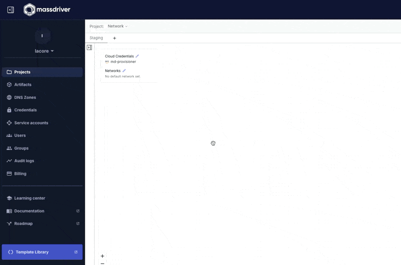
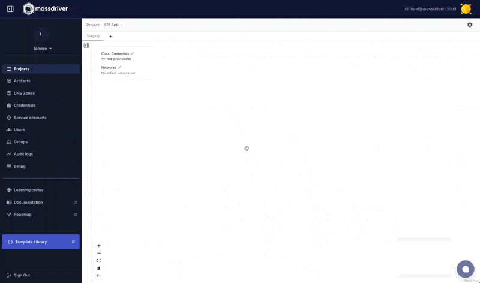
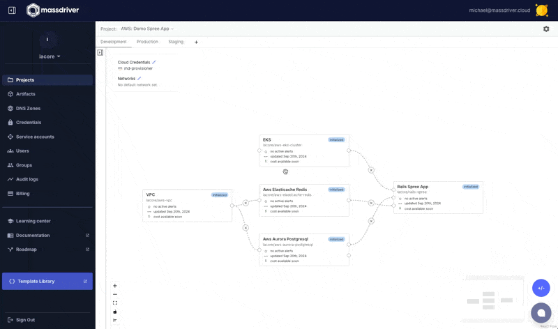

Massdriver supports sharing resources across environments and projects. Sharing resources facilitate collaboration, resource management, and operational governance across different teams or departments within an organization. 

:::info

Hate reading words? Check out the video on youtube!

<iframe width="560" height="315" src="https://www.youtube.com/embed/x-GP7Us81vQ?si=HmU8LFiD1r6OOKpZ" title="YouTube video player" frameborder="0" allow="accelerometer; autoplay; clipboard-write; encrypted-media; gyroscope; picture-in-picture; web-share" allowfullscreen></iframe>

:::


**tl;dr:** Sharing resources allow organizations to achieve better operational governance, cost efficiency, and technical synergy (you love to read it) when managing networking resources and container orchestration clusters across diverse teams and workloads.


When it comes to networking and container orchestration clusters, shared resources between projects brings several benefits:

* **Resource Sharing and Segmentation**: Allowind different teams to share resources and network configurations without compromising on isolation and security. This is crucial in a multi-tenant environment where various teams or applications need to coexist without interfering with each other.

* **Separation of Concern**: The team that owns a resource, may not be the same team(s) that use the resource. This is particularly true as organizations grow and teams become more specialized. Shared resources allow one team to have complete control of resource management while allowing other teams to utilize necessary resources.

* **Centralized Network Management**: By having a shared project for networking resources, organizations can centralize the management and control of network configurations, firewalls, and routing policies. This centralized approach ensures consistency, eases management overhead, and helps in enforcing network policies across multiple projects and teams.

* **Cost Efficiency**: Utilizing shared VPCs (Virtual Private Clouds) can lead to cost savings as resources like subnets and network routes can be re-used across different projects, thereby reducing the overhead associated with managing multiple VPCs.

* **Unified Container Orchestration**: Sharing resources provide a unified infrastructure for deploying and managing container orchestration clusters like Kubernetes. By consolidating container orchestration clusters like Nomad, Kubernetes, and ECS in a project that shares resources organizations can standardize configurations, simplify management, and ensure that clusters adhere to organizational policies and best practices.

* **Policy and Security Enforcement**: Share resources facilitate the enforcement of security policies, IAM roles, and permissions at a granular level. This is crucial for ensuring that only authorized personnel have access to networking resources and container orchestration clusters, thereby enhancing the security posture of the organization.

* **Enhanced Monitoring and Logging**: Centralized logging, monitoring, and auditing of network and container orchestration activities can also be achieved by sharing resources. This centralization is crucial for gaining visibility, troubleshooting issues, and adhering to compliance and auditing requirements.

* **Ease of Scalability and Upgrades**: As the demands of applications and services grow, having structured shared projects setup helps in scaling resources, networks, and clusters more efficiently. It also simplifies the process of upgrading networks and clusters to meet evolving operational requirements.

* **Cross-Project Communication**: Sharing resources enable easier communication and data transfer between different projects and teams. This is particularly useful in microservices architectures where services deployed across multiple projects need to communicate with each other securely and efficiently.

* **Preview Environment Management**: Sharing resources facilitate efficient creation, management, and teardown of preview environments for applications. They ensure consistent configurations, centralized monitoring, and adherence to security policies across these temporary deployments, thus accelerating the review and feedback loop while ensuring a controlled, secure, and cost-effective environment for testing and validation before production deployment.


## Setting up Shared Infrastructure

First visit the project creation page, here we'll pick AWS, but you can create shared infrastructure on AWS, Azure, GCP, or even Kubernetes with Massdriver.

First go to the [projects page](https://app.massdriver.cloud/projects)

Let's create a project for the Ops Team to share networking and compute with other teams.

Click "Create Project" and set the following values:

```
Name: Shared Infra
Abbreviation: si
```


Create a staging environment for staging, QA, or preview environments workloads to use.

Click "Create Environment" and set the following values:

```
Name: Staging
Abbreviation: staging
```


Next we will add an AWS VPC and an EKS Cluster and provision both. These resources can be shared with other projects. Teams will be able to use and deploy to them, but not configure or manage these resources.

This tutorial uses:

* [SOC2 / HIPAA compliant AWS VPC](https://massdriver.cloud/marketplace/aws-vpc) bundle 
* [SOC2 / HIPAA compliant AWS EKS Cluster](https://www.massdriver.cloud/marketplace/aws-eks-cluster) bundle

Open the **Bundle Catalog**:



Then drag both bundles from the bundle sidebar onto your project canvas.

From here you could click the "+" button to add a production environment, an EU environment, or however your team chooses to managed and isolate infrastructure.

:::important

Teams can share _anything_ between projects. If you had a internal bug tracking service, it could be provisioned once in a shared environment and exposed to other application projects.

:::

## Using Shared Infrastructure

Create a new project for an example application to hold the E-Commerce Team resources:

Navigate back to the [projects page](https://app.massdriver.cloud/projects) and click "Create Project" and fill in the following values:

```
Name: ECommerce API
Abbreviation: ecomm
```


Next, we'll create the a staging environment for the E-commerce Team's workloads.

Click "Create Environment" and set the following values:

```
Name: Staging
Abbreviation: staging
```


Here you will need to add some cloud resources and an app. This tutorial uses:

* Our [SOC2 / HIPAA compliant AWS Aurora PostgreSQL](https://www.massdriver.cloud/marketplace/aws-aurora-postgresql) bundle 
* [Spree E-Commerce Demo App](https://github.com/massdriver-cloud/application-examples/tree/main/k8s/rails-spree)


Click the **bundle** bar button and drag both bundles from the bundle sidebar onto your project canvas.

:::info

If you haven't published an application to Massdriver before, its super easy:

First [install and setup the Massdriver CLI](https://docs.massdriver.cloud/reference/cli/overview).

Then run:

```shell
git clone git@github.com:massdriver-cloud/application-examples.git
cd application-examples/main/k8s/rails-spree
mass bundle publish
```

:::

Before we can deploy our app and database, we need a network and compute to run them on. We'll use shared resources to connect our _Shared Infrastructure's_ environment to our _ECommerce_ environment.

Massdriver supports sharing resources through two mechanisms: _environment defaults_ or _remote references_

### Using Environment Defaults

Environment defaults use the shared resources, with no option for configuration in a particular environment. 

The resource is a "default" for the environment and is _not_ shown on the canvas.

In our ECommerce Project we'll set up two environment defaults.

**Set the Environment's Network**

Click the cloud icon on the top bar and select your network.



**Set the Kubernetes Cluster to use for all apps in this project:**

Click the Kubernetes logo and select your cluster.


:::note
By default only VPCs, Kubernetes clusters, and cloud credentials can be environment defaults. Other resource types can be configured as defaults (i.e.: spark clusters).

If you need to configure environment defaults for any custom resource types, please reach out in our [community slack](https://join.slack.com/t/massdrivercommunity/shared_invite/zt-1sxag35w2-eYw7gatS1hwlH2y8MCmwXA).
:::

Now we should be able to deploy our Aurora PostgreSQL server and our ECommerce API.


### Using Remote References

Remote reference uses the shared resource, but allows a developer to make a new environment and provision their own if the use case permits. The resource appears as a package on the canvas.

This is particularly useful if in one environment you want to use a shared resource, but in another environment you want to use a dedicated resource you own.

**Example 1:**

Let's say we wanted to have our _ecommerce API_ use its own dedicated cluster owned by the ECommerce Team when running in production, but when running preview environments we wanted our apps to run on a shared Kubernetes cluster for **all* preview environments.

In this scenario we would add a Kubernetes cluster to our application project.

In production, we'd deploy a cluster owned by the ECommerce Team. In preview environments we could "replace" the Kubernetes box on our diagram with the Kubernetes cluster shared from the Shared Infrastructure project.



**Example 2:**

We have a staging environment that we want to manage through Massdriver. It includes a network, a cluster, a _postgres_ database, and an app.

In staging we want to manage the _postgres_ database through Massdriver, but we aren't quite ready to move production.

Using remote references you can use your postgres database in a Massdriver production environment swapping out the postgres box on your canvas for the postgres instance in your cloud account.

This allows your team to start using Massdriver without allow Massdriver to manage your database.

:::note

If you need help migrating your database into the platform, please reach out in our [community slack](https://join.slack.com/t/massdrivercommunity/shared_invite/zt-1sxag35w2-eYw7gatS1hwlH2y8MCmwXA).

Alternatively, check out ["Upgrading PostgreSQL Versions with Minimal Downtime"](https://www.youtube.com/watch?v=hd0WlFls9b8). This approach works for migration across clouds as well as upgrading Postgres with minimal interruptions.

We also have a runbook on [restoring snapshots across AWS RDS instances](http://localhost:3000/runbook/aws/migrating-rds-databases).
:::

**Example 3:**

Network peering is an advanced scenario that is in the future of many tech orgs. Its really easy to peer networks in Massdriver using Remote References.

To peer networks using remote reference, we suggest making a "Peering" project separate from your Shared Infrastructure project. This additional project will let you create remote references to environments that are in the same project, i.e.: your shared infrastructure project.

Add two VPC bundles to the canvas and a peering bundle.

Here I will peer our US VPC to our EU VPC.


## Advanced Scenarios

**Coming soon**

Using remote references & environment defaults to:

* Enable cost controls for preview environments
* Create global networks w/ regional compute projects & per app projects
* Sharing Spark clusters between teams

<!-- 
Sharing resources can be significantly beneficial in a scenario where a company is using preview environments for applications. Preview environments are temporary deployments used for reviewing changes to an application before they are pushed to production. 

Here's how sharing resources can aid in managing preview environments:

-->
