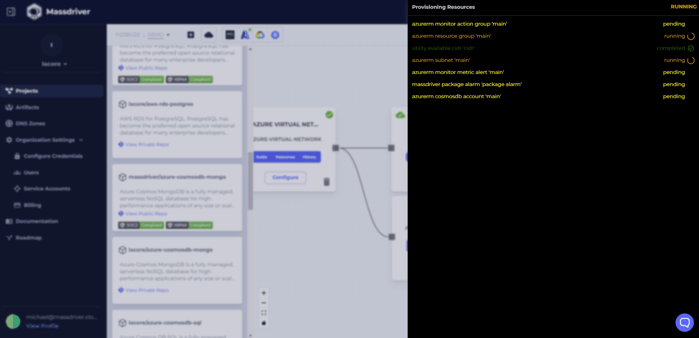

Deploying a new bundle to your canvas is as easy and dragging and dropping. To deploy a database, drag a database bundle of your cloud from the Bundlebar left of the canvas (use the filter button if you're unsure). The database bundle will be initialized and ready to deploy. Click **Configure** on your database bundle to open the configuration menu. Either fill out the configurations manually or use the presets at the top of the menu.

Once you're done, click **Deploy** to deploy your database bundle.

