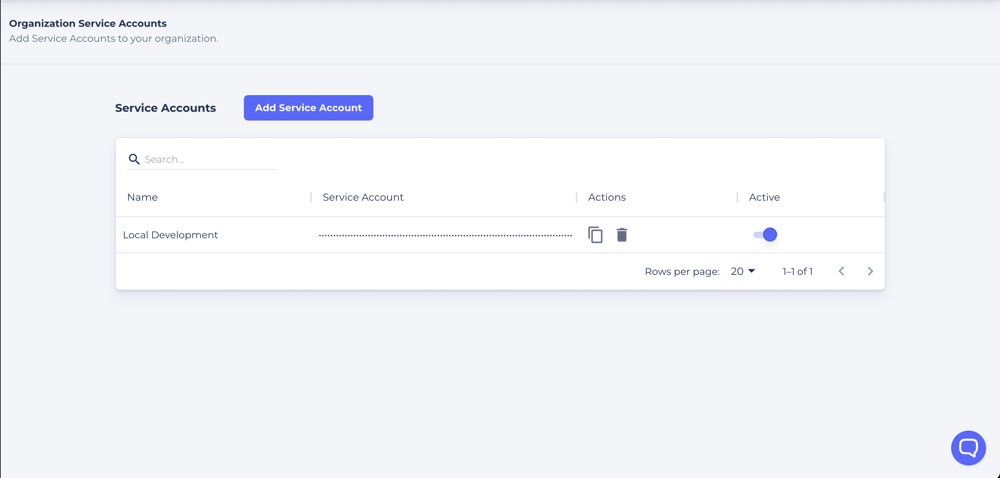

Service accounts are a special type of non-human privileged account used to execute publish bundles, deploy applications, and other functions in our [API](/swapi). In some cases, they may have administrative privileges.

Service account keys are required for using the [Massdriver CLI](https://github.com/massdriver-cloud/massdriver-cli).

To create a service account:

1. Visit the [Service Accounts page](https://app.massdriver.cloud/organization/api-keys)
2. Click 'Add Service Account'
3. Give the service account a name
4. Click the 'clipboard' icon.



You'll need to export your key to the following environment variable

```shell
MASSDRIVER_API_KEY=fookey9000!
```
