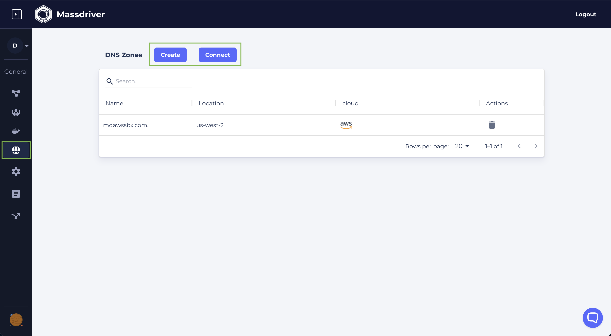
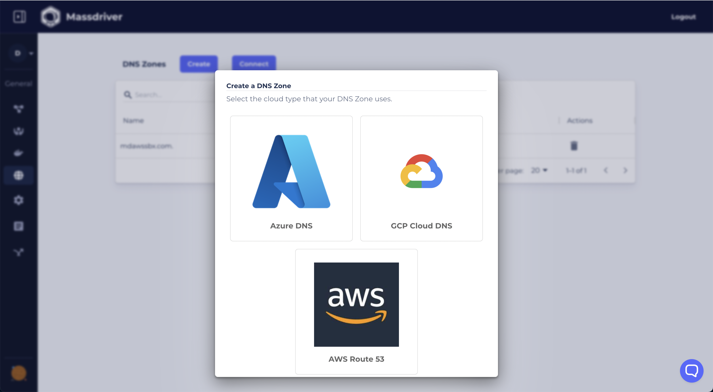
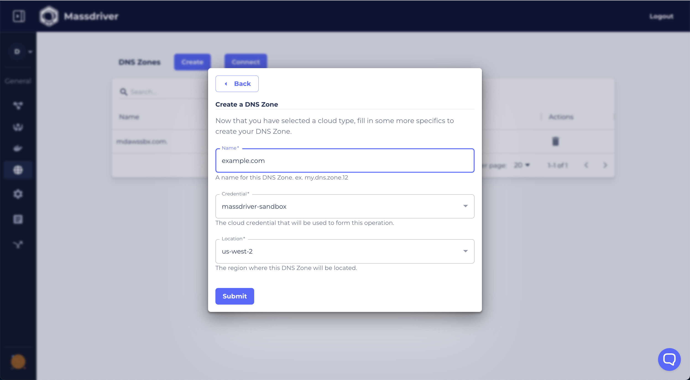

DNS Zones can be created in or imported from AWS, Azure, and GCP. Connecting a DNS Zone in Massdriver allows our [DNS Widget](/bundles/custom-widgets-and-fields#dns-zones) to create a rich dropdown for selecting zones, and can be used by Kubernetes clusters to automatically register DNS domains and TLS Certifacts (using Let's Encrypt).

To create a DNS Zone or connect an existing zone:

1. Visit the [DNS Zones' page](https://app.massdriver.cloud/dns-zones)
2. Click 'Create' to create a new zone or 'Connect' to connect to an existing zone.
3. Select the cloud the zone will be managed by.
4. Set the zone name and pick the credential and location for provisioning.

